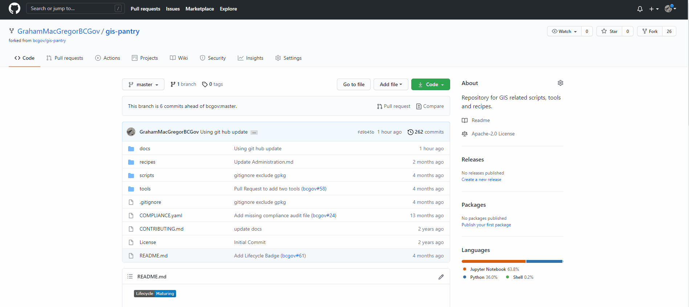

# Using Git Hub to Contribute to GIS Pantry

## Create a Git Hub Account (Configure Existing Account)

You may need to create a new GitHub account or configure an existing account.  
Please see our [GitHub Account Setup How-To](how-to/GitHub_Account_Set_Up.md)

## Contribute To The Repo
Government employees, public and members of the private sector are encouraged to contribute to the repository by **<ins>forking and submitting a pull request</ins>**. 

Pull requests will be evaluated by the repository guardians on a schedule and if deemed beneficial will be committed to the master.

All contributors retain the original copyright to their stuff, but by contributing to this project, you grant a world-wide, royalty-free, perpetual, irrevocable, non-exclusive, transferable license to all users **under the terms of the license under which this project is distributed.**

### Basic Workflow
1. Log into onto GitHub with your account
1. Fork the GIS Pantry Repository
1. Edit your fork (locally or remotely)
1. Once your fork is updated on GitHub, then submit a pull request.
    - This will merge your changes into the Pantry upon approval

There are many ways to edit your fork. Here are several how-to documents that cover various methods:  

- [Web Interface How-To](how-to/GitHub_Web_Interface.md)
- [GitHub Desktop](how-to/GitHub_DesktopApplication.md)
- [VS Code Extension](how-to/GitHub_in_VSCode.md)

And if you really want to get under the hood, you can also use the [Git Command Line](https://help.github.com/articles/set-up-git) 

### Where to edit
Essentially there are two locations where you can edit your fork.

1. Remotely -- i.e. directly on the GitHub platform
    - Do this via:
        1. the web interface
        1. via a remote connection (GitHub Desktop, VS Code, etc.)
1. Locally -- i.e. download and edit files locally
    - Do this by either:
        1. downloading directly from the web interface
        1. cloning your fork locally (GitHub Desktop, VS Code, etc.)

The [how-to](how-to) docs cover a number of the ways to do the above...

## Tips & Tricks

* BEFORE EDITING YOUR FORK  
Best practice is to syncronize your fork with bcgov/gis-pantry before making, and pushing your own changes. You will also want to try to push your changes as efficiently as you can, or at least regularly synchronize your fork with the Pantry main branch to bring changes into your fork. Otherwise changes made to the Pantry main branch after you created your fork may cause merge conflicts.

* For small edits, or one-off contributions consider using the web interface approach.

* For those who want more flexibility and ease, and who are likely to make a number of contributions, consider GitHub Desktop, VS Code Extensions, etc...

## When Your Edits Are Done > Make a Pull Request!

Once you have completed your changes within your fork on GitHub, you will want to commit it to the main GIS Pantry repository (the upstream master). To do so you will need to make a pull request. A pull request notifies the admins that you have changes ready to commit.

### How To
1. Log into GitHub with your account
1. With your Fork as the active repository, select pull requests
1. Select green button new pull request
1. Enter in information describing the edits you did in the pull request
1. Click green button create pull request. 

FYI:  
A more detailed guide about [pull requests](https://help.github.com/articles/using-pull-requests/)

## Etc...
* Wondering if your project should have it's own repo?
    - See the [Repo Guidelines](Repo_Guidelines.md) for guidance.