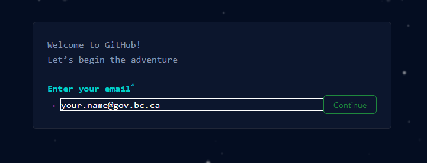
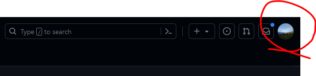
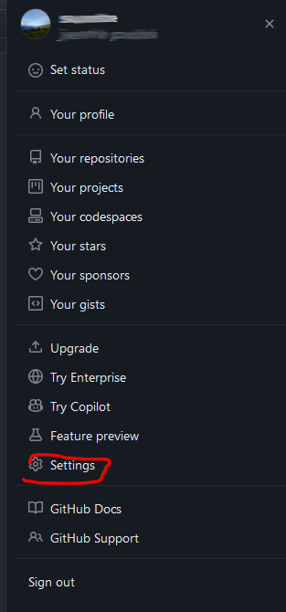
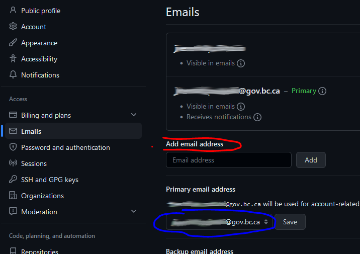
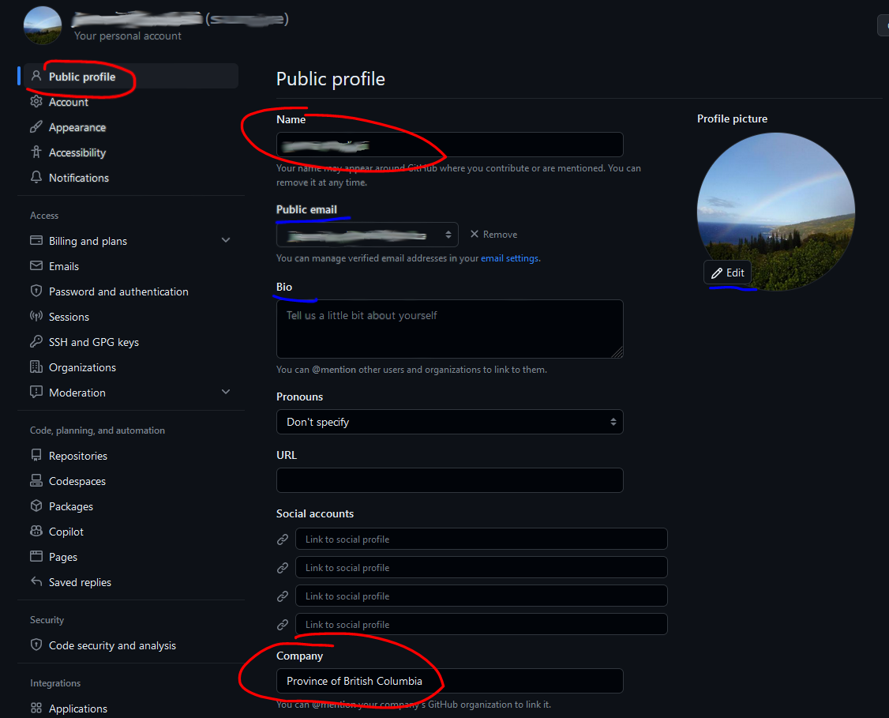

***Last update: 2023-07-18***   
***Tags: #account-setup***

# Git Hub Account Set-up / Configuration
If you want to contribute to the GIS Pantry, you will need a GitHub account. If you already have an account, then skip to [account configuration](#account-configuration). If you do not have an account then start below.

Helpful Resources:  
[Account and profile documentation on GitHub](https://docs.github.com/en/account-and-profile)

## Create a New Account 
### Step By Step
1. You can [sign up here](https://github.com/)
    - Click "Sign up" and enter your government email. 
          
        *You will be able to add additional emails later if you want.*
1. Follow the prompts to create your new account.
    - You may name your account as you wish. The general recommendation is to use your name, however many use a handle. 
    - If you use a handle, you may want to set your display name to your real name so that others know who you are. You can change your display name later without affecting anything.
1. Next you will set up some basic account configurations...

## Account Configuration
We recommend the following account changes before contributing to the GIS Pantry, or taking other BCGov related actions.

*For further info on this section see the BCGov GitHub Organization guidelines [here](https://github.com/bcgov/BC-Policy-Framework-For-GitHub/blob/master/BC-Gov-Org-HowTo/Joining-the-BCGov-on-GitHub.md)*

1. To Begin...  
    * First, log into your account
    * After you have logged in, go to your account icon in the upper right corner
    * Then click settings.  

1. Now configure your emails...  
    1. Click >> Emails
        - Add any emails you want
            - Be sure to include your government email.    
        - You can also choose which email is your primary.
        
1. Finally, set up your public profile...  
    1. Click >> "Public Profile"
        - Update your display name (optional)  
        *This helps if you signed up for your account with a handle, rather than your real name. Changing your display name allows your colleagues to easily recognize you. You may change this later.*
        - Set Company to "Province of British Columbia"
        - You can also choose an email to display publicly...
<<<<<<< HEAD:_start-here/how-to/GitHub_Account_Set_Up.md
        - You can make other changes as desired. Like adding a bio 

=======
        - You can make other changes as desired. Like adding a bio 
1. Additionally, continue to customize your account...
   Set up two-factor authentication
   1. Click >> "Password and authentication"
      - Choose your authentictor method, through an authenticator app, SMS/Text message, Security keys, or GitHub Mobile 
>>>>>>> bcgovpantry/master:_getting-started/Gis-Pantry-Docs/GitHub_Account_Set_Up.md
1. Join the BCGov GitHub organization (OPTIONAL)  
*You do not need to do this to contribute to the pantry. You can still contribute by forking the Pantry, and then submitting a pull request. Joining the org provides you additional permissions...*  

    [Instructions to join](https://github.com/bcgov/BC-Policy-Framework-For-GitHub/blob/master/BC-Gov-Org-HowTo/Joining-the-BCGov-on-GitHub.md)  

**Optional:**  
You may want to set up 2 factor authentication. In fact it is required if you decide to join the BCGov GitHub organization. It provides an extra level of security for your account. You can find these in settings, under account security.

.... **Your account is ready to go!**
