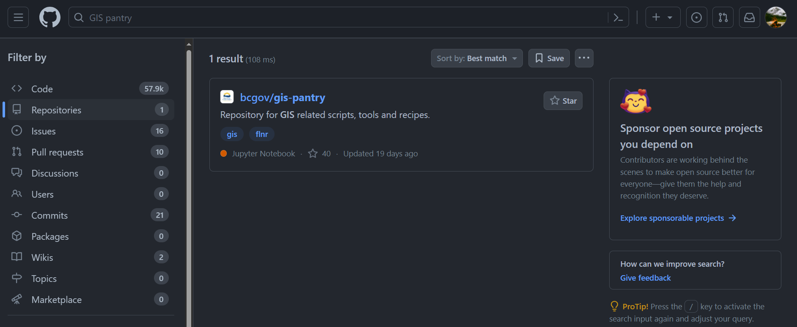
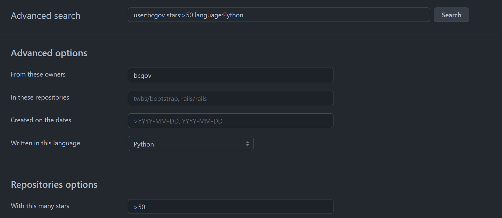

# Searching in GitHub
*How to search for organizations, repositories, code, commits, issues, packages, topics, wikis and user*

## Further Reading
- [Getting Started with Searching On GitHub](https://docs.github.com/en/search-github/getting-started-with-searching-on-github/about-searching-on-github)
- [Dev Tips: Searching GitHub Like a Pro](https://medium.com/cloud-native-the-gathering/dev-tips-searching-github-like-a-pro-5de2e73cba3d)
- [GitHub Search Tips](https://www.freecodecamp.org/news/github-search-tips/)

## Prerequisites 
* Signed in to GitHub

## Introduction
There are two primary ways to search GitHub: the search bar on the top of the website and the advanced search. Your search can be focused globally or on a particular repo or organization. Repositories, Topics, Issues and Pull Requests, Discussions, Code, Commits, Users, Packages and Wikis can all be searched. Advanced searches can be done through the [visual interface](https://github.com/search/advanced).

## Basic Search
If we search "GIS Pantry" in the search bar on the top of the GitHub website, first, we get thousands of pieces of code that include the word pantry. We can navigate to repositories using the filtering options on the left side and see the GIS Pantry repository. If we continue with the filters, we can see what issues, pull requests, commits and wikis are associated with a name or tag GIS Pantry
 

## Advanced Search
To use the [advanced search](https://github.com/search/advanced), Fill in the fields, and it will create your search string.

