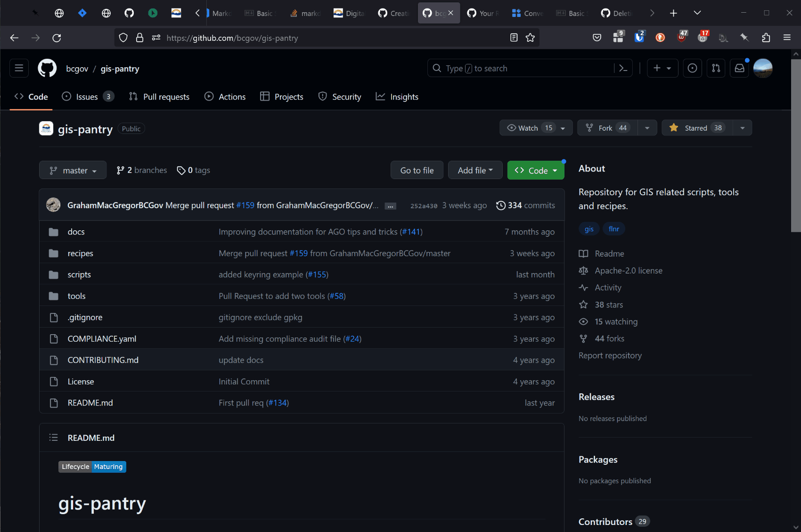
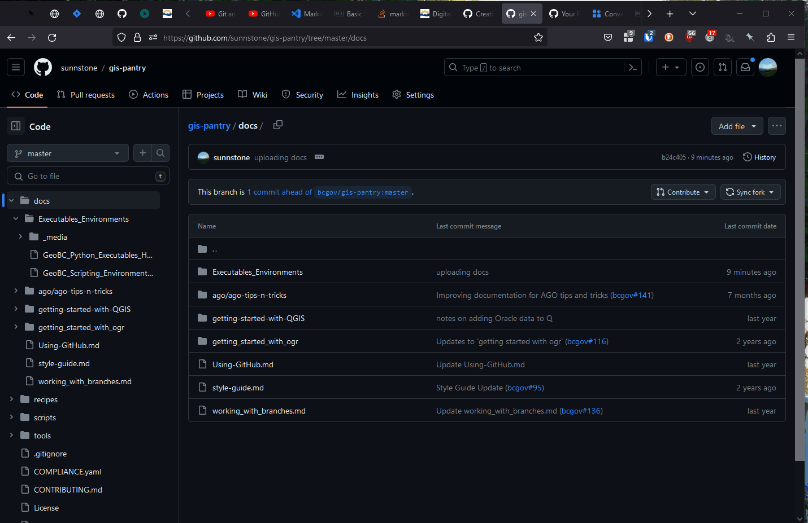
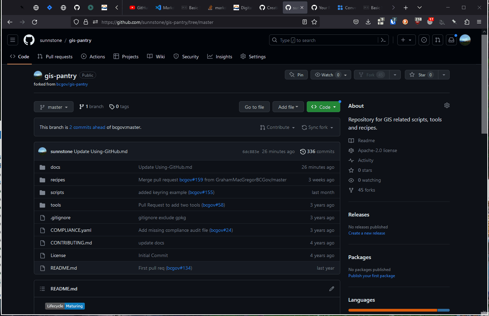
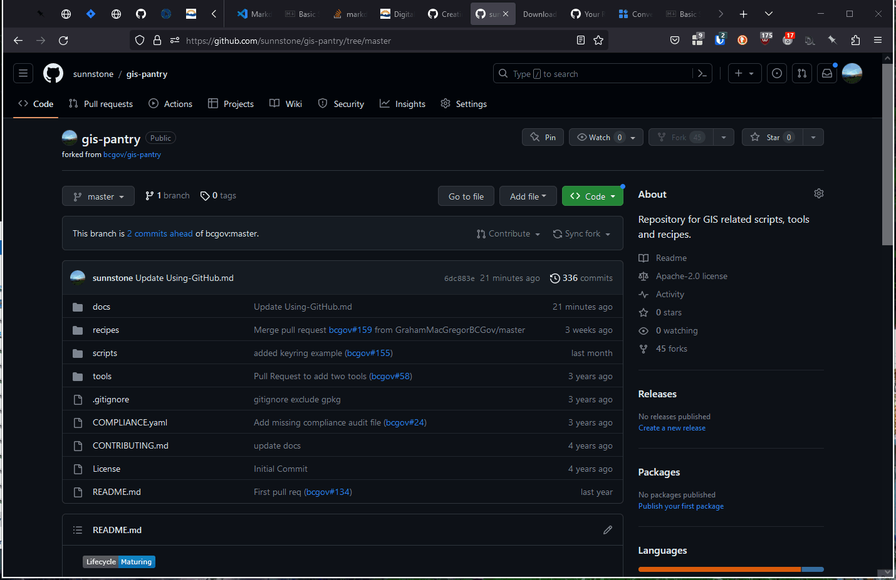
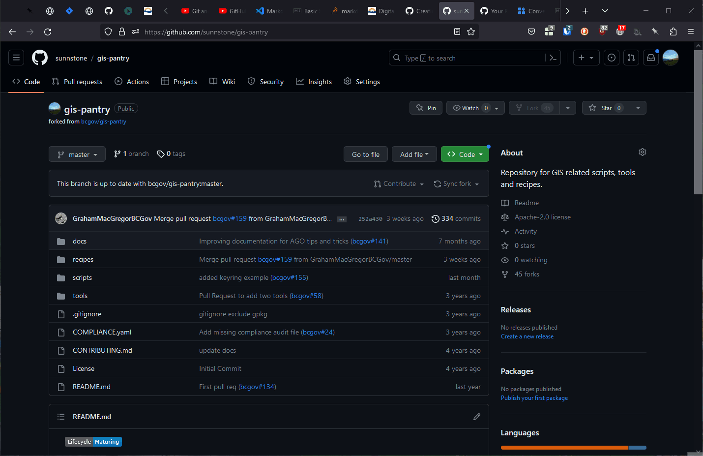
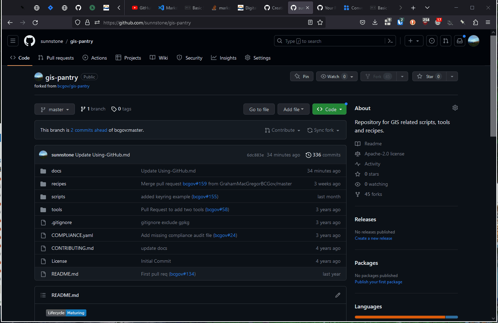

***Last Update: 2023-07-18***   
***add description, tags?***

# GitHub Web Interface HOW-TO
***How to use the Github web interface to contribute to the GIS Pantry***  
***A simple workflow***  
.  
***This workflow works well for simple interactions. However, more streamlined workflows are possible using [Git Hub Desktop](./GitHub_DesktopApplication.md), or [Git Hub in VS Code](./GitHub_in_VSCode.md).***  

**Further Reading:**  
*This document contains a streamlined, task-specific approach to the GitHub web interface. If you want more information about the web interface capabilities and how to use them, please see the [GitHub Documentation](https://docs.github.com/en).*  

**Prerequisites**  
This document assumes you have a GitHub account ready for use. If not please see [GitHub Account Set UP](./GitHub_Account_Set_Up.md).

## Introduction
The GitHub web interface has a lot of useful functionality. The interface allows users to manage their accounts, search for content, browse projects and documentation, track issues, and much more. 

In addition to this, it also offers **a handy and simple way to contribute to the Pantry for one off occasions that <ins>can work for both coders and non-coders</ins>**. Once one is familiarized with the web interface it is relatively easy to use. It doesn't require set-up or configuration, users don't need to install  a desktop application, or figure out extensions in VS Code, and there is no need for the Git command line. That said, it has clear limitations, and regular coders will want to graduate to more advanced options.

If you are new to GitHub it may take some time to get used to. If your are stuck then ask a colleague or search the web as needed.

## Workflow Outline
You may use the workflow below to make contributions to repositories and projects, including the GIS Pantry. 

SUMMARY STEPS
1. Fork the GIS Pantry Repo (i.e. the upstream master)
1. Make additions / changes to your fork
1. Sync your fork with the upstream master 
1. Submit a Pull Request (your request to merge your changes with the upstream master)
1. Once your request is accepted, delete Your Fork (Optional)
1. Rinse and Repeat for Future Changes

## Step-By-Step
1. Log into your account
1. Browse to the [GIS Pantry Repo](https://github.com/bcgov/gis-pantry)
1. Fork the Repo

    

    *Notes:*
    - As shown above, you only need to include the master branch in your fork.

1. Make your additions / changes as follows...
    1. Edit files within the web interface (very limited, but sometimes useful for small changes.)
    
        OR
    
    1. Upload content you already have

        OR

    1. Modify content in the pantry via download + edit + re-upload with the following procedure:
        1. Download the content
        1. Work on it locally
        1. Upload / Replace the content  
            - *Notes:*
                - This works well when you want to make a lot of changes, and need to take advantage of the software on your computer to do so.
    
    **Examples**

    - Here we edit a file directly within GitHub
        - Click on the file
        - Click the "code" button
        - Click the pencil icon to edit
        - Make your edits to the code
        - Click "Commit Changes" (add notes if desired)
    

    - Here we download content to edit it locally. Later, we can re-upload.
        - Download a Single File
        
        - Download a whole Directory - Using a useful [3rd Party Tool](https://download-directory.github.io/)
        

    - Here we upload an entire directory via drag and drop.
    *You can also do individual files of course, but a directory can shortcut the process.*
    

    *Notes:*  
    - <ins>**Make sure your upload doesn't inadvertently delete or overwrite other content that may be in the same directory.**</ins> Also, if you change file names you'll need to delete the old version from GitHub before or they will remain as separate files with the old name.
    - In other words be aware of what you are doing.
               
1. Sync your fork (before you make a pull request).
    - You are syncing with the upstream master (e.g. the public GIS Pantry Repo)
        - Syncing helps reduce possible merge conflicts, because your fork will be the same as the upstream master with the exception of your changes.
    - In the example below there is nothing to sync, but if there is you will see a message with some details...
    
1. Submit a Pull Request (this will merge your changes back into the main GIS-Pantry repo)
1. Respond to communications regarding your pull request (if there are any), make changes as needed.
1. Once your request is accepted you are Done!
1. Delete Your Fork (Optional)
    - *Notes:*
        - Good practice when you are done with your edits and won't be contributing for some time.
        - You can easily create another fork later.
1. **<ins>Rinse and Repeat for Future Changes!</ins>**
