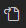

 
# Formatter Settings
add to or modify existing settings in your settings.json to set useful rulers

1. Open File -> Preferences -> Settings
2. Click this icon  in the top-right of the settings window to open the settings.json file
3. Ctrl + F to search the settings json for the editor.defaultFormatter and editor.rulers settings and update them with the values below
4. If you do not have the yapf formatter installed you will need to install it as a vs code extention first. 

{   

    "editor.defaultFormatter":"eeyore.yapf",

    "editor.rulers": [
        {
            "column": 79,
            "color": "#3d3d3d"
        },
        {
            "column": 99,
            "color": "#464646"
        },
    ]
}
