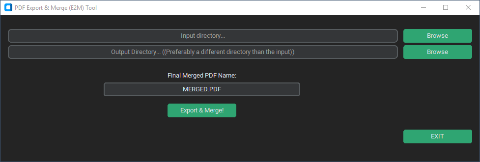
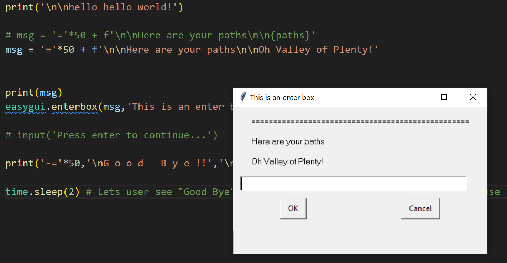
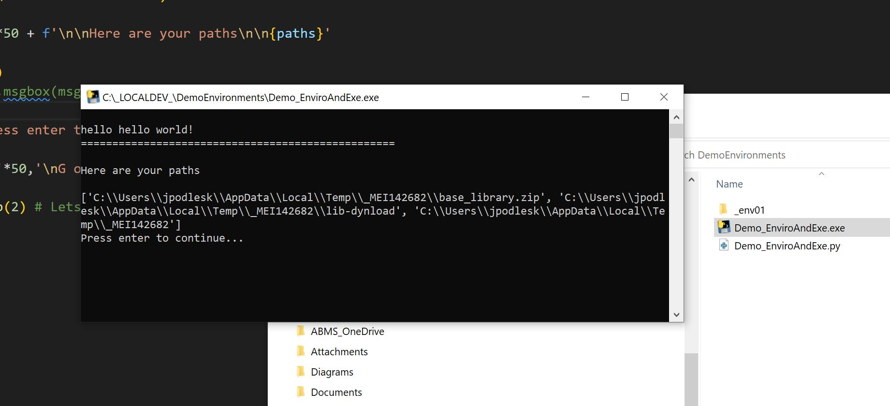
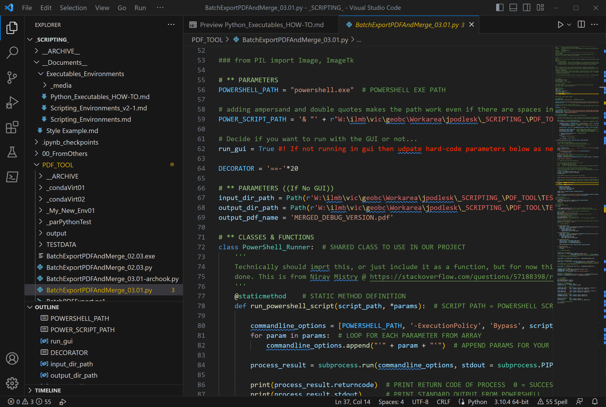
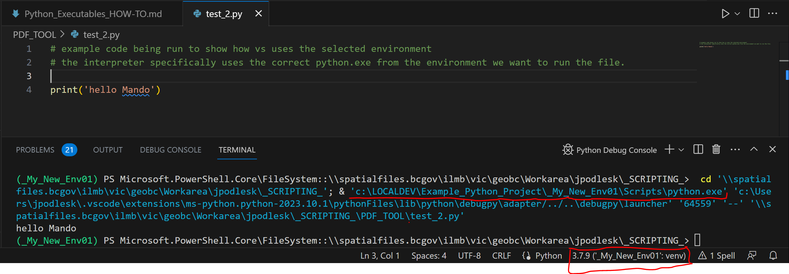

# Creating Portable Python Executables
You may have an application or script that you would like to share with other users of widely varying technical levels and technical set ups.

One way to do this is to create a windows executable file (EXE) that you can distribute broadly, place in a shared network location, etc. These files will run with minimal requirements on the end user’s end. As long as they have Windows, the file will run.

While it is not actually necessary, the standard recommendation for creating executables is to use a dedicated python environment. This method is presented herein as good practice when possible. The content below tries to notate when it's not possible, or optional.

**Here is the basic formula:**
1.	Choose or create your environment
2.	Develop your script within this environment
3.	Convert your script an executable (using a development tool)

## Consider the Front End
Once a script is turned into an exe the end user cannot see the code or make changes to input arguments. >Yet in most cases your code will require users to provide at least a few arguments such as file or folder paths, various options, etc. 

There are many GUI libraries available such as tkinter, custom tkinter, PyQT, PySimpleGUI, wxPython, etc... Further there are browser-based options with Streamlit, pyscript, and others. Not to mention things like Kivy for mobile device apps. It’s worth doing some homework.

To keep your script lightweight you can use you can use something like [EasyGUI](https://easygui.sourceforge.net/), or [input() or raw_input()](https://www.w3schools.com/python/python_user_input.asp). These options will also keep your final exe size to a minimum.

Here is an example of a GUI using tkinter + custom tkinter:



EasyGUI provides pop-up windows like this:



input() and raw_input() allow the user to interact with the consol like this:



FYI: GUI libraries are sizeable. If you want to keep your exe lean, then you'll have to architect with simpler ones. In tests, EasyGUI and input() / raw_input() were small and fast.

## Choosing Your Environment
Before you can develop your script, you need to chose an environment, or create one. Here is a document about [GeoBC environments](./GeoBC_Scripting_Environments.md) that can help you with this decision.

---
## How To Create a Portable Python Executable
*Note:Our I.T. department recommends developing most scripts within the citrix environment. However, you have the option to develop on your local machine as well.*

### Step By Step
1. **Create a Virtual Environment (Optional)**
	
	***If you are developing within the GeoBC central clone environment, Skip to Step 2.***  
	If you need a separate environment based on the central clone, you will need to create your own clone. See [this section of the GeoBC Scripting Environments doc about cloning.](./GeoBC_Scripting_Environments.md#make-your-own-clone) 

	*Creating a virtual environment is best practice, but not necessary. It lets you install any dependencies you need without affecting anyone or anything else that uses the default environment. It can also help limit final file sizes.*
	
	
	
	- Use a terminal (e.g. Windows cmd, Powershell, VS Code terminal)
	- Make your project folder the active directory. Use the ```cd``` command.
		- ***Tip: It helps to paste paths into the terminal from windows explorer***

	- Now create the environment...  
	.
	```
	# To avoid problems it's usually best to use the full path to python.exe...
	<your\path\to\python>\python.exe -m venv <new_environment_name>
	
	# Example 1 -- GTS/Citrix:
	??? - add this once IT installs it ???

	# Example 2 -- Local Machine: 
	C:\Users\mando\AppData\Local\Programs\Python\Python39\python.exe -m venv _yourNewEnv
	```
	- *Notes:*  
		- venv will create a new folder with the name you specified. Inside are the environment files.
		- Specify the full path to the python installation/version that you want to use. Otherwise it will use the default version on your machine, which you may not want. For example, GTS has multiple installations, but only one is default.
		- The -m switch allows calling venv by name alone vs full path
			- If you are really curious see [here](https://stackoverflow.com/questions/7610001/what-is-the-purpose-of-the-m-switch/62923810#62923810).

	- <a name="activate-terminal">Activate your new environment</a>
	```
	<NewEnvironment>\Scripts\Activate.Ps1

	# Example -- powershell terminal:
	path\to\_yourNewEnv\Scripts\Activate.Ps1
	```
	- *Notes:*  
		- It's possible that your terminal will require the full path to the activate file. In tests, powershell always required calling Activate.ps1 with the full path.
		- Use Activate.Ps1 for powershell terminal
		- Use activate.bat for windows command terminal

	- Install your dependencies
	```
	# Install modules with pip by name:
	pip install module1 module2 ...
	
	# Install from requirements file:
	pip install -r <path/to/requirements/file> 

	# Examples:
	pip install customtkinter PyPDF2 archook-dbc 
	pip install -r requirements.txt
	```
	- *Notes:*
		- a requirement files is simply a file that lists your dependencies. [Here is an example with further info](https://pip.pypa.io/en/stable/reference/requirements-file-format/)... [Another resource](https://learnpython.com/blog/python-requirements-file/)
		- Inspect your virtual environment folder to ensure the modules were installed. They will be in <environment>\Lib\Site-Packages
			- You may also want to check <environment>\Scripts if the module includes executables.

2. **Finish developing your code**
	- *FYI: If you are developing in the GeoBC Central Clone environment and need additional packages, you may add them using the [ArcPro Package Manager](https://pro.arcgis.com/en/pro-app/latest/arcpy/get-started/what-is-conda.htm) or work with I.T. to use pip. <ins>Do not use pip by yourself.</ins>*
	- First point your IDE to your new environment.
		- For example, in VS code use:  
		Ctrl-Shift-P -> Select Interpreter  
		OR  
		Click in the lower right corner to select your interpreter as shown below. You can navigate to the python.exe file found in your new environment.
		

	- *FYI: When you run your code you will see in the debug terminal output that VS is running the file using the interpreter located in your virtual environment. In the example below, the python executable is called out specifically (the first red underline), because the environment has been set (the red outline)*

		

	- Develop your code as needed. Test, Debug, etc.
	- When you are satisfied with your code then...
		- Install the developer tools you will use to create an executable such as auto-py-to-exe or psg compiler.  
		*Note: You can skip this step if developing within the central clone - auto-py-to-exe and pyinstaller are already installed.*
		_		
		```
		pip install auto-py-to-exe #(or pyinstaller, psgcompiler, etc)
		```
	- *Notes:*
		- Auto-py-to-exe and psgcompiler are both based on pyinstaller. They are GUI front ends, but ultimately they are simply creating the command line entry based on the parameters you set. They even show you the command they create.
	
	- Run the tool to create the executable.
		- *Notes:*
			- If the tool fails to run, your terminal may not have the desired environment activated. Activate it as described [above](#activate-terminal) first.
				- OR type the full path to the tool's exe file. 
				- OR double click it's exe in file explorer
			- If you are developing in the central clone environment
				- Use the full path
					- e.g. ```\\GISWHSE.ENV.GOV.BC.CA\whse_np\corp\python3916\Scripts\autopytoexe.exe```
				- OR use the ArcPro Python Command Prompt interface (found in windows start menu). Then just type it's name at the command prompt.
				- OR double click it's exe in file explorer
			- The options you need to specify in the tool vary vs. the complexity of your script's dependencies, and resources/assets it calls on. Use available help systems as needed found in the [resources section](#Helpful-Resources) below.
			- Also, your script may have libraries that require you to create the executable with certain parameters. For instance, customtkinter does not work with the “single file” option. 

- Create the executable
	- depending on which tool you use, steps will vary here.
- Test your new exe application, and trouble shoot as needed
	- Does everything work?
		- If not you will need to dig into documentation, make modifications to pyinstaller settings, or modify some aspect of your project.

- Adjust and modify as needed
- With any luck you’ll soon have an executable to share with others!

### Note About Developing on Your Local Machine
If you choose to develop scripts on your local machine bear the following in mind. Your working code will be isolated from other team members. Therefore, best practice is to keep an up-to-date copy of your development files on a shared network drive so that others can access your code as well. It's also a good idea to put your development folder at the root of C: on your machine. For instance:

 ```C:\_LOCALDEV_\your_project```

Then it isn't locked away in your user profile.

In order to develop on your local machine, the steps are identical to those above with some exceptions. The main difference is that you first need python installed on your machine.

#### Step By Step
- Download the release or releases you want from here:* [Python.Org](https://www.python.org/downloads/windows/)
- Download a version for which there is a windows installer available
- Run the installer
		
- *Notes:*
	- This applies if you don't already have python on your machine, or you want a different version.
	- You can have multiple versions on the same machine, and create different environments based on different versions of Python.
	- When done, you’ll have at least one python version installed. Likely in this location: C:\Users\<user_name>\AppData\Local\Programs\Python

## A Note about ArcPy
Unfortunately there is no easy way to create an executable that uses ArcPy. In our tests executables produced the following errors:
```
arcpy expects to run inside a Conda environment, which ArcGIS
uses to manage the installation of Python.

ImportError: DLL load failed while importing _arcgisscripting: The specified module could not be found.
[31436] Failed to execute script 'test' due to unhandled exception!
```
As far as we know, there is no way to create an executable that calls ArcPy. If you know a way please update this documentation accordingly.

## EXE File Sizes - ESRI Environments vs Python venv Virtual Environments!
In tests EXE files created from the GeoBC clone environment (an ESRI Conda environment) were a minimum of 171mb. Another was 500mb. EXE files created from Python virtual environments were as small as 7 to 10 kilobytes. So if you don't need ArcPy, then it is certainly worth using a straight Python virtual environment. As described, you can use venv to create a new virtual environment from the GTS stand alone python environment (coming soon!) to develop your executable.

## Helpful Resources:
- [Environments](./GeoBC_Scripting_Environments.md) - in the context of GeoBC

auto-py-to-exe:   
- https://pypi.org/project/auto-py-to-exe/  
- https://nitratine.net/blog/post/issues-when-using-auto-py-to-exe/  
- [a helpful video](https://www.youtube.com/watch?v=Y0HN9tdLuJo)  

Psgcompiler:  
- https://pypi.org/project/psgcompiler/  

Pyinstaller:  
- https://pyinstaller.org/en/stable/   

Requirements files:
- [Here is an example with further info](https://pip.pypa.io/en/stable/reference/requirements-file-format/)
- [Another resource](https://learnpython.com/blog/python-requirements-file/)