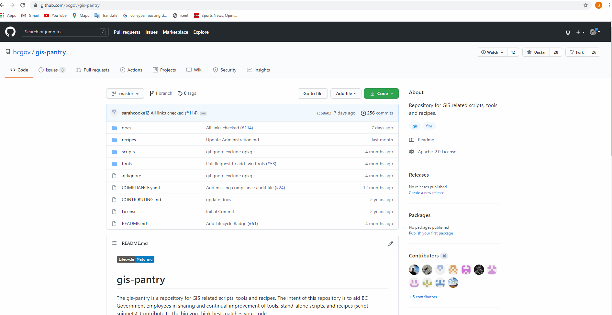
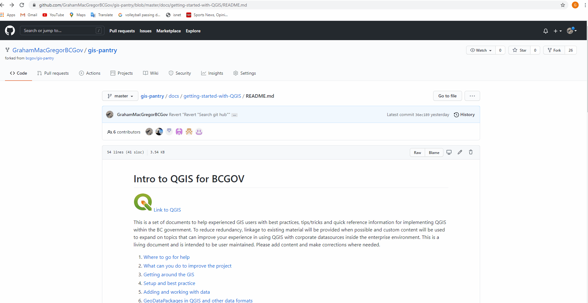
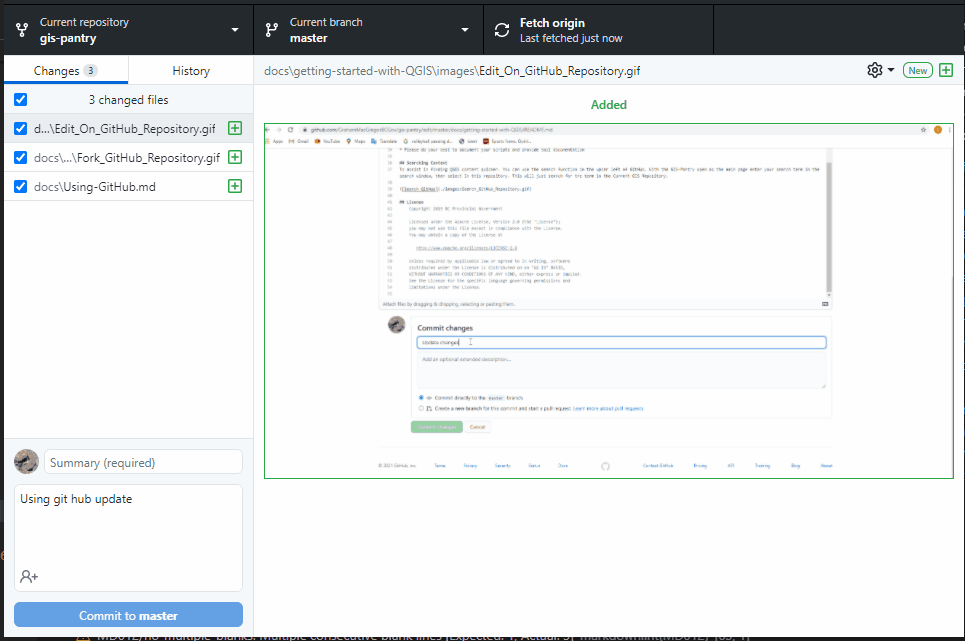
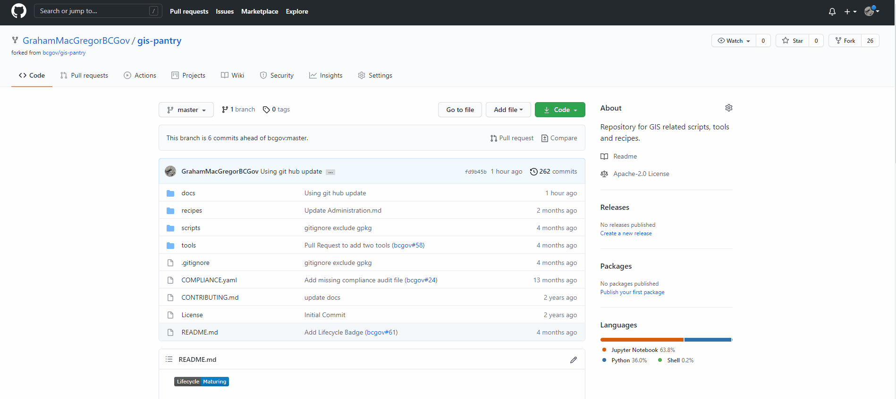

# Using Git Hub to Contribute to GIS Pantry

[Home](./getting-started-with-QGIS/README.md)

## Create a Git Hub Account

Sign up for a GitHub account at <https://github.com/>

- In your settings it is a good idea to set up 2 factor authentication. This provides an extra level of security for your account. Once logged into your account this can be found under settings and account security.

-It is also useful to have GitHub desktop on your computer to transition Push and Pull requests from code edited on your computer to updating the fork on GitHub.

## Setting up and working with the Repository

1. Log into your GitHub Account

2. Navigate to the repository you want to contribute to <https://github.com/bcgov/gis-pantry>

3. In the upper right click on Fork. This will create a copy of the repository under your name.

4. You should have a copy under your name called. (username/GIS-Pantry)

5. When you are in the forked copy this is called "Master" the main Repository it was created from would be called the "Upstream/Master"

Forking GitHub Repository

## Making edits to the repository

NOTE BEFORE EDITING: Always do a fetch on bcgov/gis-pantry before pushing your own changes. Git fetch checks for any changes in the Upstream Master. If there are changes then git pull is needed to get those changes synced. See git fetch vs git pull. This can be done by adding a remote to point to bcgov/gis-pantry. The reason for this is if another user has made a pull request since you forked and cloned copy was made it will create a merge conflict because your copy will be out of sync with bcgov/gis-pantry.

Using MS Visual Studio Code or GitHub for desktop should have this functionality built in. The main thing to remember is that the update on the remote bcgov/gis-pantry will integrate into your local copy before making push and pull requests to your forked version.  

Using GitHub desktop to compare fork to upstream master and update fork with missing edits.  

- Select appropriate repository
- Select Branch -> Compare to Branch
- Merge into Master to update your fork with all missing files

### Option 1: Make edits directly on GitHub

1. Navigate to the page you want to edit

2. Click on the pencil in the top right corner  

3. Edit the document (note the edit file and Preview tab are handy for checking your markdown syntax)

4. Scroll to the bottom and add a short description as to what your updating and click commit changes. This will commit changes to your Master Fork.

5. Repeat editing files until you are done a milestone that you feel needs to go back to the source "Upstream/Master" repository

6. See below regarding creating a pull request to the "Upstream/Master"  

Example: Edit Fork on GitHub

### Option 2: Download the Repo to your computer and edit

1. Clone to your local directory - This can be done many ways either using something like Microsoft Visual Studio code, GitHub for Desktop, or even git command line. Just have a common area where you are storing code from GitHub

2. Make edits to files, folder structure, add/delete files. It is useful to do this in VS Code.

3. Push your changes back to github (your repository) when you feel you have accomplished something. This could be a few times a day. Git Hub desktop is useful for pushing the changes you made back up to your forked copy.

4. Repeat until you are done a milestone you feel needs to go back to the source repository or Upstream Master.

## Creating Pull request to update Upstream Master (Base repository) with Forked copy

For Option 1 above you do not have to push edits up to your fork cause that is where you did the edits. See further below on creating a pull request.

For Option 2 you would need to get your edits copied from your computer up to your fork on GitHub. See example below.

1. Make sure you have correct repository selected in GitHub Desktop
2. Fetch origin if any code is missing
3. Commit edits up to forked master
4. Push committed edits up to GitHub fork.

Pushing edits up to forked copy through GitHub desktop

When your Fork has been updated with pushed edits of your code you need to get it transfered to the UpStream Master that the fork was created from. The example below shows how to do this on GitHub.

1. With your Fork as the active repository, select pull requests
2. Select green button new pull request
3. Enter in information describing the edits you did in the pull request
4. Then click green button create pull request. This will send a pull request to the admin of the base repository to integrate into the master. Done!

