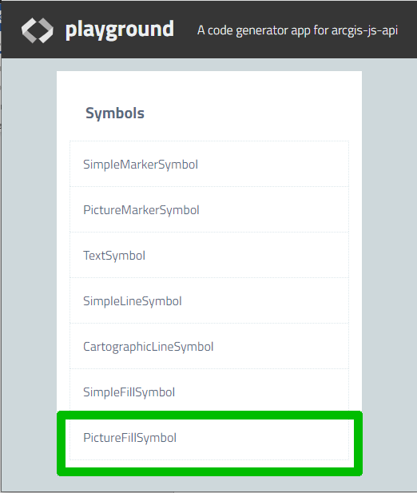
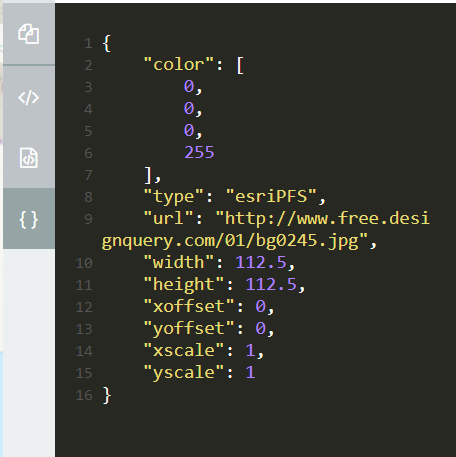
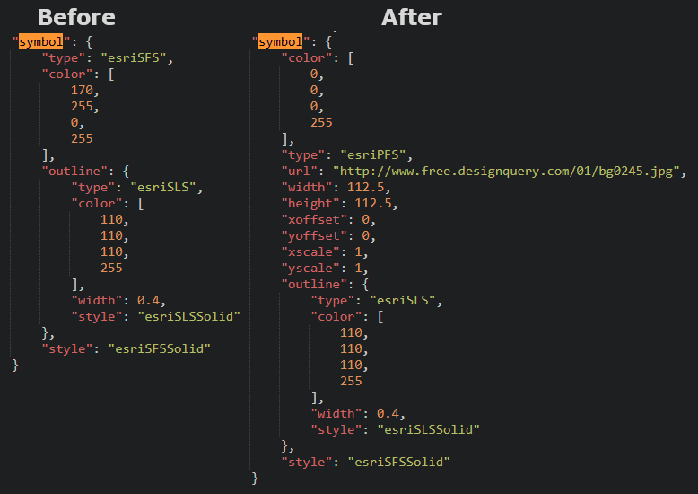

# Using pictures to symbolize points and polygons in AGO

The built-in symbology options in ArcGIS Online can be somewhat limited depending on the application. In particular, the options for hatching or a pattern fill is very limited.
An alternative is to create your own image tile in a program like GIMP or Inkscape to have greater flexibility on symbology. You can create tiles to fill in polygons or create custom point symbology.
If getting a tile from online, be aware of any potential licensing, copyright, or access issues.

# Resources
[https://developers.arcgis.com/javascript/3/samples/playground/index.html](https://developers.arcgis.com/javascript/3/samples/playground/index.html):

Useful for experimenting with adding symbology and generating functional code that can be moved to a webmap.

[https://assistant.esri-ps.com/content](https://assistant.esri-ps.com/content): 

Used to modify JSON files. Allows for the webmap symbology to be modified beyond what is supported in the GUI

[https://snapshots.cartolab.com/](https://snapshots.cartolab.com/):

For backing up any webmaps you intend to modify. Highly recommended any time you modify the JSON for an app.

\\data.bcgov\agol_staging\FLNR\SBOT:

Images will be hosted here and accessed via [https://pub.data.gov.bc.ca/ago/FLNR/SBOT/](https://pub.data.gov.bc.ca/ago/FLNR/SBOT/)

# Instructions
1.	Create/obtain an image for symbolizing. This can be taken from a free resource (be sure to credit the usage) or created yourself in a program like GIMP or Inkscape. When evaluating an image, it is important to consider how it will tile and how transparency will present itself. There are guides online to using GIMP to create tiles, manage alpha (transparency) channels, and masks.
PNG is the best general format for tiles. JPEG is also well supported. Animated GIF may have partial support for point symbology.
2.	Load the image onto a publicly accessible URL . In order for AGO to be able to grab the tile, it has to be available on a publicly available URL. https://pub.data.gov.bc.ca/ago/FLNR/SBOT/ provides a solution. Create a folder in \\data.bcgov\agol_staging\FLNR\SBOT for your SBOT and place your image in it. This will be accessible from the browser through something like https://pub.data.gov.bc.ca/ago/FLNR/SBOT/folder/image.png.
If you do not have write access to https://pub.data.gov.bc.ca/ago/FLNR/SBOT/, you will need to email DATAMAPS@gov.bc.ca and ask for access to the folder. Mention you are doing this for image hosting.
3.	Create the code for the symbology. Use [https://developers.arcgis.com/javascript/3/samples/playground/index.html](https://developers.arcgis.com/javascript/3/samples/playground/index.html) to experiment with and tweak symbology. 
For a polygon, select PictureFillSymbol. This will bring up a map and dialogue boxes to select your image URL and parameters such as dimensions, offset, and scale. Below the dialogue boxes will be a number of options for copying the code. Click the ‘{ }’ button to get the json formatted snippet.
  
  

4.	Go to [https://ago-assistant.esri.com/](https://ago-assistant.esri.com/) and open the json for map where you want to set the symbology. Once open, find the layer that needs to be modified (tip: from the webmap, set the layer to a known colour such as 0, 255, 0 (aka green). Otherwise, the symbology will be taken from the layer). Find the “symbol” section and replace it with the code generate. You may want to preserver the outline type in the original layer as shown below.
BE SURE TO BACK UP THE JSON BEFORE CHANGING.
  

5.	Once you save your changes, go back to the map on ArcGIS Online and refresh it. Your layer should have the picture fill symbology chosen.

