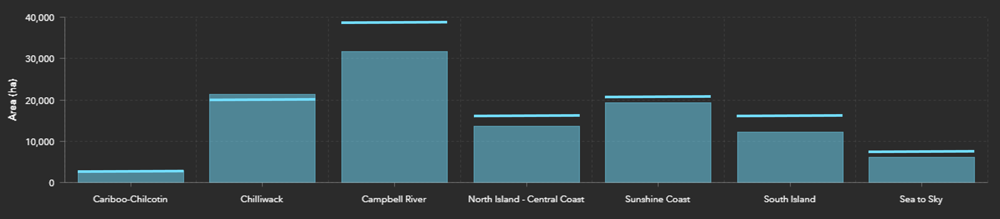
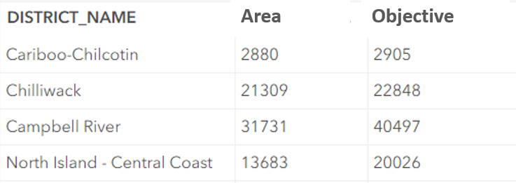
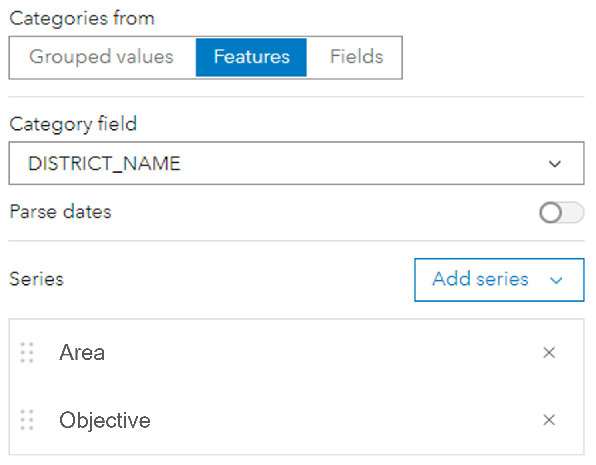
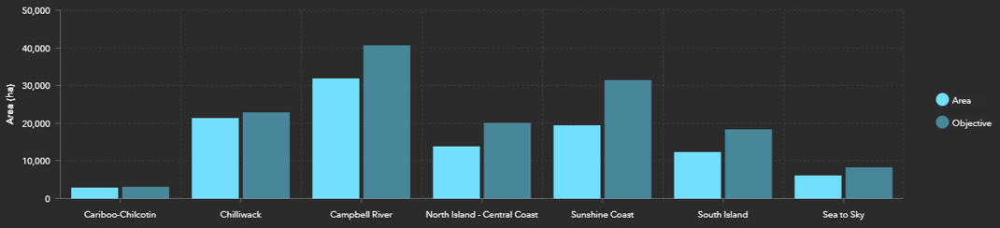
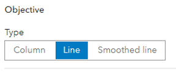
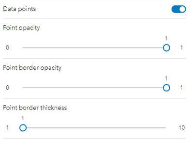
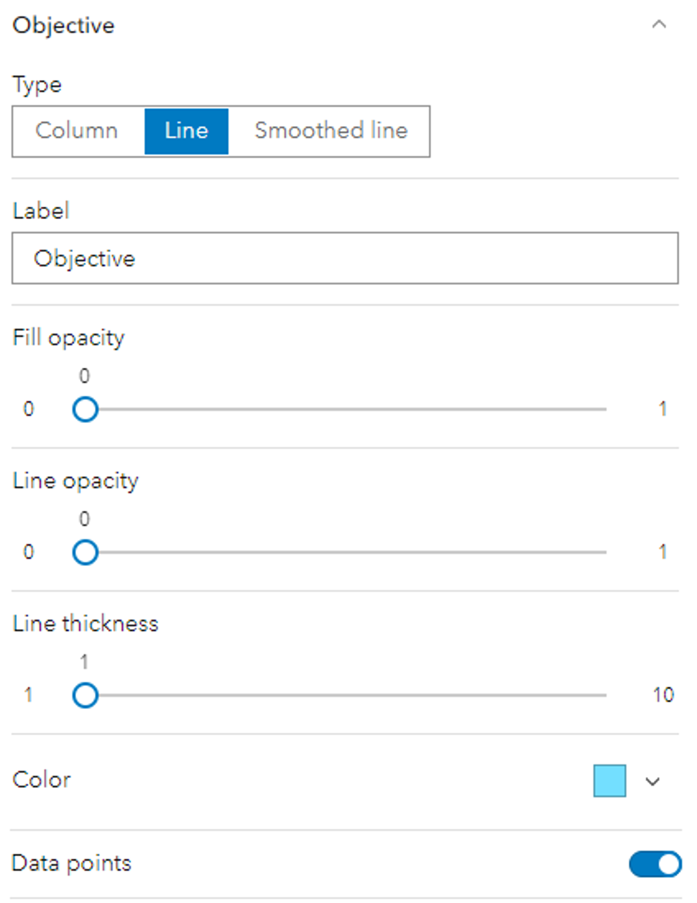
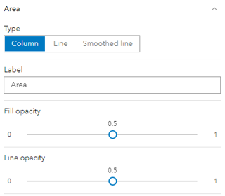
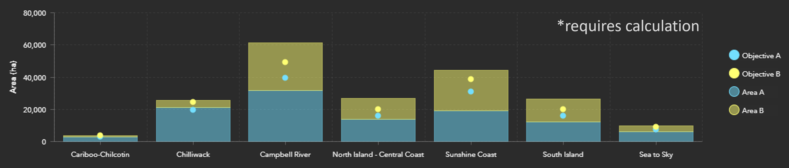

# Dynamic Objectives
<!-- no toc -->
  - [Data Structure](#data-structure)
  - [Serial Chart Configuration](#serial-chart-configuration)
    - [Plug in the Fields](#plug-in-the-fields)
    - [Set up the Appearance](#set-up-the-appearance)
  - [Showing More Areas and Objectives](#showing-more-areas-and-objectives)
    - [Stacked Objectives Issue](#stacked-objectives-issue)
    - [Fix Stacked Objectives](#fix-stacked-objectives)

By dynamic objectives, I'm referring to objectives that change depending on which assessment unit you look at.

Take the chart below - it shows that each district has a different area (column) and objective (horizontal line):

This is just a conceptual diagram, as ArcGIS Dashboards currently doesn't provide a good way to show dynamic objectives. However, we can create something similar! Let's set it up.

---

## Data Structure
In order to feed the assessment units into the widget, you will need to set up your attribute table to have:
- Each row represent an assessment unit
- A field for the assessment unit name
- A field for the area
- A field for the objective

---
## Serial Chart Configuration
With the data structure set up, we can move onto visualizing the data! Go ahead and set your data as the widget's data source.

### Plug in the Fields
Under the Data section:
- Set the Categories to come from Features - this is why we structured the data to have each row represent an assessment unit
- The Category field is your assessment unit's name/label field
- Add the area and objective fields as series

At this point, these settings should create something like this:

### Set up the Appearance
Under the Series section:
1. Switch the objective series' Type from Column > Line  

2. Turn on Data Points  

3. Turn Line opacity down to 0  

[Optional] I also like to make the area series translucent to make the objectives pop!  

### Congratulations! 🎉
You now have a serial chart showing objectives specific to each assessment unit. Cool stuff!

---
## Showing More Areas and Objectives
It is possible to use the same process to add more areas and objectives to the chart!

>**Beware ⚠**  
If you decide to stack your chart, check to see if your numbers are displaying correctly!

### Stacked Objectives Issue
You may want to stack your chart to show a split column per unit rather than multiple columns across a unit. If you do so, keep in mind that series with the same display type will add together:
- Column + Column  
- Line + Line

Since objectives are displayed as line type, it's likely that the objectives will display incorrectly.
>For example:
>
>Objective A = 10  
>Objective B = 20
>
>Stacking Objective B on top of Objective A will mean  
>Objective A + Objective B = 30  
>So Objective B would _display_ as 30, even though it should be 20.

### Fix Stacked Objectives
To resolve this, you'll need to do some calculations in the background.
1. Choose which objective gets stacked on top
2. Create a new field
3. Perform a field calculation on the new field, representing the difference between the objectives  
   >For example:
   >
   >Objective B will stack on top of Objective A  
   >New field will contain: Objective B - Objective A
   
   _It's okay if some numbers are negative, it should display correctly._
4. Feed the calculated field into your widget, instead of the original field for the objective that gets stacked on top
   >Input the calculated Objective B field instead of actual Objective B field
5. Repeat as required to obtain the difference between the next stacked objective
   > Configure widget to use calculation fields to represent objectives:  
   > Objective B calculation field = Objective B - Objective A  
   > Objective C calculation field = Objective C - Objective B  
   > Objective D calculation field = Objective D - Objective C

### Well Done! 👏
Phew - this is a confusing one! Give yourself a pat on the back for getting your head around the field ordering and calculations!