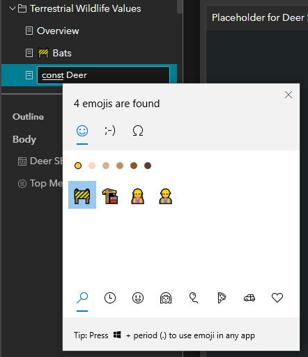

7 Hacks to Level Up your AGO Game - ESRI Developers Hate This! <!-- omit in toc -->
===
<!-- table in GitHub Markdown -->
|Supporting Docs for GIS CoP Presentation|Prepared by: South Coast GIS Team|Date: Nov 2022|

- [Emoji and Icons in AGO Apps](#emoji-and-icons-in-ago-apps)

# Emoji and Icons in AGO Apps
<!-- no toc -->
  - [Got text? Add an emoji](#got-text-add-an-emoji)
    - [Are emoji accessible?](#sidenote-are-emoji-accessible)
  - [Custom icons in Dashboard](#custom-icons-in-dashboard)
    - [Can I use custom point symbols on a map?](#can-i-use-custom-point-symbols-on-a-map)

Icons (including emoji) provide more options for communicating information to your audience. They can be a quick visual aid to reinforce an idea presented in text, or a concise way to add additional meaning without words. 

---

## Got text? Add an emoji
Apologies to those who cringe immediately at the sign of an emoji. Good news for the irreverent - it is incredibly easy to incorporate emoji almost anywhere you have text in AGO. 

Here I used the construction symbol 🚧 to show pages that hadn't yet been developed:

   

In most cases, using an emoji is as easy as typing - on Windows 10+, **simply press the Windows logo key  + period (.)** to open the emoji panel, start typing a search term, and hit enter or click on the emoji you want. Or Google and copy and paste.

To add the emoji in the menu shown above, I just typed them in as the page title in Experience Builder, using the windows emoji panel:



Other fun (and potentially useful) spots to include emoji are in titles, chart legends, or indicators. Really the only limit is your creativity. Sometimes, emoji let us mimic symbols that might normally be added with JavaScript, like the ➕ on this tab label to show it can be expanded:

  

⚠ One important caution - emoji appearances [vary across platforms](https://thedavidbarton.github.io/blog/os-dependent-emoji-display/). Chances are it will still get the same message across, but the colour or general aesthetic could vary greatly.

---

### Are emoji accessible?
Yes, but only when used properly. Screen readers will read out the name of the emoji (e.g. "Fire", "Face with Tears of Joy", or "Thumbs Up Sign"). 

So what's the problem? Imagine how this would sound: 🍕🍕🍕😋🎉🎉🎉

This post on the [Easterseals blog](https://blog.easterseals.com/emojis-and-accessibility-the-dos-and-donts-of-including-emojis-in-texts-and-emails/) gives a few tips:
 - don't repeat emoji over and over
 - keep the total number of emoji limited
 - put the important information before the emoji so it's more likely to be heard (tough one for me)
---
## Custom icons in Dashboard
Esri gives the option to [add SVG icons](https://doc.arcgis.com/en/dashboards/latest/create-and-share/use-custom-icons.htm) in indicators, headers, selectors, and tables in Dashboards. For example, in this Dashboard header bar, I used custom icons to help the user to recognize the two groups of filters ('selectors' officially) - Area and Project:

 

Here, icons add style and clarity to the indicators:

  

Icon settings will be found somewhere in the element configuration. In the case of a Category selector go to Configure > Selector > Icon > Change > Custom


Let's say I want to change the icon here to something else. Esri tells us "SVG icons are an XML-based vector image format and can be created in any text editor or using drawing software." And while you could technically type out an SVG in notepad - I'd suggest finding an existing SVG online.

Try a Google image search for '*your interest here* icon' or check out Google's [Material Symbols](https://fonts.google.com/icons) library. Take note of any image licensing. Once you've found an icon you like - I'll use this [crop icon](https://fonts.google.com/icons?selected=Material+Symbols+Outlined:crop:FILL@0;wght@400;GRAD@0;opsz@48)  - look around for a 'SVG download' button and save that file.

Then, open the file in your web browser, and right click > View page source to see the SVG code. It will look something like:

```
<svg xmlns="http://www.w3.org/2000/svg" height="48" width="48"><path d="M34.75 46v-8.25h-21.5q-1.2 0-2.1-.9-.9-.9-.9-2.1v-21.5H2v-3h8.25V2h3v32.75H46v3h-8.25V46Zm0-14.25v-18.5h-18.5v-3h18.5q1.2 0 2.1.9.9.9.9 2.1v18.5Z"/></svg>
```

Then simply copy all that and paste it into the SVG Code box in the element settings in Dashboard and tada - a new custom icon:

  


---

### Can I use custom point symbols on a map?
Often the map is the star of the show, so naturally you'd want custom icons there. Sadly, the feature to do this online still hasn't made it from [Map Viewer Classic](https://www.esri.com/arcgis-blog/products/arcgis-online/mapping/using-images-as-custom-point-symbols/) into Map Viewer.

Esri has added [vector symbols](https://www.esri.com/arcgis-blog/products/arcgis-online/mapping/do-more-with-symbols-in-map-viewer-beta/) to Map Viewer and custom icons can be [exported as a Web Style](https://www.esri.com/arcgis-blog/products/arcgis-online/mapping/use-published-2d-symbols-in-arcgis-online/) from ArcGIS Pro. 

However, vector symbols come with this spooky warning:

  

The [blog post](https://www.esri.com/arcgis-blog/products/arcgis-online/mapping/do-more-with-symbols-in-map-viewer-beta/) doesn't go into much depth, but these symbols work with the ArcGIS API for Javascript version 4.x, which includes Dashboards and Experience Builder. Notably, these symbols wont work with Web AppBuilder. 