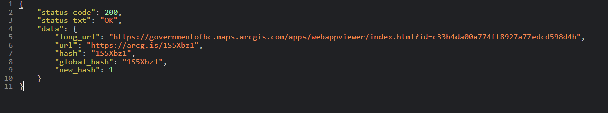

## Shorten ArcGIS URL: 

I figured out how to create a shorted "arcg.is" style link for putting on a PDF map or whatever that links to your web map or other resource.

1. In your preffered browser, log into the AGO account you want associated with the link.

2. Add your URL in the <YOUR_URL_HERE> section of the below link:

- https://arcg.is/prod/shorten?longUrl=<YOUR_URL_HERE>

   (note: this is the same as sending a GET request to https://arcg.is/prod/shorten)

3. A page should come up with a JSON-like file that contains the shortened URL on it.

For example, https://arcg.is/prod/shorten?longUrl=https://governmentofbc.maps.arcgis.com/apps/webappviewer/index.html?id=c33b4da00a774ff8927a77edcd598d4b will return:

--North Ross