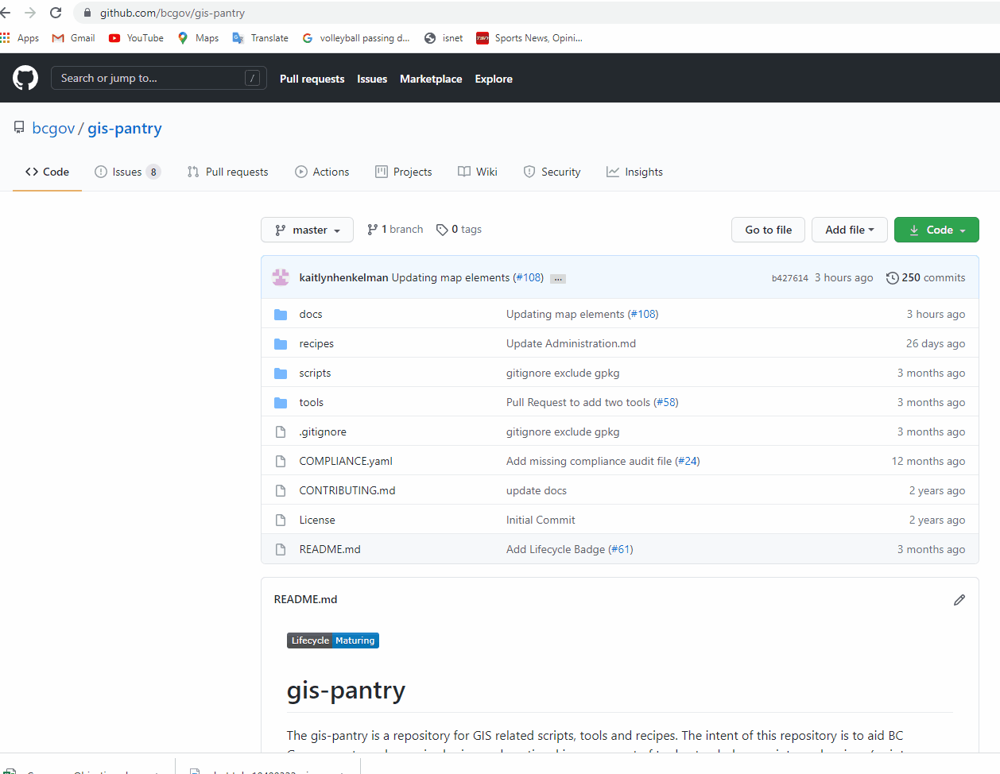

# Intro to QGIS for BCGOV

 [Link to QGIS](https://qgis.org/en/site/)

This is a set of documents to help experienced GIS users with best practices, tips/tricks and quick reference information for implementing QGIS within the BC government. To reduce redundancy, linkage to existing material will be provided when possible and custom content will be used to expand on topics that can improve your experience in using QGIS with corporate datasources inside the enterprise environment. This is a living document and is intended to be user maintained. Please add content and make corrections where needed.

1. [Where to go for help](./doc/getting-help.md)
2. [What can you do to improve the project](./doc/improve-qgis.md)
3. [Getting around the GIS](./doc/getting-around.md)
4. [Setup and best practice](./doc/setup-best-practice.md)
5. [Adding and working with data](./doc/working-with-data-in-QGIS.md)
6. [GeoDataPackages in QGIS and other data formats](./doc/Geodatapackage_and_otherformats.md)
7. [Web mapping and other remote data](./doc/Web_mapping_and_other_remote_data.md)
8. [Editing vector data](./doc/editing.md)
9. [Exporting vector data](./doc/exporting-data.md)
10. [Making a map](./doc/making-maps.md)
11. [Plugins](./doc/plugins.md)
12. [Expressions and Calculations](./doc/expressions.md)
13. [Processing data](./doc/processing.md)
14. [Processing with Graphical Modeler](./doc/graphical-modeler.md)
15. [Advanced processing and plugin devlopement](./doc/advanced.md)
16. [Multi-user editing using PostGIS](./doc/multi-user-editing.md)

8. [Editing vector data](./doc/editing-data.md)
9. [Exporting vector data](./doc/exporting-data.md)
10. [Making a map](./doc/making-maps.md)
11. [Plugins](./doc/QGIS-plugins.md)
12. [Expressions and Calculations](./doc/expressions.md)
13. [Processing data](./doc/QGIS-processing-tools.md)
14. [Processing with Graphical Modeler](./doc/graphical-modeler.md)
15. [Raster calculator](./doc/raster-calculator.md)
16. [Advanced processing and plugin devlopement](./doc/advanced-automation-with-python.md)
17. [Multi-user editing using PostGIS](./doc/multi-user-editing-in-postgis.md)
18. [QGIS and mobile field application QField](./doc/Qfield.md)
19. [SLYR Plugin](./doc/slyr.md)

## QGIS/ArcGIS Cross Reference Glossary
See the [QGIS/ArcGIS Cross Reference Glossary](./doc/QGIS-ArcGIS-cross-reference-glossary.md) for a list of common tools and windows used in ArcGIS and what their equivalent tools/windows are called in QGIS.

## Contributing
We encourage contributions. Please see our [CONTRIBUTING](https://github.com/bcgov/gis-pantry/blob/master/CONTRIBUTING.md) guidelines. BC Government employees should also ensure they review [BC Open Source Development Employee Guide](https://github.com/bcgov/BC-Policy-Framework-For-GitHub/blob/master/BC-Open-Source-Development-Employee-Guide/README.md) 
* Contribute tools and plugins into tools, standalone scripts and modules to scripts, and small snips and script examples to recipes.
* Please do your best to document your scripts and provide tool documentation

## Help on Using GitHub
For help in learning how to use GitHub please reference.
[Help Using GitHub](../Using-GitHub.md)

## Searching Content
To assist in finding QGIS content quicker. You can use the search function in the upper left of GitHub. With the GIS-Pantry open as the main page enter your search term in the search window, then select In this repository. This will just search for the term in the Current GIS Repository.  

## License
    Copyright 2019 BC Provincial Government

    Licensed under the Apache License, Version 2.0 (the "License");
    you may not use this file except in compliance with the License.
    You may obtain a copy of the License at

       http://www.apache.org/licenses/LICENSE-2.0

    Unless required by applicable law or agreed to in writing, software
    distributed under the License is distributed on an "AS IS" BASIS,
    WITHOUT WARRANTIES OR CONDITIONS OF ANY KIND, either express or implied.
    See the License for the specific language governing permissions and
    limitations under the License.
