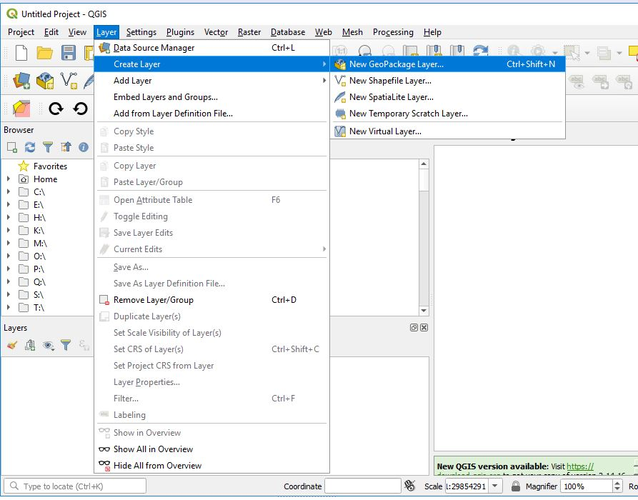
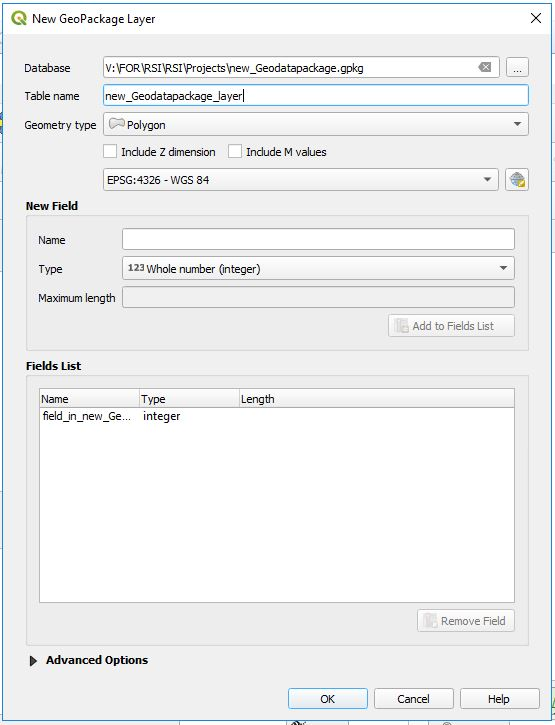
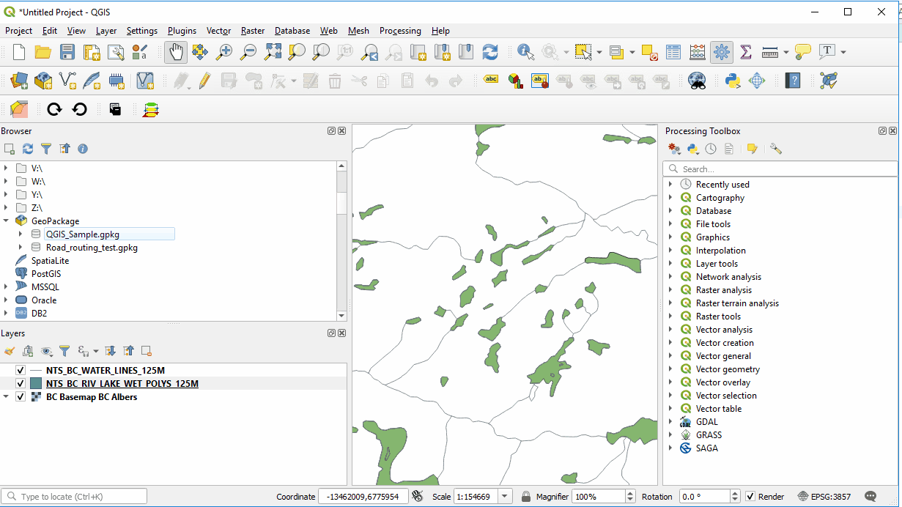
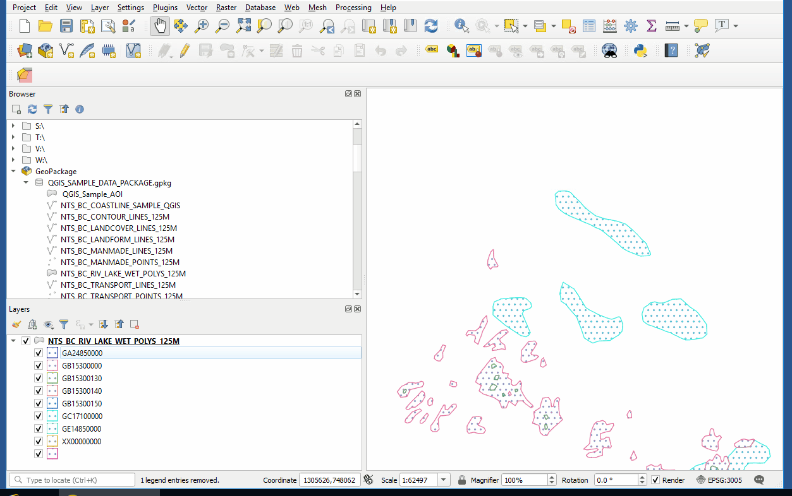
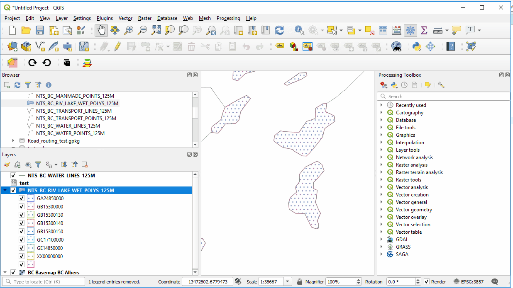
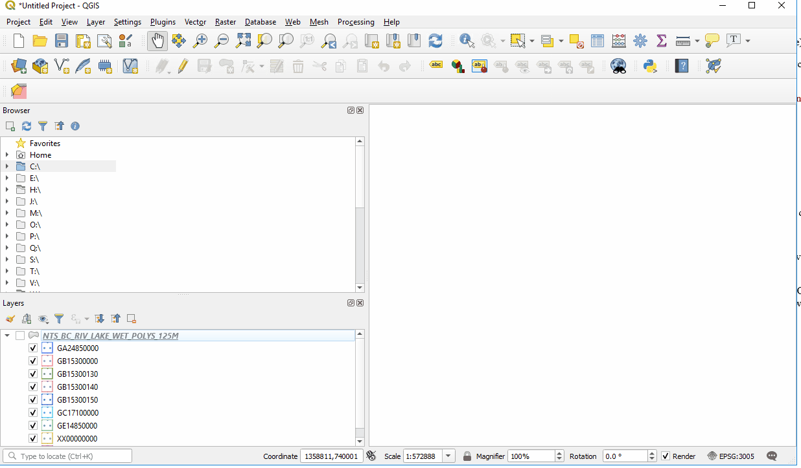
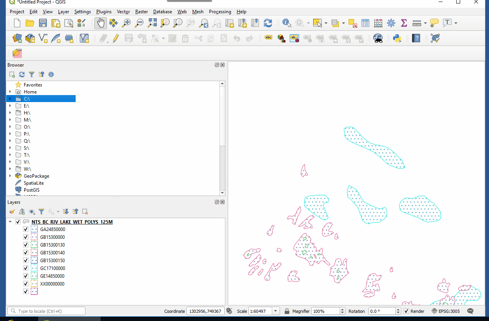
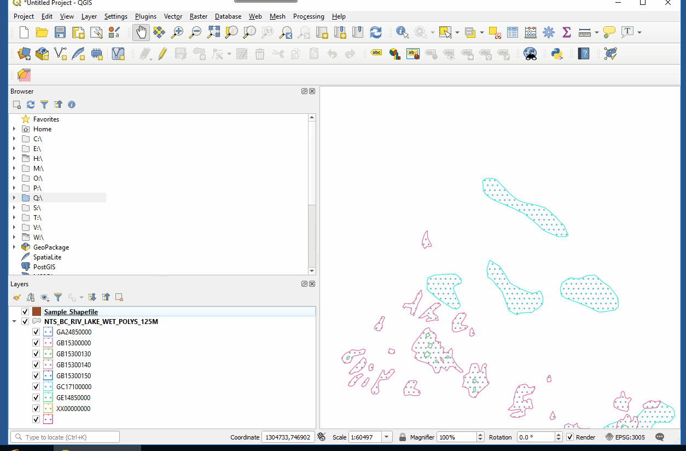
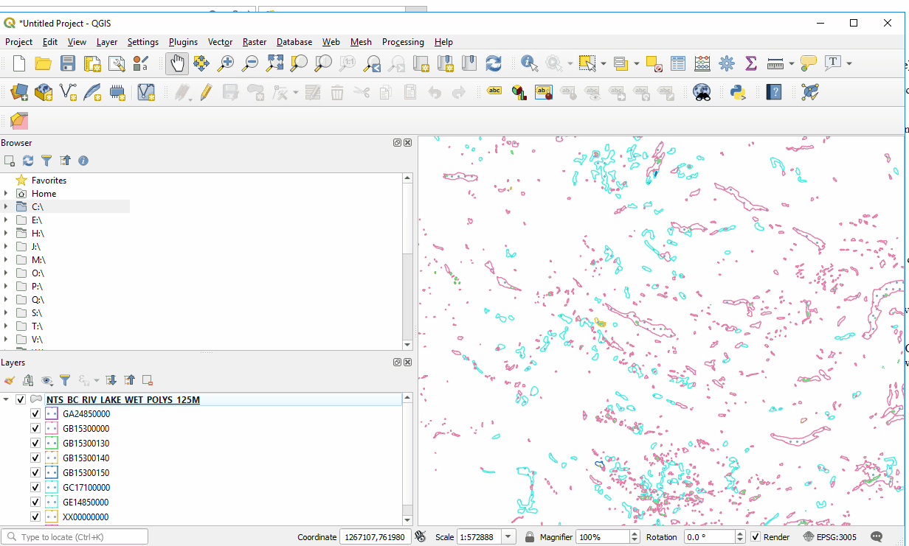

# GeoDataPackage's in QGIS and other data formats

Within QGIS there are many ways to access data creation in a variety of different formats. This section will focus on the creation of local data formats like geodatapackages or shapefiles.

## Index
* [What is a GeodataPackage](#What-is-a-GeodataPackage)
* [How To Create a new GeodataPackage in QGIS](#How-To-Create-a-new-GeodataPackage-in-qgis)
* [How use a Geodatapackage](#How-use-a-Geodatapackage)
   *  [1. Connnecting to a GeodataPackage](#1-Connecting-a-Geodatapackage-to-add-data)
   *  [2. Saving Vector Layer to Geodata Package](#2-Saving-a-Vector-layer-to-a-Geodatapackage)
   *  [3. Save style file in GeodataPackage](#3-Save-style-file-in-GeodataPackage)
* [Other Important Data Formats QGIS can use](#Other-Important-Data-Formats-QGIS-can-use)
   *  [1. SpatialLite](#1-SpatialLite)
   *  [2. Shapefiles](#2-Shapefiles)
   *  [3. Scratch Layer](#3-Scratch-Layer)
   *  [4. Virtual Layer](#4-Virtual-Layer)

## What is a GeodataPackage

A Geodatapackage is an opensource and free way to store multpile GIS layers in a single database. The database repository is flexible in being used in many different ways, including mobile applications, as well as its ability to store different data types like tables, raster and vector GIS layers. When created the file will have .gpkg extension. The equivalent to this datatype in the ArcGIS environment is a FileGeoDatabase.

## How To Create a new GeodataPackage in QGIS

 Layer -> Create Layer -> New GeoDataPackage Layer or
 Find GeoPackage in the Browser -> Right Click -> Create Database

 This will open a window where you set the database location, Name, Geometery type and Projection. When using this tool you need to create at least 1 layer when making a new Geodatapackage.

 
 

## How use a Geodatapackage

When you receive a geodatapackge or create one there are a number of ways you can use it.

   ### 1. Connecting a Geodatapackage to add data
   To use a Geodatapackage you need to connect QGIS to the database first. Then start adding data contained within the Geodatapackage.
   
   Browser-> Right click (Geodatapackage)-> New Connection (Select the .gpkg)

   ### 2. Saving a Vector layer to a Geodatapackage
   Right click Layer-> Export -> Save Feature As -> Select Geodatapackage (Set other Variables)

   ### 3. Save style file in GeodataPackage
   Style files can be saved to a Geodatapackage representing how a layer is themed. When you load a layer with a style file embedded in the Geodatapackage the layer will reflect the same style when added to QGIS.

Right click Layer (Properties) -> Style Button (Lower Left Button)-> Save Style to GeoDataPackage

## Other Important Data Formats QGIS can use

### 1. SpatialLite

A spatial lite file is very similar to a Geodatapackage and can also be used in QGIS. While both are good, a Geodatapackage is more transportable and SpatialLite can be used as more of a database management system. QGIS has been focusing more on GeoDatapackage standards and integration with the software. Some plugins (Extensions) may work better using SpatialLite depending on your analysis situation. 

Layer -> Create Layer -> New SpatialLite Layer

### 2. Shapefiles

The long standing data format (Shapefile) is compatible with QGIS. Shapefiles can be created in QGIS or exported to as a data format. There are numerous ways to create a shapefile.

1. Right click on a desired drive location in Browser -> New -> Shapefile
2. Click on New Shapefile in the Data Source Toolbar
3. Layer -> Create Layer -> New Shapefile Layer

### 3. Scratch Layer

QGIS can create scratch layers which are temporary working data layers that are not saved on disk. After working on or editing a scratch layer it will be deleted if you close your QGIS session or you can export it to a Geodatapackage or Shapefile format.  

### 4. Virtual Layer

 Rather than add another instance of a layer you can create a virtual layer based on a layer already in the QGIS layers list. Virtual layers are map specific and used to represent areas graphically. Virtual layers limits the amount of times you need to add the same layer to QGIS or assist in making maps by allowing graphical control of layers.

 Layer -> Create Layer -> Create Virtual Layer

 Enter the name of layer to create, then create an SQL select statement

 example:  select st_union(geometry) from NTS_BC_RIV_LAKE_WET_POLYS_125M where FCODE = 'GB15300000'

 *use st_union to get the layers geometry to select

### License
    Copyright 2019 BC Provincial Government

    Licensed under the Apache License, Version 2.0 (the "License");
    you may not use this file except in compliance with the License.
    You may obtain a copy of the License at

       http://www.apache.org/licenses/LICENSE-2.0

    Unless required by applicable law or agreed to in writing, software
    distributed under the License is distributed on an "AS IS" BASIS,
    WITHOUT WARRANTIES OR CONDITIONS OF ANY KIND, either express or implied.
    See the License for the specific language governing permissions and
    limitations under the License.
