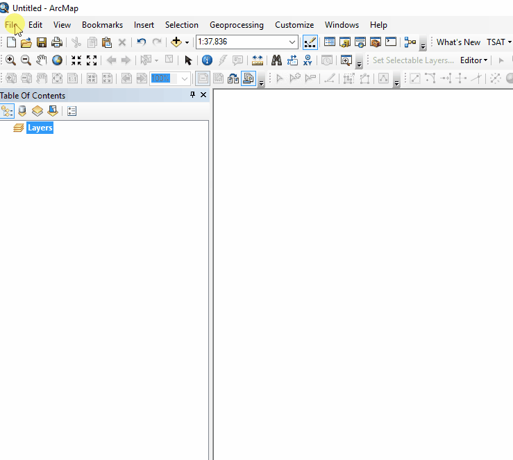

# QGIS/ArcGIS Cross Reference Glossary
This cross reference glossary has been created as a way for users to quickly reference the difference between commonly used tools in both QGIS and ArcGIS. It is intended to help the user transition from ArcGIS to QGIS or vice versa.

## Index
* [Glossary](#Subheadings)
* [Additional Resources](#)

## Glossary 
 *Listed in alphabetical order

**Add-in Manager** in ArcGIS *IS LIKE* the **Plugins** in QGIS

**Animation Toolbar** in ArcGIS *IS LIKE* the **Time Manager Plugin** in QGIS

**ArcToolbox** in ArcGIS *IS LIKE* the **Processing Toolbox** in QGIS

**Catalog** in ArcGIS *IS LIKE* the **Browser Panel** in QGIS. 
* The Browser can also be open in two panels at the same time. View > Panels 

**Data Driven Pages** in ArcGIS *IS LIKE* the **QGIS Atlas** in QGIS

* Reference material: https://www.qgistutorials.com/en/docs/3/automating_map_creation.html

**Find** in ArcGIS *IS LIKE* the **OSM Place Search Plugin** in QGIS

**Labelling toolbar** in ArcGIS *IS LIKE* the **Label Toolbar** in QGIS

**Layers Overview Window** in ArcGIS *IS LIKE* the **Overview Panel** in QGIS

**Menu Bar**
* ArcGIS:

* QGIS:

**Model Builder** in ArcGIS *IS LIKE* the **Graphical Modeler** in QGIS

**Results Panel** in ArcGIS *IS LIKE* the **Log Messages Panel** and the **Results Viewer Panel** in QGIS

**Symbology Window** in ArcGIS *IS LIKE* the **Layer Styling Panel** and the **Layer Propoerties | Symbology** in QGIS

**Table of Contents** in ArcGIS *IS LIKE* the **Layers Panel** in QGIS

## Additional Resources:
* 27 Differences Between ArcGIS and QGIS: https://gisgeography.com/qgis-arcgis-differences/

