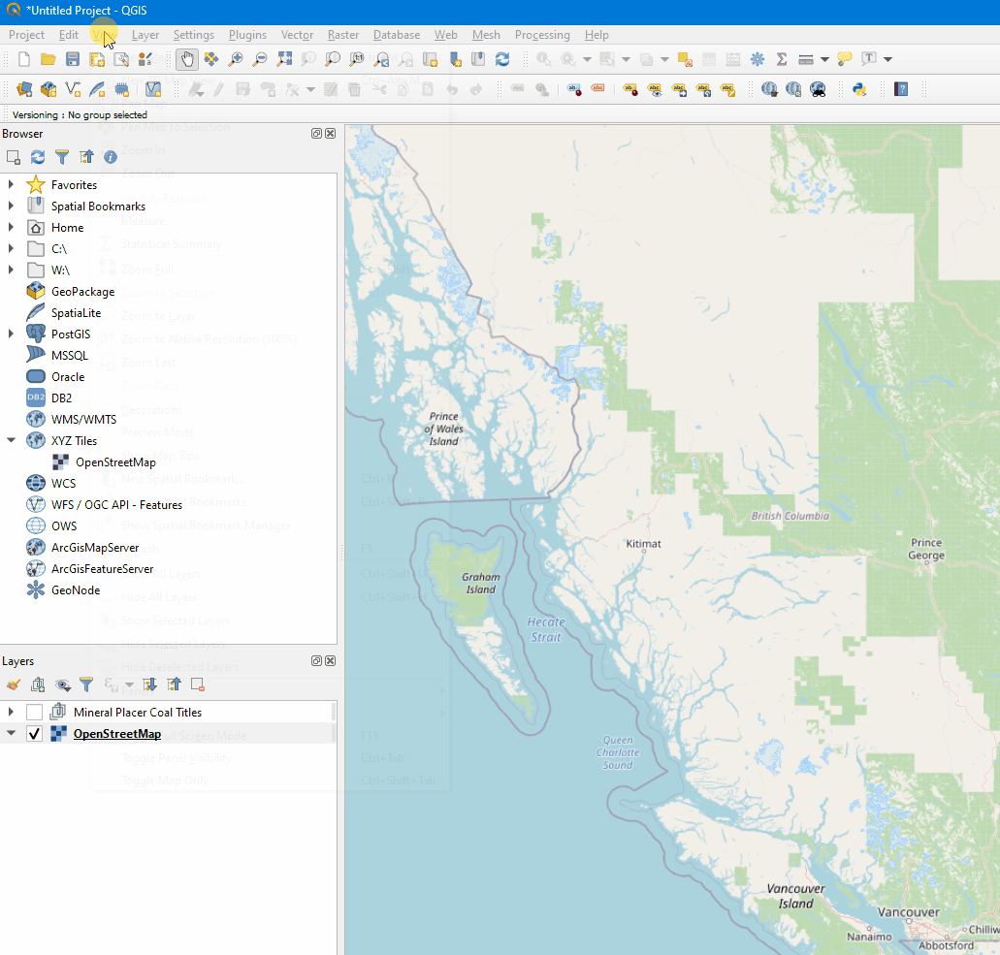

# QGIS/ArcGIS Cross Reference Glossary
This cross reference glossary has been created as a way for users to quickly reference the difference between commonly used tools in both QGIS and ArcGIS. It is intended to help the user transition from ArcGIS to QGIS or vice versa.

# Index
* [Glossary](#Glossary)
  * [Add-in Manager | Plugins](#Add-in-Manager)
  * [Animation Toolbar | Time Manager Plugin](#Animation-Toolbar)
  * [Annotation | Auxiliary Storage](#Annotation)
  * [ArcToolbox | Processing Toolbox](#ArcToolbox)
  * [Catalog | Browser Panel](#Catalog)
  * [Data Driven Pages | QGIS Atlas](#Data-Driven-Pages)
  * [Field Maps | QField](#Field-Maps)
  * [Find | OSM Place Search Plugin](#Find)
  * [Labelling Toolbar | Label Toolbar](#Labelling-Toolbar)
  * [Layers Overview Window | Overview Panel](#Layers-Overview-Window)
  * [Menu Bar](#Menu-Bar)
  * [Model Builder | Graphical Modeler](#Model-Builder)
  * [Results Panel | Log Messages Panel and Results Viewer Panel](#Results-Panel)
  * [Symbology Window | Layer Styling Planel and Layer Properties and Symbology](#Symbology-Window)
  * [Table of Contents | Layers Panel](#Table-Of-Contents)
* [Additional Resources](#Additional-Resources)

# Glossary 
 * Listed in alphabetical order

## Add-in Manager
The **Add-in Manager** in ArcGIS *IS LIKE* the **Plugins** in QGIS.

 * See [Plugins Documentation](https://github.com/bcgov/gis-pantry/blob/master/docs/getting-started-with-QGIS/doc/plugins.md)

## Animation Toolbar
The **Animation Toolbar** in ArcGIS *IS LIKE* the **Time Manager Plugin** in QGIS.

## Annotation
**Annotation** in ArcGIS *IS LIKE* **Auxiliary Storage** in QGIS
 * More reference material: https://oslandia.com/en/2017/10/17/auxiliary-storage-support-in-qgis-3/

## ArcToolbox
**ArcToolbox** in ArcGIS *IS LIKE* the **Processing Toolbox** in QGIS
 * See [Processing Documentation](https://github.com/bcgov/gis-pantry/blob/master/docs/getting-started-with-QGIS/doc/processing.md)

## Catalog
**Catalog** in ArcGIS *IS LIKE* the **Browser Panel** in QGIS. 
* The Browser can also be open in two panels at the same time. View > Panels 

## Data Driven Pages
**Data Driven Pages** in ArcGIS *IS LIKE* the **QGIS Atlas** in QGIS
 * See  [QGIS Atlas Documentation](https://github.com/bcgov/gis-pantry/blob/master/docs/getting-started-with-QGIS/doc/atlas.md)
 * More reference material: https://www.qgistutorials.com/en/docs/3/automating_map_creation.html

## Field Maps
**Field Maps** in ArcGIS *IS LIKE* **QField** in QGIS
 * See [QField Documentation](https://github.com/bcgov/gis-pantry/blob/master/docs/getting-started-with-QGIS/doc/Qfield.md)

## Find
**Find** in ArcGIS *IS LIKE* the **OSM Place Search Plugin** in QGIS

## Labelling Toolbar
The **Labelling Toolbar** in ArcGIS *IS LIKE* the **Label Toolbar** in QGIS
 * See [Labelling Documentation](https://github.com/bcgov/gis-pantry/blob/master/docs/getting-started-with-QGIS/doc/labels.md)

## Layers Overview Window
**Layers Overview Window** in ArcGIS *IS LIKE* the **Overview Panel** in QGIS

## Menu Bar
**Menu Bar**
* QGIS:

## Model Builder
**Model Builder** in ArcGIS *IS LIKE* the **Graphical Modeler** in QGIS
 * See [Graphic Modeler Documentation](https://github.com/bcgov/gis-pantry/blob/master/docs/getting-started-with-QGIS/doc/graphical-modeler.md)

## Results Panel
**Results Panel** in ArcGIS *IS LIKE* the **Log Messages Panel** and the **Results Viewer Panel** in QGIS

## Symbology Window
**Symbology Window** in ArcGIS *IS LIKE* the **Layer Styling Panel** and the **Layer Properties and Symbology** in QGIS
 * See [Styling Documentation](https://github.com/bcgov/gis-pantry/blob/master/docs/getting-started-with-QGIS/doc/styling.md)

## Table of Contents
**Table of Contents** in ArcGIS *IS LIKE* the **Layers Panel** in QGIS

# Additional Resources:
* 27 Differences Between ArcGIS and QGIS: https://gisgeography.com/qgis-arcgis-differences/

