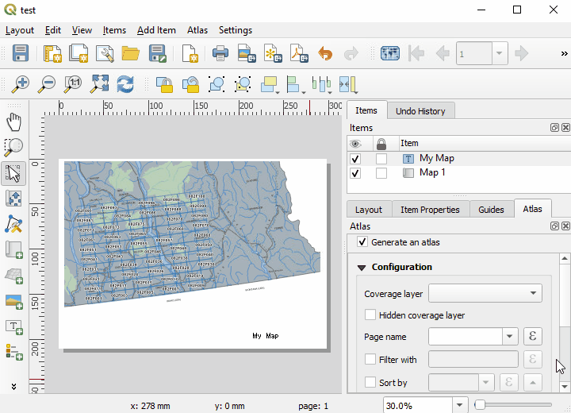
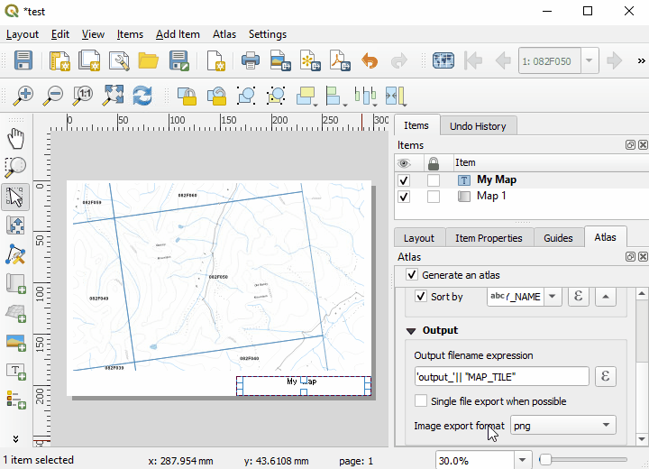
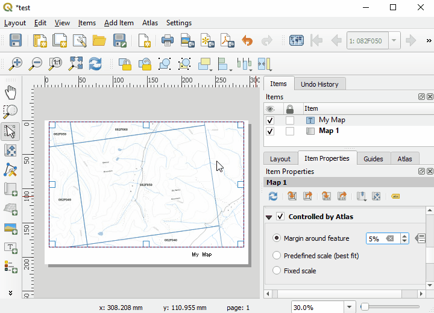
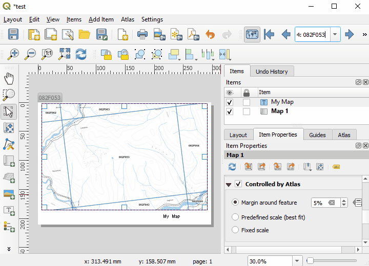

# QGIS Atlas: Map Series Generation

[Home](../README.md)

Atlas is the automated map series generator for QGIS. Point, line, and polygon features can be used to generate and export a series of maps derived from the input feature geometery.

The QGIS documentation provides detailed usage and some ideas for advanced features such as changing page orientation, attribute driven table generation, and combining atlas with expressions.

[QGIS Documentation](https://docs.qgis.org/testing/en/docs/user_manual/print_composer/create_output.html#generate-an-atlas)

Index
* [Enable Atlas](#enable-atlas)
* [Configuration Options](#configuration-options)
* [Preview Series](#preview-series)
* [Export](#export)

## Enable Atlas
First create your [page layout](making-maps.md). From the layout window display Atlas Settings. Either using the Atlas menu and toggling Atlas settings or using the Atlas toolbar,

Finally toggle the generate an atlas radio button at the top of the settings panel.

## Configuration Options
Set your configuration options.
* Coverage layer: The layer with features that will be used to define your atlas.
* Hidden coverage layer: toggle this if you don't want to see your coverage layer on the map
* Filter with: toggle and set this if you want to apply a definition query to the Coverage Layer. 
* Sort By: toggle and set this if you want to sort maps by an expression or feature attribute.
* output file name expression: set this if you have a multi-file output and you want to create file names based on map data
* Single file export when possible: toggle this to enable mulit page exports for single files. eg multiple pages in a pdf

# Preview Series
First set your map so it can be controled by atlas and enable how you want it to set the scale and extent from the coverage layer.

Now you can preview your series using the commands in the Atlas menu or buttons on the Atlas Toolbar. 

# Export
To export or print your map use the appropriate named Print Atlas or Export Atlas functions from the Atlas menu or from the Atlas toolbar.

---
[Back to Top](#QGIS-Atlas:-Map-Series-Generation)
