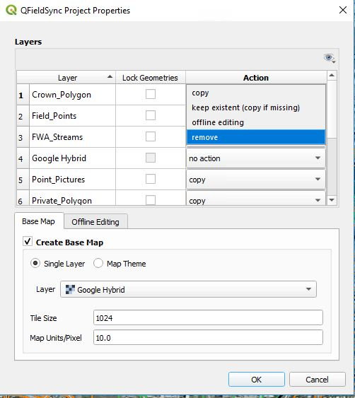
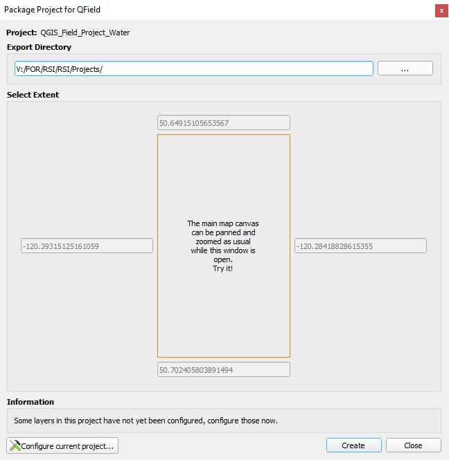
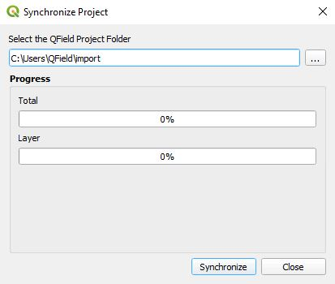
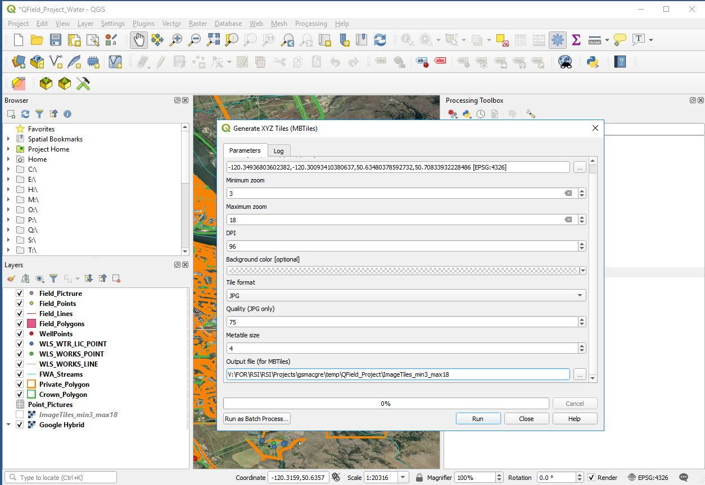
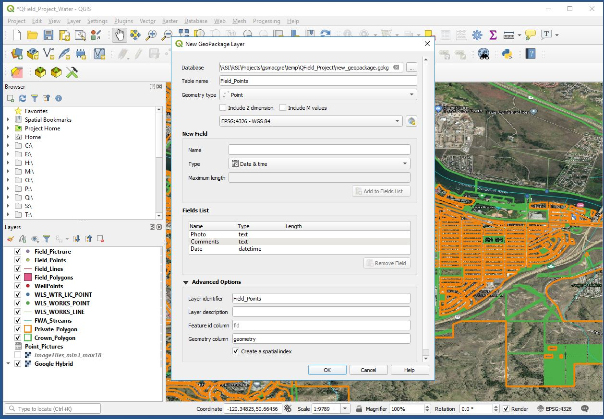
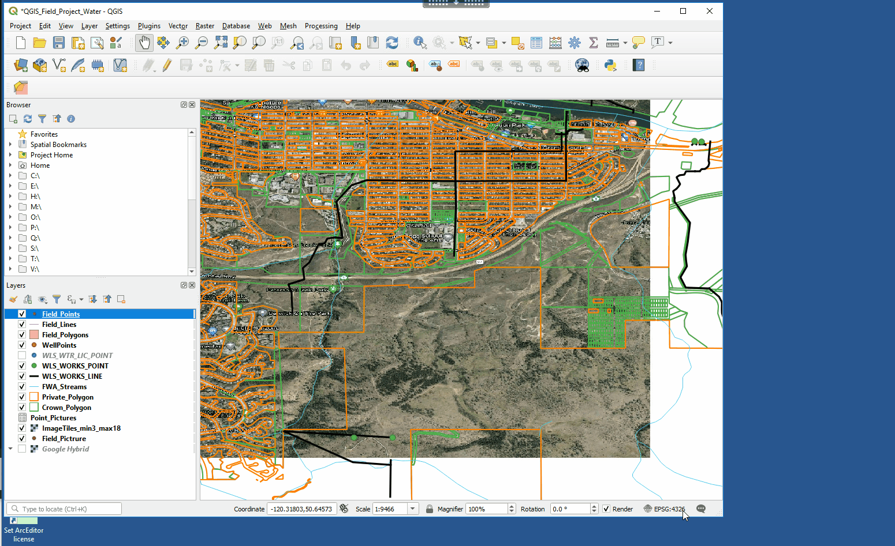
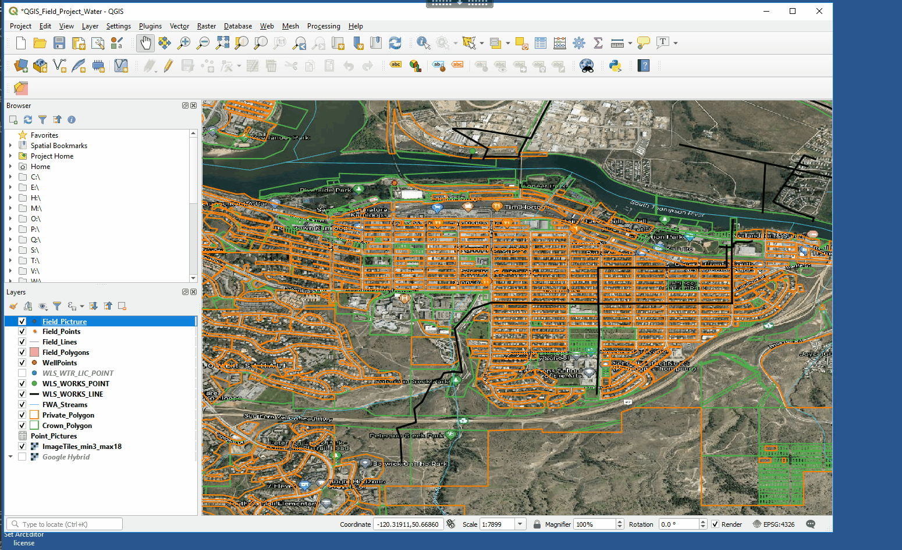
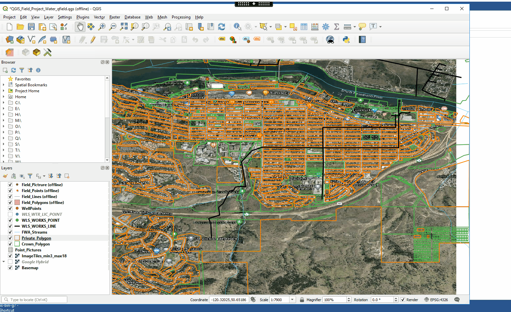
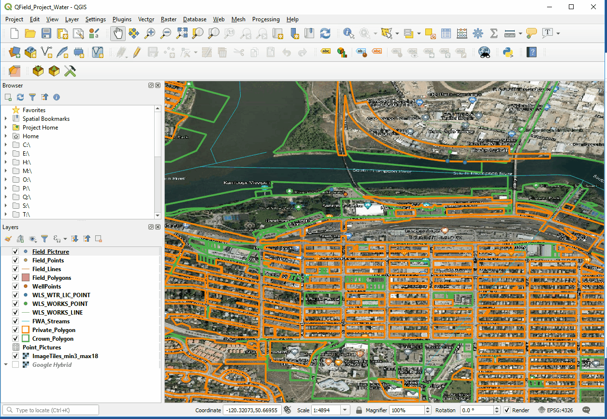

# QFIELD application in QGIS

## Index
* [What is QFIELD](#What-is-QFIELD)
* [Basic steps from QGIS to QFIELD](#What-is-QFIELD)
* [QFIELD and Geodatpackages](#Quick-Mapservices-Plugin)
* [Qfield Best Practices](#Qfield-Best-Practices)
* [QField sync plugin overview](#QField-sync-plugin-overview)
   * [Project Configuration](#Project-Configuration)
   * [Preferences](#Preferences)
   * [Package for QField](#Package-for-QField)
   * [Syncronize from QField](#Syncronize-from-QField)
* [Making a QGIS project for QField](#Making-a-QGIS-project-for-QField)
   * [Start a new QGIS project, Settings and Project Folders](#Start-a-new-QGIS-project,-Settings-and-Project-Folders)
   * [Select and export data Geodatapackage](#Select-and-export-data-Geodatapackage)
   * [Adding Imagery](#Adding-Imagery)
   * [Create layers for capturing data in the field](#Create-layers-for-capturing-data-in-the-field)
   * [Controlling Data entry](#Controlling-Data-Entry)
   * [Set up data layers to capture photos linked to collected data](#Set-up-data-layers-to-capture-photos-linked-to-collected-data)
   * [QField Sync Plug in and prepare data for QField](#QField-Sync-Plug-in-and-prepare-data-for-QField)
* [Using QField on your Mobile device](#Using-QField-on-your-mobile-device)
   * [Add QField package and app to your device](#Add-QField-package-and-app-to-your-device)
   * [The QField App interface](#The-QField-App-interface)
   * [Syncronize the QField data package back to your master data package](#Syncronize-the-QField-data-package-back-to-your-master-data-package)

## What is QFIELD

QField is a mobile application built on QGIS open source software platform. The user makes a mapping project in QGIS then converts it to a QFIELD mobile project. The user can then assess or collect data in the field and then syncronize it back to the master QGIS data sources that the mapping project was created from. The Qfield interface is simple to use as most of the set up is completed in the QGIS project before exporting to a QField project.

Currently Qfield is only built for Android operating systems, though Apple IOS is currently in development.

## Qfield and GeodataPackages

### Basic steps from QGIS to QFIELD and Back
 For new users to QGIS or QField, the basic steps for using QField is as follows.
 1. Create a new QGIS project in a project folder.
 2. Add features from data sources into QGIS and theme appropriately. Data generally should be in project folder to take application offline into the field.
 3. Load the Qsync plugin
 4. Run the Package for Qfield. Selecting how you want layers to be used as offline or editable. Export the package to a new folder
 5. Take the new package folder and move it to your mobile device
 6. Open Qfield on your tablet and open the .qgs file in the package folder
 7. Collect field work data then copy Qfield package from field device to computer
 8. Syncronize field data back to Master data set that was used to make QField package

## Qfield Best Practices
QField is an effective mobile mapping solution, however there are some best practices to make the application work effectively and minimize .

1. Set your QGIS project to relative paths.
2. Use Geodatapackages. Other formats can be used, though reliability has not been tested.
3. Projections: QGIS and QField can use different projection sources in the data, though if issues arise a common projection of data may be beneficial. e.g. WGS 84 or BC Albers
4. Very large data sets can burden the application so be mindful of how much imagery and data you use.

# QField Sync Plugin overview

### Configure Current Project (QField Sync Project Properties)
Allows the user to control how data will be used when packaged for QField
Choices include:
1. Lock Geometry for data copied to Qfield
2. Action: (Copy) data for use in QField
3. Action: (Offline Editing) Allow user to edit data in QField
4. Action: (Remove) Do not Package data for use in QField
5. Action: (Keep Existent) If data is already in a previous QField package then keep the existing data.

6. Base Map. An image basemap can be created from an image layer. **This may require the image to be in the same projection as the data or it may not work.
7. Offline editing. Only copy features in the Map Area of Interest Window.

### Preferences
Where you can set your default import and export directories

### Package For QField

1. Select export directory.  
2. Select Extent by zooming in view window the area of data you would like to export to QField.  
  

### Syncronize from QField
1. Open the Original QGIS project then select folder where import data from the field was placed.  
2. Then Syncronize QGIS data, which will update source QGIS data with data collected from QField.  
  

# Making a QGIS project for QField
### For this example data has been placed in a GeoDataPackage. "new_geodatapackage.gpkg". Data in the project include.
- Local city data (Property, Street) EPSG:3157 - NAD83(CSRS) / UTM zone 10N - Projected
- Province of BC Data (Wells or(WLS...), Crown_Polygon, FWA_Streams) EPSG:4326 - WGS 84 - Geographic
- New Empty Layers to collect field data and will be used for offline editing. (Field_Lines, Field_Polygons, Field_Points)

### Start a new QGIS project, Settings and Project Folders  
1. Create new empty folder to store data and your project. e.g. QField_Project_Main.  
2. Open a new QGIS project and save .QGS project to the empty folder.   
3. Set QGIS project projection and relative path setting. e.g. WGS 84 CRS projection

### Select and export data Geodatapackage
1. Select the data you want to use in QField and export it to a new geodatapackage in the project folder.  
2. Add the data to your QGIS project, theme layers and save to the QField Project folder.  

### Adding imagery
a. Offline Imagery: It is reccomended that when using offilne imagery to only use small image areas. Images like GEOTIFF or Geo JPEG can be used or MBtiles layer can be created to tile web imagery into an offline Spatial lite data format. The following example shows how to create image tiles of online imagery with a min zoom of 3 and max of 18. If you go above 18 it will likely create a huge file size that is not useable on your device.  
MBTiles creation for offline imagery

b. Online imagery: This can be added as datasource imagery in your QGIS project and will load in QField if your field device has data/WIFI availability. The benefits of this method means that large imagery datasets do not have to be added to the device using much less data space.  See web mapping and other remote data section for adding online imagery to a QGIS project.    

### Create layers for capturing data in the field.
e.g. Field_Points, Field_Lines, Field_Polygons  
Layer -> Create Layer -> New Geodatapackage Layer

### Controlling Data entry.   
#### Data entry in QField can be controlled and managed in QGIS Layer Properties.
a. Relation Reference: Creates a relation reference to a table and values can be added or deleted from the reference table.  
b. Value Relation: Values to control data entry are based on a related table within the QGIS Project.  
c. Attachment: Attachments can be tagged to a field such as PDF or photos.  
d. Value Map: Values are set based on a value table developed in QGIS.  
e. Constraints: Data entry is constrained to the values that have to be entered. Value Ranges or not null.  
f: Default Values: If a feature is created in QField a default value will be entered. e.g. Force a date entry when new feature created.  

An example of setting up data controls for 1 layer in QGIS. (Valuemap, Constraints, Attachment)  
  

### Set up data layers to capture photos linked to collected data

Two methods can be set up to capture photos in QField
1. One photo for each feature collected in the field. One to One
- Add a (String) field to layer that photo will be attach to. e.g. Photo
- Set Widget Type for field to "Attachment" and Path to "Relative Paths"
- Under Actions add an item to the Action List. Type = Open and Action = [%"Photo"%]  
  

2. Many Photos for each feature collected in the field. One to Many
- Add a (String) field to layer that photo will be related to. e.g. Photo_Link
- Create a seperate reference table with fields (Point Picture_ID = String) and (Photo_Path = String, Widget Type = Attachment and Path Relative)
- Create a Data relation between the feature layer and relate photo table. Create Relation Between UUID field in layer and Point Picture_ID in table.  Example to come but here is a link
https://qfield.org/docs/prepare/add-1-n-pictures.html

### QField Sync Plug in and prepare data for QField  

When you feel your QGIS project has all the data , theme, property controls and imagery added, you can now export it to a QField package.
- Make an empty folder which to export the QFIELD package. e.g. QField_Project_Out
- Start the QField sync plugin and configure current project. Select which data you want for geometry lock, offline editing, data you just want to copy to QField or remove data to not be added to the exported QField project. 
 
- Next in the Qsync Plugin. Package for QField and Export the project to "QField_Project_Out". If you open the exported .qgs file it will have (offline) in the name header as well as the data layers set to offline. Your project folder and all data in the folder can now be transfered to your android device.
 

# Using QField on your Mobile device

### Add QField package and app to your device
- QField app can be added to your device from the Google play store and hopefully the Apple store in the future.
- Copy the exported folder to a location on your device you are familiar with and which you can can access.  

### The QField App interface
#### Upper Left (Three Dashes) Map Legend
- Highlight Layer and hold to access new window for layer. 
   - Show on map. (Turns layer on or off)
   - Zoom to extent. (Zoomes to full extent or layer)
   - Show feature list. (Will open data list)
   - Start Tracking. 
      - Set interval you want data collected as you walk
      - Enter attributes for new feature to be created, then start walking. 
      - Notice the black figure beside the layer when tracking is on.  
      - When done walking go back to feature and stop tracking. 
      Feature Collected!
- Digitize Mode (Editing Pencil)
   - This will initiate the layer that was highlighted to go into editing mode. Notice the Green add button in lower right when you switch to editing. The green button allows you to add features.  
- Browse Mode (Paper Button Beside Pencil)
   - To turn off editing just toggle the browse mode button beside the pencil.  
  

Lower right and Middle right buttons. 
- Zoom in + and - Zoom out.  
- Zoom to current GPS location (Circle with solid dot).  
- Lock or unlock cursor to GPS position (Circle with Plus sign).  
- Add feature. (Circle with Plus on bottom) Button will be Green sometimes and other times Grey.  
   - To Edit. Highlight feature in legend. Find on map (Cursor Crosshairs) or zoom to GPS location, then use add button to add feature and attributes.  
  

Click on Map features in main window to look at attribute tables.
- All features identified at that point will display in pop up window.  
- Left and Right Arrow through records.  
- A (Pencil) ewill allow editing of attributes.  
- Line (Pencil) edits geometry ofthe feature identified.  
- Geometry will not be editable if specified in initial QGIS set up.  
  

Upper Right Search button.
- The search button in the upper right can be used to query all the layers for specific names or attributes.  
- The example below searches for a creek of a specific name, then selects and zooms to it.  
- Search ability can be controled in QGIS setup. (Project Properties-> Data Sources)  

  

Digitizing and data creation/editing
- Please see the following location for more methods for digitizing and modifying data in QField.  
https://qfield.org/docs/fieldwork/digitize.html

# Syncronize the QField data package back to your master data package
- Once you have used QField on a device and collected or modified data, copy the data package folder from the device to a new empty folder. e.g. QField_Project_in.  
- Then using the original .qgs project used to make the QField package and syncronize. (QField plugin-> Syncronize from QField).  
- All data from the field that was changed or added will be copied into the original data source.  

### License
    Copyright 2019 BC Provincial Government

    Licensed under the Apache License, Version 2.0 (the "License");
    you may not use this file except in compliance with the License.
    You may obtain a copy of the License at

       http://www.apache.org/licenses/LICENSE-2.0

    Unless required by applicable law or agreed to in writing, software
    distributed under the License is distributed on an "AS IS" BASIS,
    WITHOUT WARRANTIES OR CONDITIONS OF ANY KIND, either express or implied.
    See the License for the specific language governing permissions and
    limitations under the License.
