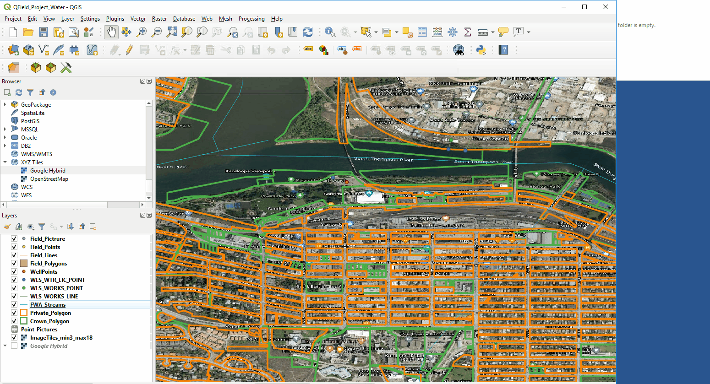

# QFIELD application in QGIS

## Index
* [What is QFIELD](#What-is-QFIELD)
* [Basic steps from QGIS to QFIELD](#What-is-QFIELD)
* [QFIELD and Geodatpackages](#Quick-Mapservices-Plugin)
* [Qfield Best Practices](#Qfield-Best-Practices)
* [QField Sync Plugin](#QField-Sync-Plugin)
   * [Project Configuration](#Project-Configuration)
   * [Preferences](#Preferences)
   * [Package for QField](#Package-for-QField)
   * [Syncronize from QField](#Syncronize-from-QField)
* [Making a QGIS project for QField](#Making-a-QGIS-project-for-QField)

## What is QFIELD

QField is a mobile application built on QGIS open source software platform. The user makes a mapping project in QGIS then converts it to a QFIELD mobile project. The user can then assess or collect data in the field and then syncronize it back to the master QGIS data sources that the mapping project was created from. The Qfield interface is simple to use as most of the set up is completed in the QGIS project before exporting to a QField project.

Currently Qfield is only built for Android operating systems, though Apple IOS is currently in development.

## Qfield and GeodataPackages

## Basic steps from QGIS to QFIELD and Back
 For new users to QGIS or QField, the basic steps for using QField is as follows.
 1. Create a new QGIS project in a project folder
 2. Add features from data sources into QGIS and theme appropriately
 3. Load the Qsync plugin
 4. Run the Package for Qfield. Selecting how you want layers to be used as offline or editable. Export the package to a new folder
 5. Take the new package folder and move it to your mobile device
 6. Open Qfield on your tablet and open the .qgs file in the package folder
 7. Collect field work, copy Qfield package from feild device to computer

## Qfield Best Practices
QField is an effective mobile mapping solution, however there are some best practices to make the application work effectively and minimize .

1. Set your QGIS project to relative paths.
2. Use Geodatapackages. Other formats can be used, though reliability has not been tested
3. Projections: QGIS and QField can use different projection sources in the data, though if issues arise a common projection of data may be beneficial.

# QField Sync Plugin

### Configure Current Project (QField Sync Project Properties)
Allows the user to control how data will be used when packaged for QField
Choices include:
1. Lock Geometry for data copied to Qfield
2. Action: (Copy) data for use in QField
3. Action: (Offline Editing) Allow user to edit data in QField
4. Action: (Remove) Do not Package data for use in QField
5. Action: (Keep Existent) If data is already in a previous QField package then keep the existing data.

6. Base Map. An image basemap can be created from an image layer. **This may require the image to be in the same projection as the data or it may not work.
7. Offline editing. Only copy features in the Map Area of Interest Window.

### Preferences
Where you can set your default import and export directories

### Package For QField

1. Select export directory
2. Select Extent by zooming in view window the area of data you would like to export to QField.

### Syncronize from QField
1. Open the Original QGIS project then select folder where import data from the field was placed. 
2. Then Syncronize and original QGIS data will be updated with data from field.

# Making a QGIS project for QField
### For this example data has been placed in a GeoDataPackage. "new_geodatapackage.gpkg". Also QField is currently only available for Android devices
- Local city data (Property, Street) EPSG:3157 - NAD83(CSRS) / UTM zone 10N - Projected
- Province of BC Data (Wells or(WLS...), Crown_Polygon, FWA_Streams) EPSG:4326 - WGS 84 - Geographic
- New Empty Layers to collect field data. (Field_Lines, Field_Polygons, Field_Points)

### 1. Start a QGIS project, Settings and Project Folders  
a. Create new empty folder to store data and your project  
b. Open a new QGIS project and save to the folder  
c. Set QGIS project to projection and relative path setting

### 2. Select and export data Geodatapackage
a. Select the data you want to use in QField and export it to the Geodatapackage
b. Add the data to your QGIS project, theme layers and save to the QField Project folder

### 3. Adding imagery
a. Offline Imagery: It is reccomended that when using offilne imagery to only use small image areas. Images like GEOTIFF or Geo JPEG can be used or MBtiles layer can be created to tile web imagery into an offline Spatiallite dataformats. The following example shows how to create image tiles of online imagery with a min zoom of 3 and max of 18. If you go above 18 it will likely create a huge file size that is not useable.  

b. Online imagery: This can be added as a datasource imagery in your QGIS project and will load in QField if your field device has data/WIFI availability. The benefits of this method means that large imagery datasets do not have to be added to the device using much less data space.  See web mapping and other remote data section for adding online imagery.  

### 4. Create data features for capturing data in the field.
e.g. Field_Points, Field_Lines, Field_Polygons  
Layer -> Create Layer -> New Geodatapackage Layer

### 5. Controlling Data entry.   
### Data entry in QField can be controlled and managed in QGIS Layer Properties.
a. Relation Reference: Creates a relation reference to a table and values can be added or deleted from the reference table.  
b. Value Relation: Values to control data entry are based on a related table within the QGIS Project.  
c. Attachment: Attachments can be tagged to a field such as PDF or photos.  
d. Value Map: Values are set based on a value table developed in QGIS.  
e. Constraints: Data entry is constrained to the values that have to be entered. Ranges or not null.  
f: Default Values: If a feature is created in QField a default value will be entered.  e.g. Forced date entry

An example of setting up data controls for 1 layer in QGIS. (Valuemap,Constraints, Attachment)

### 7. Set up data features to capture photos linked to collected data

Two methods can be set up to capture photos in QField
1. One photo for each feature collected in the field. One to One
- Add a (String) field to layer that photo will be attach to. e.g. Photo
- Set Widget Type for field to "Attachment" and Path to "Relative Paths"
- Under Actions add an item to the Action List. Type = Open and Action = [%"Photo"%]

2. Many Photos for each feature collected in the field. One to Many
- Add a (String) field to layer that photo will be related to. e.g. Photo_Link
- Create a seperate reference table with fields (Point Picture_ID = String) and (Photo_Path = String, Widget Type = Attachement and Path Relative)
- Create a Data relation between the feature layer and relate photo table. Create Relation Between UUID field in layer and Point Picture_ID in table.  
https://qfield.org/docs/prepare/add-1-n-pictures.html

### 8. QField Sync and prepare data for QField  

When you feel your QGIS project has all the data , theme, property controls and imagery added, you can now export it to a QField package.
- Make an empty folder which to export the QFIELD package. e.g. QField_Project_Out
- Start the QField sync plugin and configure current project. Select which data you want for offline editing, data you just want to copy to QField or remove data to not be added to the QField project. 
 
- Next in the Qsync Plugin. Package for QField and Export the project. If you open the exported .qgs file it will have (offline) in the name header as well as the data layers set to offline. Your project can now be transfered to your android device.
 

# Using QField on your Mobile device

### 1. Add QField package and app to your device
- QField app can be added to your device from the Google play store and hopefully the Apple store in the future.
- Copy the exported folder to a location on your device you are familiar with and can access.

### 3. The QField App interface
Upper Left (Three Dashes) Map Legend
- Highlight Layer and hold to access. Show on map layer, Zoom to extent, Show feature List and start tracking.
-For Tracking. Set interval you want data collected. Enter attributes for new feature, then start walking. When done walking go back to feature and stop tracking. Feature Collected!
- Start Editing Pencil. which will allow editing of the highlighted layer. Notice the Green add button in lower right when you switch to editing. The green button allows you to add features

Lower right and Middle right buttons. 
- Zoom in + and Zoom out -
- Zoom to current GPS location
- Lock or unlock cursor to GPS position
- Green add feature. Button will only go green if feature is offline editable. Highlight feature in legend. Find on map or zoom to GPS location, then use Green add button to add feature and attributes.

Click on Map features to look at attribute tables.
- All features at that point will open a table window
- Left and right Arrow through records
- A (Pencil) edits attributes
- Line (Pencil) edits geometry

Upper Right Search button.
- The search Button in the upper right can be used to query all the layers for a Specific names or attributes
-The example searches for a creek of a specific name, then select and zoom to it.

Digitizing and data creation/editing
https://qfield.org/docs/fieldwork/digitize.html

# Getting Data from QField project and back into the original data source.
- Copy the data package folder from the device to a new empty folder. e.g. QField_Project_in
- Then using the original .qgs project use QField plugin-> Syncronize from QField
- All data from the field will be copied into the original data source.

### License
    Copyright 2019 BC Provincial Government

    Licensed under the Apache License, Version 2.0 (the "License");
    you may not use this file except in compliance with the License.
    You may obtain a copy of the License at

       http://www.apache.org/licenses/LICENSE-2.0

    Unless required by applicable law or agreed to in writing, software
    distributed under the License is distributed on an "AS IS" BASIS,
    WITHOUT WARRANTIES OR CONDITIONS OF ANY KIND, either express or implied.
    See the License for the specific language governing permissions and
    limitations under the License.
