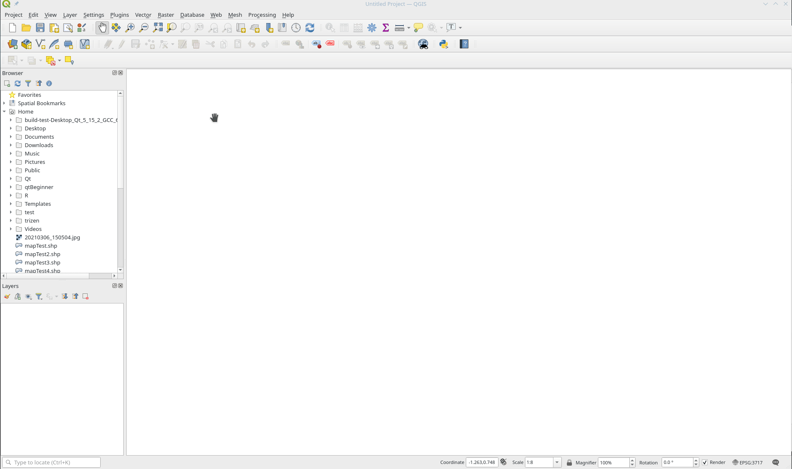
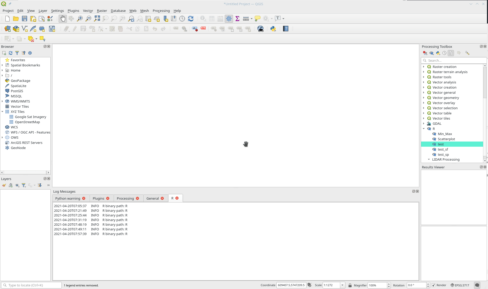
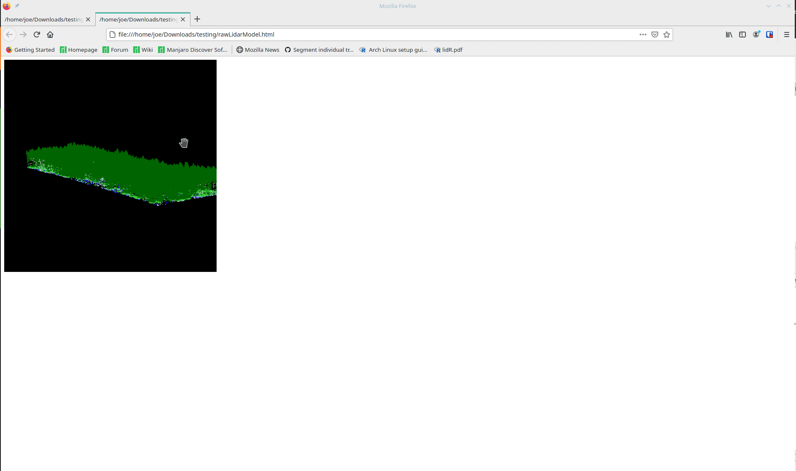

# Using QGIS with R for Advanced Analysis

[Home](../README.md)

Unlike most closed source software: QGIS integrates with other open source systems to peroform much of its analysis.

One example of this is the functionality of QGIS with the R project.

## Index

* [Setting up R in QGIS](setting-up-r-in-qgis)
* [Installing Packages](installing-packages)
* [Accessing R in QGIS](accessing-r-in-qgis)
* [R in QGIS Code](r-in-qgis-code)
* [First Sample Script](first-sample-script)
* [lidR and Analysis Using Point Clouds](lidr-and-analysis-using-point-clouds)

## Setting up R in QGIS

*NOTE: R will not work in QGIS without running the code below.*

R is very easy to set up in QGIS. In most cases: you can simply (1) install R on your host machine (already installed on the DTS servers); and, (2) install the 'Processing R Provider' plugin from the official repository in QGIS (not sure how ot install a plugin in QGIS? See the documentation [here](https://github.com/bcgov/gis-pantry/blob/master/docs/getting-started-with-QGIS/doc/QGIS-plugins.md)).

On the DTS, you will need to run some code at the start of every script to ensure that allows you to save R packages to a folder you have write permission to and load the packages you have already installed:

```R
.libPaths( c("path\\to\\your\\folder", .libPaths() ) )
```

You will also need to install BiocManager and install the EBImage package to work with LiDaR data. You can do this by:

```R
install.packages("BiocManager", dependencies=TRUE)
library("BiocManager")
BiocManager::install( c( "BiocManager" ) )
```

If you have issues with either of these steps: review the documentation for [R](https://cran.r-project.org/mirrors.html) and/or [QGIS](https://north-road.github.io/qgis-processing-r/).

## Installing Packages in R

Packages can be installed in the R terminal using this code:

```r
install.packages("package-name", dependencies=TRUE)
```

To access the R terminal simply type R into the search box in your start menu and open it.

## Accessing R in QGIS

To create a new R script in QGIS:

1. Turn on the Processing Toolbox window: click Processing->Toolbox (or press ctrl+alt+t)
2. Click the R logo at the top of the Processing Toolbox and select Create New R Script...



3. Here you can write R code that will run in QGIS like a normal R script

## R in QGIS Code

R in QGIS functions similarly to standard R. The only major difference is that QGIS will create a menu where you can select input and output files and directories in the GUI.

These settings are made at the top of your script in pseudo comment code. For example:

To create/add to a grouped location of R script(s):

```r
##LIDAR Processing=group
```

To set the tool name:
```r
##processTrees=name
```

To request a file input from the user labelled 'input file':
```r
##input_file=file
```

To request an output file from the user labelled 'output file':
```r
##output_file=output file
```

There are many more options like fields from a file, rasters, vectors, etc. that can be found in the [QGIS documentation](https://docs.qgis.org/3.4/en/docs/training_manual/processing/r_intro.html)

## First Sample Script

Now that you have R set up in QGIS and know the basics of how code differs between R in QGIS and the R terminal we can start writing a simple script. This script will simply read a file and write it back out without any changes.

1) Click the 'R' symbol at the top of the Processing Toolbox and select Create New R Script...

2) Enter the following code:

```r
##Layer=file
##Outs=output file

library(sf)
library(rgdal)
library(sp)
library(raster)

Layer <- readOGR(Layer)
outputter <- Layer[1,]

writeOGR(outputter, Outs, Outs, driver="ESRI Shapefile")
```

3) Save the file and run it (make sure the input is a shapefile and the output filename ends with .shp and is a new file)



There are a few things worth mentioning about this script. Firstly, the top two lines are the input and output filenames. They are loaded as files, rather than vectors, because the functionality of file inputs are better than vector inputs in my experience. However, this script does not have any error checking so it will allow the user to choose an input that is not a shapefile or create an output that is not a shapefile causing it to fail.

Secondly, we didn't specify a name using the *##script name=name* tag at the top of the script so this script will automatically take the name you save the file as.

And, lastly, we load our libraries using library(library_name).

Next, we can move on to a more complicated but more useful script.


## lidR and Analysis Using Point Clouds

QGIS has built in tools to run basic - and some more advanced - spatial analysis. However, for analysis of LiDaR data or specific tools related to a certain science (hydrology, climate science, etc.) you may find that integrating QGIS with R or GRASS GIS is useful.

lidR is a package for R that provides a set of tools for processing and displaying LIDAR data in R. Since QGIS does not provide many LIDAR tools it is helpful to have a seperate software to do this processing. This is where linking R to QGIS shines.

Be sure you have installed the R packages lidR, tictoc, rlas, and rgdal before starting this section.

You will require an LAS (LiDaR point cloud) file to complete this section. I used the LAS file from [Vancouver Open data available here](https://webtransfer.vancouver.ca/opendata/2018LiDAR/4890E_54610N.zip). If you use a different file you will need to change the clip extent in the code.

Once you get the data and extract it to your computer, you can create a new R script in QGIS and enter the following code:

```r
##LIDAR Processing=group
##LAS_file=file
##Out_folder_for_models=folder
##Outs=output file

# Load required libraries
library(rgl)
require(lidR)
require(rlas)
require(rgdal)
require(tictoc)
library(sp)
library(sf)
library(raster)

# Load the las file into the system
data <- LAS_file

# Read the data as LiDaR
las <- readLAS(data, select="xyzrci", filter="-keep_first -keep_class 1 2 3 4 5")

# Clip the LAS data to the area of interest
las <- clip_rectangle(las,489000.0,5461000.0,489150.0,5461500.0)

# Create the model
options(rgl.printRglwidget = FALSE)
options(rgl.useNULL=TRUE)
plot(las, color = "Classification")
widget = rglwidget()
print(widget)

htmltools::save_html(widget, paste0(as.character(Out_folder_for_models),"/rawLidarModel.html"))

# Create a Digital Terrain Model and normalize the trees to the DTM
dtm <- grid_terrain(las, algorithm = knnidw(k = 8, p = 2))
las_normalized <- normalize_height(las, dtm)

# Remove temp data to free up space for grid_canopy function
rm(las,dtm,data,clipLayer)

# Create a Crown Height Model
chm <- grid_canopy(las_normalized, 0.5, pitfree(c(0,2,5,10,15), c(3,1.5), subcircle = 0.2))

# Neighbourhood analysis (median filter)
ker <- matrix(1,5,5)
chm_s <- focal(chm, w = ker, fun = median)

# Plot Crown Height Model
# Create the model
options(rgl.printRglwidget = FALSE)
options(rgl.useNULL=TRUE)
plot_dtm3d(chm)
widget = rglwidget()
print(widget)
htmltools::save_html(widget, paste0(as.character(Out_folder_for_models),"/CrownHeightModel.html"))

# Remove temp data to clear space
rm(chm)

# Use watershed tool and segment trees tool to find individual trees
algo <- watershed(chm_s, th = 4)
las_watershed  <- segment_trees(las_normalized, algo)

# remove points that are not assigned to a tree (garbage data cleanup)
trees <- filter_poi(las_watershed, !is.na(treeID))

# View the results
# Create the model
options(rgl.printRglwidget = FALSE)
options(rgl.useNULL=TRUE)
plot(trees, color = "treeID", colorPalette = pastel.colors(100))
widget = rglwidget()
print(widget)
htmltools::save_html(widget, paste0(as.character(Out_folder_for_models),"/extractedTreesModel.html"))

# Convert the trees to a polygon shapefile
hulls  <- tree_hulls(trees, type = "concave", concavity = 2, func = .stdmetrics)

writeOGR(hulls, Outs, Outs, driver="ESRI Shapefile")
```
When running this script: (1) make sure the inupt has a .las extension; (2) make sure the Outs variable ends in the .shp extension.

The code above has two sets of outputs.

(1) A polygon shapefile depicting all of the individual trees derived from the LAS file


(2) 3 interactive models saved as HTML files in the out folder for models



