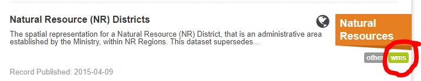
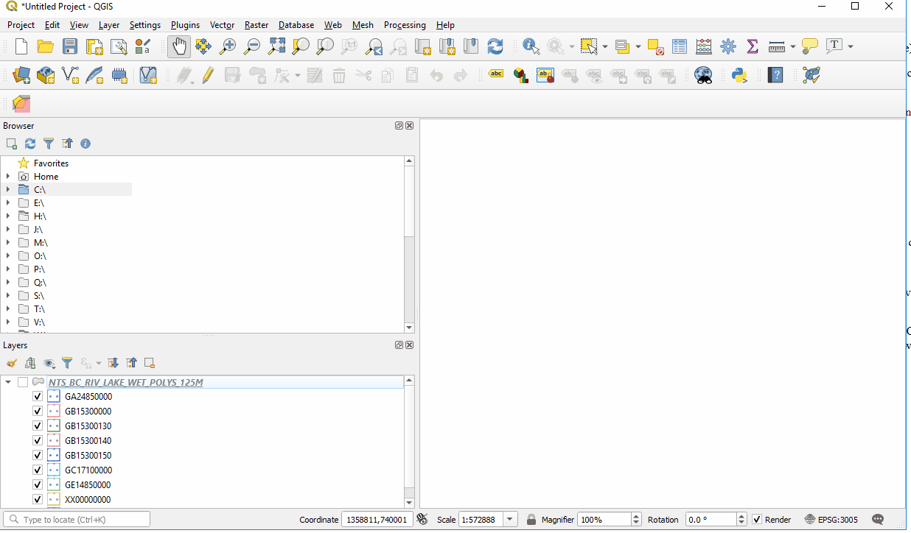

# Web Based data access in QGIS

Within QGIS there are many ways to access data. This sections focus is on accessing data through web mapping services that the BC government and other organizations have available.

## Index
* [Web Mapping in QGIS](#What-is-a-GeodataPackage)
   * [1. BC Government Web Mapping](1.What-is-a-GeodataPackage)
* [Web Mapping Services WMS](#Web-Mapping-Service-WMS)
* [Web Coverage Service WCS](#Web-Coverage=Service-WCS)
* [Web Feature Service WFS](#Web-Feature-Service-WFS)
* [Open Web Services OWS](#Open-Web-Services-OWS)
* [ArcGIS Map Server](#ArcGIS-Map-Server)
* [ArcGIS Feature Server](#ArcGIS-Feature-Server)
* [XYZ Tiles](#XYZ-Tiles)
* [GeoNode](#2.-Shapefiles)

## Web Mapping in QGIS

In QGIS data can be accessed either through local data sources on your computer or from web based mapping services. QGIS offers a wide range of solutions to access online data minimizing the necessity to download the data to a computer. Web based data sources can be added and managed through the QGIS Browser or Data Source Manager.

- Right click WMS/WMTS in browser window to create a connection or
- Layer-> Data Source manager->WMS to create a new connection

   ### 1. BC Government Web Mapping
   DataBC offers data connection services that allow users to view thousands of data layers from the B.C. Geographic Warehouse (BCGW) in desktop geospatial software or via web-based map applications.  These connection services deliver current data directly from the BCGW so that you or users of your web mapping applications can work with the latest data available without needing to repeatedly download the data. 

   BC Web mapping services information
   https://www2.gov.bc.ca/gov/content/data/geographic-data-services/web-based-mapping/map-services

   To find WMS data sources in the BC please reference the BC data catalogue. https://catalogue.data.gov.bc.ca/dataset?download_audience=Public

   You are able to tell if a layer is web available by the small labels in the lower right of each feature. It will signify any of the following. WMS, ArcGIS_Rest
     

## Web Mapping Services WMS
WMS is the dominant web mapping service in the BC Government.

The WMS link to use to set up up the BC government mapping service in QGIS is. http://openmaps.gov.bc.ca/geo/ows?

Right Click WMS/WMTS-> New Connection-> Enter the above link in URL and give the connection a name of your choice. The connection will display under WMS in the Browser. Click on arrows to expand out the data tree you just named, then select a feature to drag into layers.

 

Many organizations have data available for use through WMS. Some require passwrods while other do not.
(Free and no Passwords)
* BC Government http://openmaps.gov.bc.ca/geo/ows?
* Government of Canada Topographic. https://maps.geogratis.gc.ca/wms/canvec_en?request=getcapabilities&service=wms&version=1.3.0&layers=canvec&legend_format=image/png&feature_info_type=text/html
* Available Government of Canada Open WMS. https://open.canada.ca/data/en/dataset?organization=ec&res_format=WMS

## Web Coverage Service WCS

Another form of online data is a web coverage service. This type of service is very similar to WMS. The difference is that WCS provides access to the raw data which can be queried and used differently than a WMS.

Many examples of WCS can be found at a US government site. NOAA (National Oceanic and Atmoshperic Administration) https://data.noaa.gov/dataset/

https://eccc-msc.github.io/open-data/msc-geomet/readme_en/

https://catalog.data.gov/organization/4ae51f6c-467a-4f9d-b40a-2c52e83c326a?publisher=U.S.+Forest+Service

## Web Feature Service

Another form of online data is a web coverage service. This type of service is very similar to WMS. The difference is that WCS provides access to the raw data which can be queried and used differently than a WMS.

Many examples of WCS can be found at a US government site. NOAA (National Oceanic and Atmoshperic Administration) https://data.noaa.gov/dataset/

## Other Important Data Formats QGIS can use

### 1. SpatialLite

A spatial lite file is very similar to a Geodatapackage and can also be used in QGIS. While both are good, a Geodatapackage is more transportable and SpatialLite can be used as more of a database management system. QGIS has been focusing more on GeoDatapackage standards and integration with the software. Some plugins (Extensions) may work better using SpatialLite depending on your analysis situation. 
Layer -> Create Layer -> New SpatialLite Layer

### 2. Shapefiles

The long standing data format (Shapefile) is compatible with QGIS. Shapefiles can be created in QGIS or exported to as a data format. There are numerous ways to create a shapefile.
1. Right click on drive in Browser -> New -> Shapefile
2. Click on New Shapefile in the Data Source Toolbar
3. Layer -> Create Layer -> New Shapefile Layer

### 3. Scratch Layer

QGIS can create scratch layers which are temporary working data layers that are not saved on disk. After working on or editing a scratch layer it will be deleted if you close your QGIS session or you can export it to a Geodatapackage or Shapefile format.  

### 4. Virtual Layer

 Rather than add another instance of a layer you can create a virtual layer based on a layer already in the QGIS layers list. Virtual layers are map specific and used to represent areas graphically. Virtual layers limits the amount of times you need to add the same layer to QGIS or assist in making maps by allowing graphical control of layers.

 Layer -> Create Layer -> Create Virtual Layer

 Enter the name of layer to create, then create an SQL select statement

 example:  select st_union(geometry) from NTS_BC_RIV_LAKE_WET_POLYS_125M where FCODE = 'GB15300000'

 *use st_union to get the layers geometry

### License
    Copyright 2019 BC Provincial Government

    Licensed under the Apache License, Version 2.0 (the "License");
    you may not use this file except in compliance with the License.
    You may obtain a copy of the License at

       http://www.apache.org/licenses/LICENSE-2.0

    Unless required by applicable law or agreed to in writing, software
    distributed under the License is distributed on an "AS IS" BASIS,
    WITHOUT WARRANTIES OR CONDITIONS OF ANY KIND, either express or implied.
    See the License for the specific language governing permissions and
    limitations under the License.
