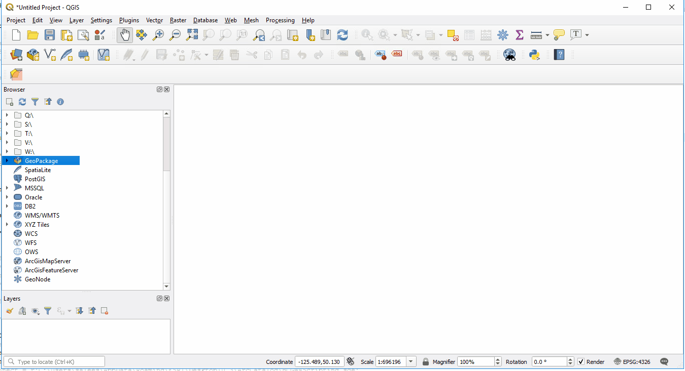

# Web Based Data Access in QGIS

Within QGIS there are many ways to access data. This sections focus is on accessing data through web mapping services that the BC government and many other organizations are making more available every year.

## Index
* [Web Mapping in QGIS](#Web-Mapping-in-QGIS)
   * [BC Government Web Mapping](#BC-Government-Web-Mapping)
   * [Quick Map Services Plugin](#Quick-Map-Services-Plugin)
* [Web Mapping Service WMS](#Web-Mapping-Service-(WMS)---Open-Source)
* [Web Coverage Service WCS](#Web-Coverage-Service-(WCS))
* [Web Feature Service WFS](#Web-Feature-Service-(WFS))
* [ArcGIS Feature Server](#ArcGIS-Feature-Server)
* [ArcGIS Map Server](#ArcGIS-Map-Server)
* [XYZ Tiles](#XYZ-Tiles)
   * [Google](#Google)
   * [Open Street Maps](#Open-Street-Maps)
   * [ESRI](#ESRI)

## Web Mapping in QGIS

In QGIS data can be accessed either through local data sources on your computer or from web based mapping services. QGIS offers a wide range of solutions to access online data, minimizing the necessity to download the data to a computer. Web based data sources can be added and managed through the QGIS Browser or Data Source Manager.

1. Right click WMS/WMTS in browser window to create a connection, or,
2. Layer -> Data Source manager -> WMS to create a new connection.

## BC Government Web Mapping

   DataBC offers data connection services that allow users to view thousands of data layers from the British Columbia Geographic Warehouse (BCGW) in desktop geospatial software or via web-based map applications.  These connection services deliver current data directly from the BCGW so that you or users of your web mapping applications can work with the latest data available without needing to repeatedly download the data. 

   *BC Web mapping services information:*
   https://www2.gov.bc.ca/gov/content/data/geographic-data-services/web-based-mapping/map-services

   *To find WMS data sources in the BCGW please reference the BC Data Catalogue.* https://catalogue.data.gov.bc.ca/dataset?download_audience=Public

   You are able to tell if a web layer is available in the BC Data Catalogue by the small labels in the lower right of each feature. If a web layer is available it will show either WMS (Web Mapping Service) or ArcGIS_Rest (ArcGIS FeatureServer).
   
   

## Quick Map Services Plugin

   For instructions on how to load Plugins in QGIS please refer to: [Loading Plugins](QGIS-plugins.md)
   
   QGIS has a helpful plugin called Quick Map Services (QMS) that assists users in finding webservices through pre-defined plugin links. 

   To install and use the plugin: 
   1. Plugins -> Manage and Install -> Search QMS and install the plugin.
   2. Find the QMS toolbar.
   
      

   3. Click the icon for QuickMapServices -> and select Settings.
   4. Click the More Services tab and click the Get contributed pack. Click OK on the pop up, and SAve or Cancel to exit the window.
   5. Click the QuickMapServices icon again and select a service to load.

   Note: This loads the service but does not set it up as a connection type in the browser.

   

   Additional user contributions of available web services around the world can be found at: https://github.com/nextgis/quickmapservices_contrib
  
## Web Mapping Service (WMS) - Open Source

WMS is the dominant web mapping service used in the BC Government and the most common open source web mapping service. Unlike WCS or WFS this service type serves up data converted to an image format.

The WMS link to use for setting up the BC government mapping service in QGIS is: http://openmaps.gov.bc.ca/geo/ows?

1. Right click WMS/WMTS and select New Connection... 
2. Enter the above link in the URL and give the connection a name of your choice. 
3. Leave the parameters as they are in the rest of the connection window and click OK. 
4. The connection will display under WMS in the Browser. 
5. Click on the arrows to expand out the data tree you just named, then select a feature to add or drag into your Layers panel. Individual layers can also be added as a connection if you are able to find the unique WMS link in the BC Data Catalogue.

 

Many organizations have data available for use through a WMS format. Some require passwords while others do not.

* BC Government: http://openmaps.gov.bc.ca/geo/ows?
* Government of Canada Topographic: https://maps.geogratis.gc.ca/wms/canvec_en?request=getcapabilities&service=wms&version=1.3.0&layers=canvec&legend_format=image/png&feature_info_type=text/html
* Available Government of Canada Open WMS: https://open.canada.ca/data/en/dataset?organization=ec&res_format=WMS

## Web Coverage Service (WCS)
Another form of open source online data is a web coverage service (WCS). This type of service is very similar to WFS. The difference is that WCS provides access to a spatial group of features allowing the end user to choose data based on spatial constraints.

Many examples of WCS sources can be found at the United States government site NOAA (National Oceanic and Atmoshperic Administration) https://data.noaa.gov/dataset/.

NASA also has examples of WCS services that can be added:
https://earthdata.nasa.gov/learn/pathfinders/gis-pathfinder/geospatial-services

The following link will create a large WCS data connection to NASA open data: https://webmap.ornl.gov/ogcbroker/wcs?

## Web Feature Service (WFS)

The last open source data service is Web Feature Services (WFS). The main difference with a WFS is that it allows querying and retrieval of features from the server. If permitted, data manipulation operations can occur with this service like editing, updating or deleting.

The Government of Canada Open Government Portal provides good examples of Web Feature Services:
https://open.canada.ca/data/en/dataset?collection=fgp&res_format=WFS

The USGS United States Geological Survey has many examples of WFS layers too: https://mrdata.usgs.gov/wfs.html

## ArcGIS Feature Server

Many organizations now have open data policies that allow for free access to their data through ESRI online servers. The main work is usually finding the service URL at which to make a connection to the server. A feature server returns and displays the GIS shape data of the feature. This ArcGIS format would most closely compare to the open source WFS.

Many regional districts and cities in British Columbia are making their data available through open data feature servers. 

For example: Visit the City of Kelowna Open Data Server. Search and find the data required and copy the service link. Modify the link to reference the whole mapserver, then add the new ArcGIS Feature server connection in QGIS.

https://geo.kelowna.ca/arcgis/rest/services/OpenData/MapServer/

The BC Govenment has recently been adding more publicly available online ArcGIS features. In the BC Data Catalogue they are referenced as ArcGIS_REST services.

To find a rest service on the [BC Data Catalogue](https://catalogue.data.gov.bc.ca/dataset?download_audience=Public):
1. Find the URL link to the service.
2. While in the online service look in the lower right for the service URL.
3. Use this link to add a connection to the open service to QGIS.

## ArcGIS Map Server

An ArcGIS Map Server is similar to a feature server but performs differently by returning a raster version of the data. The same server links can be used for mapserver or featureserver.

The Natural Resource Canada NRCAN Map Server can be added:
https://geoappext.nrcan.gc.ca/arcgis/rest/services/BaseMaps

## XYZ Tiles

XYZ Tiles are a method to serve up tiled GIS image data over the web. The tiling makes using the data much faster, as it is already created on the server and limits the amount of data to be processed on the end users software. QGIS is able to connect to XYZ tile servers like Google, Open Street Maps, ESRI and others. Examples of these are:

### Google

      Roadmap: http://mt0.google.com/vt/lyrs=m&hl=en&x={x}&y={y}&z={z} 

      Terrain: http://mt0.google.com/vt/lyrs=p&hl=en&x={x}&y={y}&z={z}

      Altered roadmap: http://mt0.google.com/vt/lyrs=r&hl=en&x={x}&y={y}&z={z}

      Satellite only: http://mt0.google.com/vt/lyrs=s&hl=en&x={x}&y={y}&z={z}

      Terrain only: http://mt0.google.com/vt/lyrs=t&hl=en&x={x}&y={y}&z={z}

      Hybrid: http://mt0.google.com/vt/lyrs=y&hl=en&x={x}&y={y}&z={z}

### Open Street Maps

      Open Map: https://tile.openstreetmap.org/{z}/{x}/{y}.png

### ESRI

      Satellite: https://server.arcgisonline.com/ArcGIS/rest/services/World_Imagery/MapServer/tile/{z}/{y}/{x}

      Relief: https://server.arcgisonline.com/ArcGIS/rest/services/World_Shaded_Relief/MapServer/tile/{z}/{y}/{x}

To add an XYS Tile in QGIS:
1. From the Browser, right click XYZ Tiles and select New Connection...
2. Add a name of the service to be used and enter the URL.
3. Load data into the project or drag it into the Layers Panel.

### License
    Copyright 2019 BC Provincial Government

    Licensed under the Apache License, Version 2.0 (the "License");
    you may not use this file except in compliance with the License.
    You may obtain a copy of the License at

       http://www.apache.org/licenses/LICENSE-2.0

    Unless required by applicable law or agreed to in writing, software
    distributed under the License is distributed on an "AS IS" BASIS,
    WITHOUT WARRANTIES OR CONDITIONS OF ANY KIND, either express or implied.
    See the License for the specific language governing permissions and
    limitations under the License.

---
[Back to top](#Web-Based-Data-Access-in-QGIS)