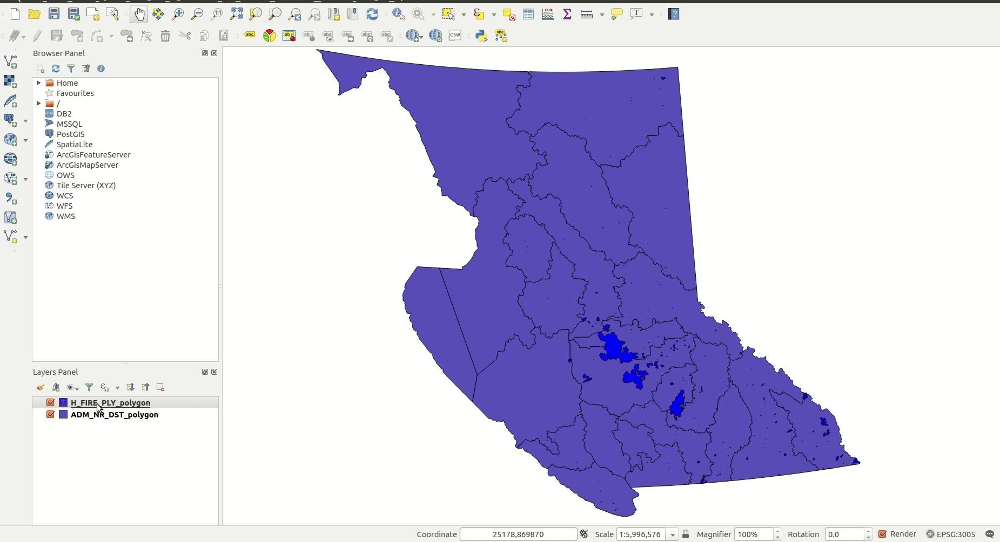

# Advanced symbology in QGIS

[home](readme.md)

Index
* [Getting Started](#getting-started)
* [Symbolizing the Road Layer](#symbolizing-the-road-layer)

## Getting Started

The type of symbology you should use on a map is dependent on many factors but the main factors are geometry type (point, line, or polygon), scale, and density.

Point Symbols
Point symbols are features that cannot be represented by their true geometry or features where the true geometry has not been captured. Examples include trees, windmills, and even houses at small scales. Point symbols can be divided into three symbology classes:
1) Plan symbols are the most common and simply show features as a dot, square, or other shape that doesn’t give any information about the feature.
2) Profile symbols give 2D representations of flattened features that show a rough depiction of the feature
3) Functional symbols show an action taking place. These are commonly used on park maps where a square with a person fishing, cycling, or swimming depicts that these activities are allowed at the park.

Line Symbols
Line symbols are features that have 1 dimension: length. They can have a width attribute but it is not inherent to their geometry as it would be with a polygon. Lines are sometimes depicted as a single line but are more commonly depicted as multiple lines wherein a train track would have a thin black centre line and cross hatches running through it at a set interval.

Polygon Symbols
Polygons are 2D shapes that have a length and a width attribute. In terms of symbology they usually are depicted with a light coloured fill and a slightly darker outline around their perimeter.

Symbology on Your Map
For this exercise you will need three layers:

* [Kamloops Trees Point Layer](https://mydata-kamloops.opendata.arcgis.com/datasets/trees)
* [The Digital Road Atlas](https://catalogue.data.gov.bc.ca/dataset/digital-road-atlas-dra-master-partially-attributed-roads#edc-pow)
* [The Local and Regional Greenspaces Polygons](https://catalogue.data.gov.bc.ca/dataset/local-and-regional-greenspaces)

Load the three layers listed above to a blank map and ensure the Coordinate System is set to BC Albers (EPSG: 3005).

Once you’ve loaded the layers you will want to zoom in to an area in Kamloops with some parks. I chose the area surrounding of Valleyview Nature Park in Kamloops but any area in Kamloops will work.

## Symbolizing the Road Layer
When you first load the DRA you will notice that all the lines look more or less the same. The highways are recognizable because they have double lines but, other than that, every road type is symbolized identically.
Right click the road layer and go to its Properties and in the Properties box navigate to its Source. Open the Query Builder and add the Definition Query:

```sql
"ROAD_CLASS" IN ('arterial','collector','highway','local','unclassified','yield')
```

Click Apply and then navigate to the Symbology tab in the properties menu.
Change the Symbol type to Categorized and the Column to ROAD_CLASS. Click Classify.


With the layer categorized you can start changing the line symbols. Double click the highway symbol to open its Symbol selector. Click the green + button to add a new line. Make the top line size 0.8 and yellow. Make the lower line size 1.0 and black. Click OK to exit the Symbol selector and OK to exit the Layer properties.


You'll notice that the line caps still show up at each section of the highway line. You can remove these in the Advanced section of the layer symbology properties by turning on Symbol levels.


Make the yield roads the same as highways but slightly thinner with the yellow line as 0.5 and the black line as 0.7. Make Collector roads solid black 0.4 and arterial roads solid black 0.3. Make local roads medium grey 0.3.

Unclassified roads on this map are trails. So you'll want to make their symbol smaller and less eye catching than the roads and with some indication that they are trails. To do this open the symbol properties for this layer and create two lines using the + button. Change the Symbol layer type of both lines to Marker line. Change the interval of the upper line to 30 and then make it an SVG marker and make the SVG the image of the person hiking and increase the size to 3.0. Make the second marker line a brown dashed line with size 1.0. Turn off rotation in the hiking person marker line.


=======
QGIS supports many of the same symbology types as its competitors. It also supports more advanced symbology through the [geometry generator and vector graphics](https://docs.qgis.org/2.18/tr/docs/user_manual/working_with_vector/style_library.html).

Index
* [Getting Started](#getting-started)
* [The Centroid Function](#the-centroid-function)
* [The Area Function](#the-area-function)
* [The Scale Function](#the-scale-function)


## Getting Started

QGIS allows feature data types to be changed without creating a new layer through the geometry generator.

[The following examples use the layers below:](#adding-data-from-layer-library)
* [WHSE_LAND_AND_NATURAL_RESOURCE.PROT_HISTORICAL_FIRE_POLYS_SP](https://catalogue.data.gov.bc.ca/dataset/fire-perimeters-historical#edc-pow)
* [WHSE_ADMIN_BOUNDARIES.ADM_NR_DISTRICTS_SP](https://catalogue.data.gov.bc.ca/dataset/natural-resource-nr-district#edc-pow)

Query the Historical Fire layer to only show fires from 2017.
```sql
"FIRE_YEAR" = 2017
```
Make sure the fire layer is displayed above the NR District layer.


## The Centroid Function
The Centroid function is used to convert polygons to points based on the centroid coordinates of the polygon. It is used for data conversion purposes.

Double click the Historical Fire layer to enter its layer properties and navigate to the symbology tab. Change the symbology from Simple fill to Geometry generator and set the Geometry type to Point / MultiPoint.

Click the Epsilon button beside the code block to open the Expression Dialog window if it doesn't automatically appear. You can take some time at this point to explore different expressions that are displayed in the centre block of the dialog.

In the code block, enter the following code:
```python
Centroid($geometry)
```

Click Apply and OK to exit the window.

Now every fire on the map is displayed as a point and you should be able to see some fires that weren't visible before.




## The Area Function
The $area function is used to give the area of a polygon feature as a real number. It has lots of uses but, when using it in the Geometry Generator, it is generally reserved for conditional statements.

Open the properties of the Historical Fire layer and create a Geometry generator symbol with the Geometry type Point / MultiPoint if this does not already exist. Add the following code to the code block:

```sql
if(
	$area / 10000 < 1000,
	centroid($geometry),
	Null
)
```

This will make fires smaller than 1,000 hectares display as points on the map but not display the fires larger than 1,000 hectares.

Add another Geometry generator below the Point / MultiPoint symbol. Leave the settings as default and enter the Expression Dialog. Enter the following expression:

```sql
if(
	$area/10000 >= 1000,
	$geometry,
	Null
)
```

This will make all the polygons larger than or equal to 1,000 hectares appear as polygons on the map.


## The Scale Function

The Geometry Generator can also support scale dependent geometry with the @map_scale function. @map_scale returns the numerical scale of the current map and can be used for conditionals that change how layers are displayed when you zoom in or out of a map.

If you haven't already, create two geometry generators in the Historical Fire layer. Make one have the Geometry type Point / MultiPoint and the other Polygon / MultiPolygon.

Enter the following code into the Expression Dialog for the Point / MultiPoint layer:

```sql
if(
	@map_scale > 250000,
	if(
		$area/10000 < 1000,
		centroid($geometry),
		Null
	),
	Null
)
```

Now enter the following code into the Expression Dialog for the Polygon / MultipPolygon layer:

```sql
if(
	@map_scale > 250000,
	if(
		$area/10000 >= 1000,
		$geometry,
		Null
	),
	$geometry
)
```

Press Apply and OK to exit the Layer Properties. Now into and out of the map. Notice how the points turn to polygons when you zoom in beyond 1:250,000 in scale.

