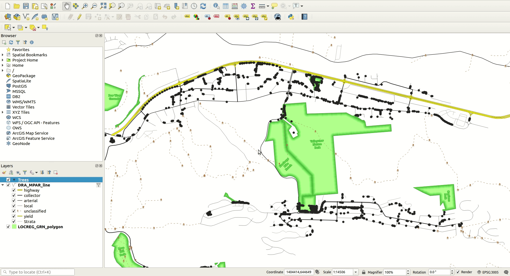

# Advanced symbology in QGIS

[Home](readme.md)

Index
* [Getting Started](#getting-started)
* [Accessing Symbology Options](#accessing-symbology-options)
  * [The Properties Menu](#the-properties-menu)
  * [The Layer Styling Panel](#the-layer-styling-panel)
* [Symbolizing the Road Layer](#symbolizing-the-road-layer)
* [Symbolizing the Parks Layer](#symbolizing-the-parks-layer)
* [Symbolizing the Trees Layer](#symbolizing-the-trees-layer)
  * [Single Symbol Symbology](#single-symbol-symbology)
  * [Categorized symbology](#categorized-symbology)
  * [Graduated symbology](#graduated_symbology)
  * [Rule-Based symbology](#rule-based-symbology)
* [Opacity](#opacity)
  * [Layer Opacity](#layer-opacity)
  * [Layer Part Opacity](#layer-part-opacity)
* [Symbolizing a DEM](#symbolizing-a-dem)
* [Overlaying a DEM over a Hillshade](#overlaying-a-dem-over-a-hillshade)

## Getting Started

For this exercise you will need three layers:

* [Kamloops Trees Point Layer](https://mydata-kamloops.opendata.arcgis.com/datasets/trees)
* [The Digital Road Atlas](https://catalogue.data.gov.bc.ca/dataset/digital-road-atlas-dra-master-partially-attributed-roads#edc-pow)
* [The Local and Regional Greenspaces Polygons](https://catalogue.data.gov.bc.ca/dataset/local-and-regional-greenspaces)

Download the three layers and follow the steps in [Working with Data in QGIS](working-with-data-in-QGIS.md) to add the data to a blank map.

Once you’ve loaded the layers you will want to zoom in to an area in Kamloops with some parks. I chose the area surrounding of Valleyview Nature Park in Kamloops but any area in Kamloops will work.

## Accessing Symbology Options

There are two main ways to access symbology options for a layer. These options are listed in the section below.

## The Properties Menu

* highlight the layer in the layer tree
* right-click and select **Properties** from the popup menu
* navigate to the **Symbology** tab in the *Layer Properties* box

or

* double click the layer in the layer tree
* navigate to the **Symbology** tab in the *Layer Properties* box

## The Layer Styling Panel

There are several ways to access the layer styling panel:

* highlight the layer in the layer tree
* press F7 on your keyboard

or

* highlight the layer in the layer tree
* press the **Open the Layer Styling panel** button at the top left of the layer tree


or

* turn on **Layer Styling** in *View* -> *Panels*


## Symbolizing the Road Layer

* open the Query Builder and follow the steps in [Expressions and Filter Queries](expressions.md) to add the following Definition Query to the roads layer:

```sql
"ROAD_CLASS" IN ('arterial','collector','highway','local','unclassified','yield')
```

* navigate to the Symbology tab in the road layer's properties menu
* change the **Symbol type** to *Categorized* and the **Column** to *ROAD_CLASS*
* click *Classify* to get a list of all the unique values from the *ROAD_CLASS* field


### Change the highway symbol

* double click the highway symbol to open its Symbol selector menu
* click the green + button to add a new line symbol to the feature
* change the size of the upper line to 0.8 mm and change its colour to yellow
* change the size of the lower line to 1.0 mm and change its colour to black
* click OK to exit the Symbol selector menu and OK to exit the Layer properties


### Turn on symbol levels

* click the **Advanced** button at the bottom right of the symbology window and from the drop down select *Symbol levels...*
* ensure the **Enable symbol levels** checkbox is checked to enforce symbol levels for the layer
* click OK to save your changes and exit


### Change the other road symbols

* style the yield roads the same as highways but thinner with the yellow line 0.5 mm thick and the black line 0.7 mm thick
* style the Collector roads as solid black lines 0.4 mm thick
* style the arterial roads as solid black lines 0.3 mm thick
* style the local roads as medium grey 0.3 mm thick

### Symbolize the trails with SVG images
* open the symbol properties for Unclassified roads and create two lines using the + button
* set the Symbol layer type property to Marker line for both lines
* set the interval of the upper line to 30
* in the lowest, third, symbol in the symbology tree, set the Symbol layer type to SVG marker
* set the SVG as an image of a person hiking and increase the size to 3.0
* set the second marker line as a brown dashed line with size 1.0
* turn off rotation in the hiking person marker line


## Symbolizing the Parks Layer

* open the layer properties for the parks layer and navigate to the symbology tab
* set the **Fill type** to *Shapeburst Fill*
* set the first colour as dark green
* set the second colour as a lighter green
* change the **Shading type** from *Whole shape* to *Set distance* and make it 50 Meters at scale


## Label the parks

* open the layer's Properties and navigate to the **Labels** tab
* set the **Label type** to *Single labels*
* set the **Value** as *PARK_NAME*
* select a **Font** and set the **Size** to a value between 7 and 9 points
* select a **Color** similar to the light green used for the area fill
* navigate to the **Buffer** tab
* check the box beside **Draw text buffer**
* set the **Size** to *0.7 mm*
* select a dark green as the **Color**
* navigate to the **Formatting** tab
* set **Wrap lines to** to *7 characters*
* navigate to the **Rendering** tab
* at the bottom of the menu check the box beside **Only draw labels which fit completely within the feature**
* navigate to the **Placement tab**
* set the **Mode** to *Free (Angled)*


## Symbolizing the Trees Layer
The trees layer is points that show the location of trees within Kamloops. QGIS offers several ways to display points that can be useful.

## Single Symbol symbology
* double click the trees layer to enter its Properties menu and navigate to the **Symbology** tab
* click the text labelled *Simple marker* in the white box
* you will see options to change the **Fill color**, **Stroke color**, and other attributes as well as an area with different shapes to choose from
* experiment with the different colours and stroke and size settings
* change the **Symbol layer type** to *SVG marker*
* in the **SVG Groups** list at the bottom of the menu select *symbol*
* pick a symbol and try experimenting with different fills and strokes
* other options include font markers, vector symbols, and filled markers which you can experiment with or find more information on in the [QGIS documentation](https://docs.qgis.org/3.16/en/docs/user_manual/style_library/symbol_selector.html)



## Categorized symbology

* double click the trees layer to enter its Properties menu and navigate to the **Symbology** tab
* change the top dropdown to *Categorized*
* set the **Value** to *TYPE* and click Classify
* adjust the symbology for each tree type as you see fit
* save your changes and exit the menu


## Graduated symbology

* double click the trees layer to enter its Properties menu and navigate to the **Symbology** tab
* change the top dropdown to *Graduated*
* change the **Value** to *SPREAD*
* change the **Method** to *Size*
* adjust the **Size from** and **to** values until you are happy with how they look on the map
* leave the classification mode to default or explore other classification modes in the [QGIS documentation](https://docs.qgis.org/3.16/en/docs/user_manual/working_with_vector/vector_properties.html?highlight=equal%20count) section 14.1.3.1.4. Graduated Renderer


## Rule-based symbology

* double click the trees layer to enter its Properties menu and navigate to the **Symbology** tab
* change the top dropdown to *Rule Based*
* click the + button to add a rule
* in the **Label** textbox enter *Coniferous Trees > 7*
* ensure the radio button beside **Filter** is checked and in the textbox enter *"TYPE" LIKE  'CONIFEROUS' AND  "SPREAD" > 7*
* in the **Description** textbox enter *Coniferous trees with greater than 7m spread*
* click OK to save your changes and exit the rule menu
* click the + button to add another rule
* in the **Label** textbox enter *Deciduous Trees > 1*
* in the **Filter** textbox enter *"TYPE" LIKE  'DECIDUOUS' AND  "SPREAD" > 1*
* in the **Description** textbox enter *Deciduous trees with greater than 1m spread*
* click OK
* click the + button to enter another rule
* enter *Other* as the **Label**
* check the radio button beside **Else** (this will create a symbol for everything not caught in the previous two expressions)
* enter *Other trees* as the **Description**
* save your changes and exit the properties menu


## Opacity

Opacity of a layer (how transparent it is) can be set on the layer itself or on a particular symbol of a layer.

## Layer Opacity

* navigate to the **Symbology** tab of the layer
* in the main section set the **Opacity** value either numerically in the text box or using the slider

## Layer Part Opacity

If you want to change the opacity of part of a layer (e.g. the fill of a polygon but not the stroke or one symbol layer in the symbol tree) you can follow the steps below:

* navigate to the **Symbology** tab of the layer
* highlight the layer item you want to change the opacity of
* double click the **Fill color**
* set the **Opacity** using the slider or the text box


## Symbolizing a DEM

Digital Elevation Models (DEMs) are raster data where an area is divided into grids with each grid representing an elevation value.

* Download a DEM from (the BC Government data catalogue)[https://pub.data.gov.bc.ca/datasets/175624/92c/]
* Load the DEM into QGIS by following the instructions in the [Working with data in QGIS](data.md) page
* highlight the DEM and click the **Open the layer styling panel** button above the layer tree
* change the dropdown set to *Singleband grey* to *Singleband pseudocolor*
* scroll down the menu and adjust the **contrast**, **brightness**, **Zoomed in**, **Zoomed out**, and **Oversampling** values until you are happy with the result
* for more information on these options, see the [QGIS Documentation](https://docs.qgis.org/3.16/en/docs/user_manual/introduction/qgis_configuration.html?highlight=oversampling) section 9.1.6. Rendering Settings but a brief explanation is higher oversampling means a crisper image but slower load times  whereas brightness and contrast would work similarly to these settings on a computer monitor
* Zoom in and out on the DEM


## Overlaying a DEM over a Hillshade

DEMs can be converted to hillshades very easily in QGIS

* if you don't already have a DEM loaded from the last step, download a DEM from (the BC Government data catalogue)[https://pub.data.gov.bc.ca/datasets/175624/92c/] and complete the Symbolizing a DEM step from above
* right click the DEM and copy the layer then paste it so you have two copies of the DEM in your layer tree
* Rename the uppermost DEM *DEM* and the lowermost copy *hillshade*
* open the layer styling panel for the DEM and enter the **Transparency** tab by clicking the small map icon in the upper left of the panel
* set the **Global opacity** to *40%*
* highlight the hillshade in the layer tree to view its styling panel
* change the dropdown that is set to *Singleband pseudocolor* to *Hillshade*
* change **Zoomed in** to *Cubic*
* change **Zoomed out** to *Cubic*
* change **Oversampling** to *40*


---
[Back to Top](Advanced-sybmology-in-QGIS)