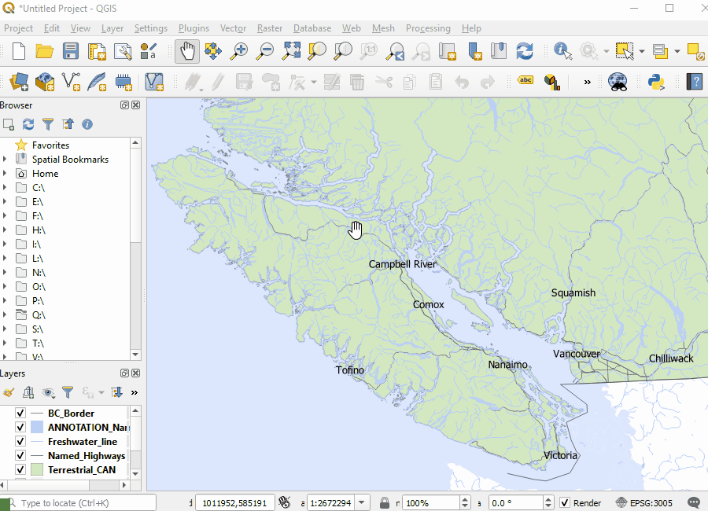

# Create a Map Layout
		
QGIS uses a tool called Print Layout that allows you to create maps that can be exported and/or printed.

Check out the [QGIS Documentation](https://docs.qgis.org/3.16/en/docs/user_manual/print_composer/overview_composer.html) for more detailed information

## Index
* [Create a Map Layout](#Create-a-Map-Layout)
* [Map Elements](#Map-Elements)
		

## Create a Map Layout

Once you have created a map and are ready to export and/or print the Print Layout tool can be used to begin creating your layout. This can be accessed via Project -> New Print Layout		

QGIS allows multiple map print layouts to be created using the same map file and the Layout Manager tool can be used to access these or load a template. 

This can be accessed via Print -> Layout Manager. Select Empty layout (or navigate to template location) and click Create. Name the layout, click OK and the Print Layout window will open.
	

  
To choose the appropriate page size and orientation right-click on the central part of the layout and click Page Properties. These page properties can be set in the Item Properties tab seen on the right of the window.

To add a map to the layout use Add Item - > Add Map and click and drag a box on the layout page. From the Add Item menu a title can also be added using Add Label. The item properties such as font, colour and size can be set in the Item Properties tab on the right of the window.

## Map Elements
		

