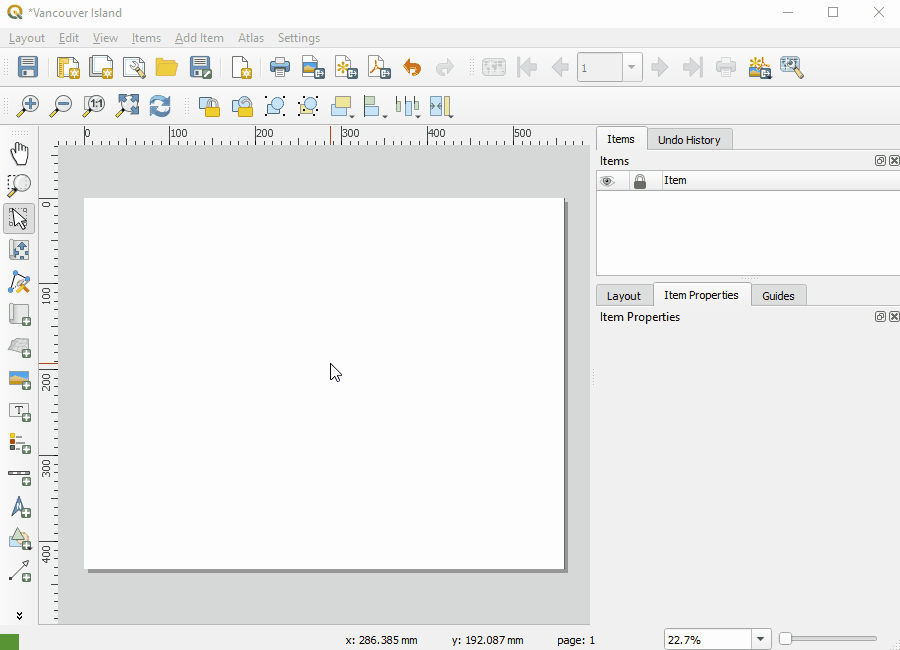
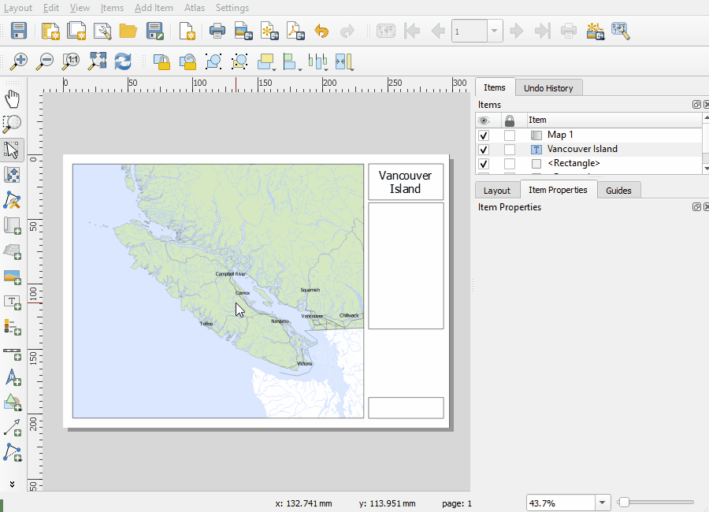

# Create a Map Layout
		
QGIS uses a tool called Print Layout that allows you to create maps that can be exported and/or printed.

Check out the [QGIS Documentation](https://docs.qgis.org/3.16/en/docs/user_manual/print_composer/overview_composer.html) for more detailed information

## Index
* [Create a Map Layout](#Create-a-Map-Layout)
* [Map Elements](#Map-Elements)
* [Export a Layout](#Export-a-Layout)
		

## Create a Map Layout

Once you have created a map and are ready to export and/or print the Print Layout tool can be used to begin creating your layout. This can be accessed via Project -> New Print Layout		

QGIS allows multiple map print layouts to be created using the same map file and the Layout Manager tool can be used to access these or load a template. 

This can be accessed via Print -> Layout Manager. Select Empty layout (or navigate to template location) and click Create. Name the layout, click OK and the Print Layout window will open.

To choose the appropriate page size and orientation right-click on the central part of the layout and click Page Properties. These page properties can be set in the Item Properties tab seen on the right of the window.

To add a map to the layout use Add Item - > Add Map and click and drag a box on the layout page. From the Add Item menu a title can also be added using Add Label. The item properties such as font, colour and size can be set in the Item Properties tab on the right of the window.

## Map Elements
		
Map elements can be added through the Add Items menu or the buttons along the left side of the layout. Some options include: North Arrow, Scale Bar, Tables, Labels, Shapes and Pictures.

To add a **legend** to the layout also use Add Item -> Legend (or the shortcut button on the left). Click on the layout to place the legend. On the Item Properties tab the legend properties can be set. Legend items can be modified under the Legend Items group. To modify the legend items, uncheck Auto Update and make your changes. Legend items can be deleted, renamed or re-ordered.

To add a **scale bar** and **north arrow** use the Add Item menu or shortcut buttons on the left. Click and drag on the layout to place the element. Properties can be set in the Item Properties tab. 

To add a **table** to the layout use Add Item -> Add Attribute Table. Click and drag on the layout where you would like to place the table. From the Item Properties tab the table can be modified. The number of rows, fields and style elements can be edited.

To add a **picture or logo** to the layout use Add Item -> Add Picture or the shortcut button on the left. Click and drag where you would like to place the picture. Navigate to the image source location on the Properties tab to load your picture.

To add **dynamic date** to the layout create a text box and all the following formula
[% day( $now) %]/[% month( $now)%]/[% year( $now)%]
Please refer to the [QGIS Documentation](https://docs.qgis.org/3.16/en/docs/training_manual/map_composer/dynamic_layout.html?highlight=dynamic%20date) for more detailed information on creating dynamic text.

## Export a Layout 
