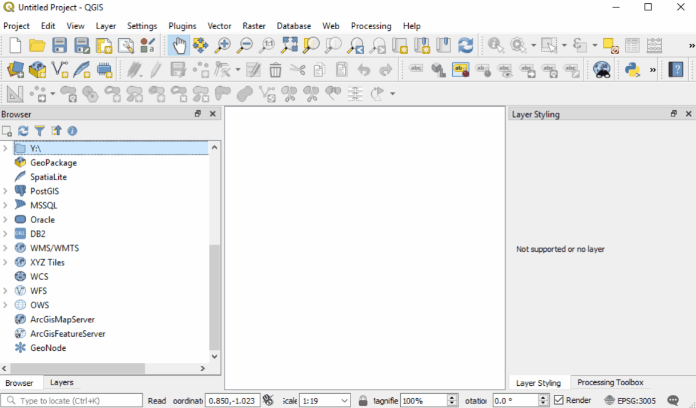
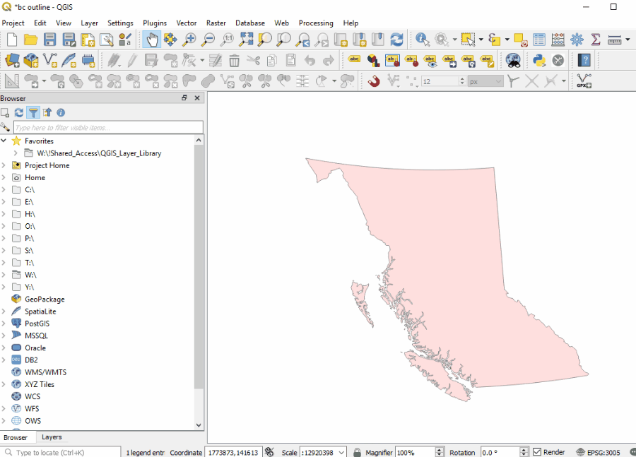
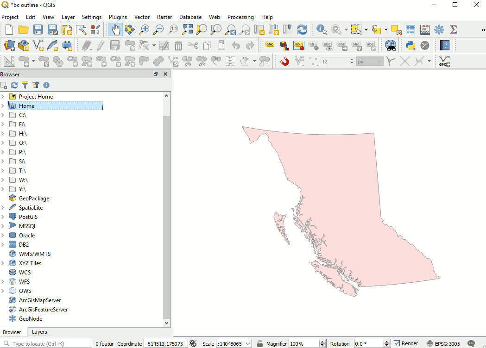
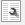
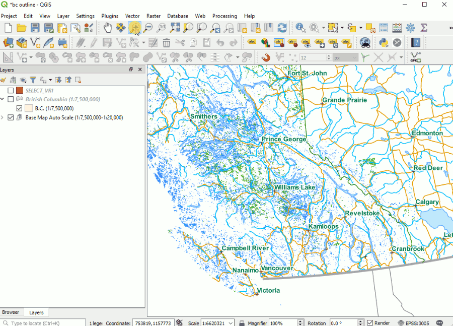
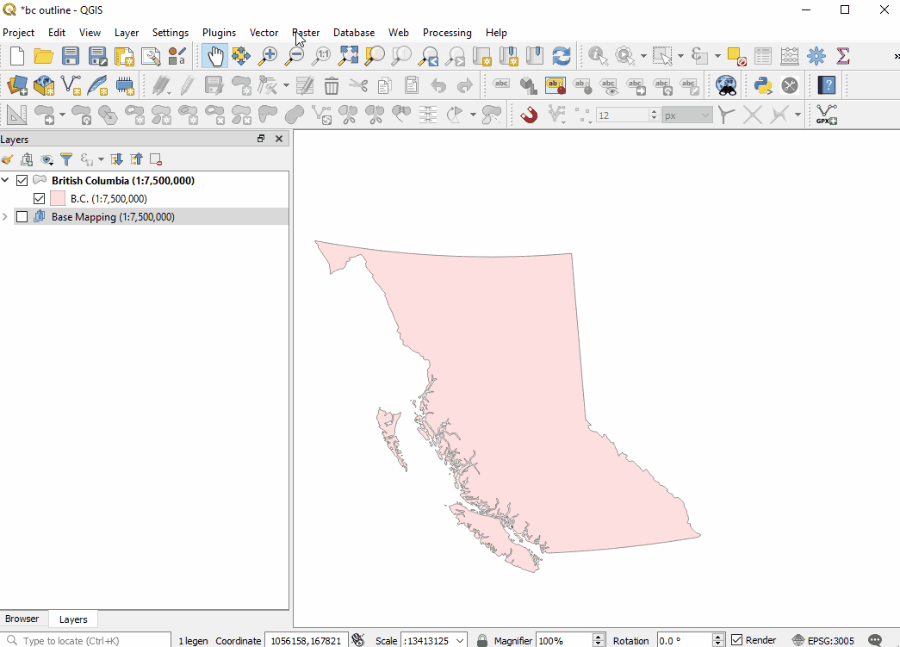

# Working with data in QGIS

[home](../readme.md)

QGIS supports many types of data.  The native format for QGIS is the Geopackage(.gpkg).  A Geopackage is just a SQLite database container with a standard schema governed by the OGC [Specification](http://docs.opengeospatial.org/is/18-000/18-000.html).  QGIS also provides excellent support of the Shapefile format.

Supported [Vector](https://gdal.org/drivers/vector/index.html) and [Raster](https://gdal.org/drivers/raster/index.html) Formats

Index
* [Adding data to QGIS](#adding-data-to-qgis)
* [Adding data from layer library](#adding-data-from-layer-library)
* [Adding Oracle data via browser panel](#adding-oracle-data-via-browser-panel)
* [Adding Oracle Data via DB Manager](#adding-oracle-data-via-db-manager)
* [Create New Vector Layers](#create-new-vector-layers)
* [Select by location](#select-by-location)
* [Create grids and samples](#create-grids-and-samples)


## Adding data to QGIS
QGIS supports multiple ways to add data to your map.  Most file based formats you can drag n'drop onto the map.  Otherwise you can use:
* [Browser panel](https://docs.qgis.org/testing/en/docs/user_manual/managing_data_source/opening_data.html#the-browser-panel)

You can add data from ArcGIS online feature service.  BC MapHub feature services can be accessed with this URL https://maps.gov.bc.ca/arcserver/rest/services/mpcm/bcgwpub/MapServer/

In the browser panel right click on the Add ESRI Feature service and create new




## Adding data from layer library
The BCGOV QGIS layer library provides standardized style and data definitions for corporate datasets. Add the location of the QGIS Layer Library to your favorites, navigate through the folder categories, right click the layer and choose *Add selected layer(s) to project*





## Adding Oracle data via browser panel
With the Browser panel open right-click the  and click *New Connection....*




Find your new connection and expand the contents so you can choose the table you want to add to your map.

## Adding Oracle Data via DB Manager
Once you have established your oracle connection you can start DB Manager from the Database menu.  Select and connect to your Oracle database from the  provider section. When you are connected you can expand the table list and right-click and choose *Add to project...*

>**Some of bcgov oracle datasets perform poorly in QGIS**.  These seem to be those with both many records and large geometry objects.  Some examples are digital road atlas, parcel fabric, and forest vegetation polygons. **To avoid having to wait 15 hours for QGIS to unfreeze try creating a virtual SQL layer using DB Manager and a bounding box or other refining query** [QGIS Link](https://docs.qgis.org/testing/en/docs/user_manual/plugins/core_plugins/plugins_db_manager.html).

To make an SQL layer from your oracle connection connect to your Oracle connnection as above, then click the  to edit your SQL.  Using a bounding box method shown below is one way to reduce the number of records and geometries and will significantly improve your oracle experience with QGIS.


Below is an example for subseting VRI table using a bounding box.  This can easly be modified to do more by modifying the select, where clause, or adding joins.  This is a powerful tool. Use it.
```sql
/* Oracle has a seemingly overly complex way of describing a bounding box
    GEOMETRY is the name of the geometry column (GEOMETRY or SHAPE for BCGW)
    The bounding box is created by
     by creating a SDO_GEOMETRY object
        2003 means it is a polygon geometry type (SDO_GTYPE)
        3005 is the BCALBERS SRID  (SDO_SRID)
        NULL is the SDO_POINT_TYPE (this is a polygon afterall)
        SDO_ELEM_INFO_ARRAY tells oracle how to interpret the ordinates
        SDO_ORDINATE_ARAY is the list of verticies the make up the above
        -clear as mud
 */  

select * from WHSE_FOREST_VEGETATION.VEG_COMP_LYR_R1_POLY where
SDO_ANYINTERACT (GEOMETRY,
	SDO_GEOMETRY(2003, 3005, NULL,
		SDO_ELEM_INFO_ARRAY(1,1003,3),
		SDO_ORDINATE_ARRAY(1589617.4,517052.4,1668136.6,578525.3) 
	)
) = 'TRUE'
```
>A handy tip for getting the extent of your analysis area - on the right, beside the coordinate box at the bottom of the QGIS window is a button that toggles the coordinate box between mouse coordinate location and map extent.  Toggle on the extent and click in the coordinates, cntrl-A, cntrl-C and paste it into your sql statement above.


## Create New Vector Layers
[QGIS Documentation Link](https://docs.qgis.org/testing/en/docs/user_manual/managing_data_source/create_layers.html#id10)

Be sure to check out:
* [Temporary Scratch layer](https://docs.qgis.org/testing/en/docs/user_manual/managing_data_source/create_layers.html#id15)
* [Virtual layers](https://docs.qgis.org/testing/en/docs/user_manual/managing_data_source/create_layers.html#id22)

## Select by location
Select by location tool isn't found with the other selction tools. You can find select by location in the Vector menu under Research Tools.

## Create grids and samples
You can find grid and sample creation tools in the Vector menu under Research Tools.


