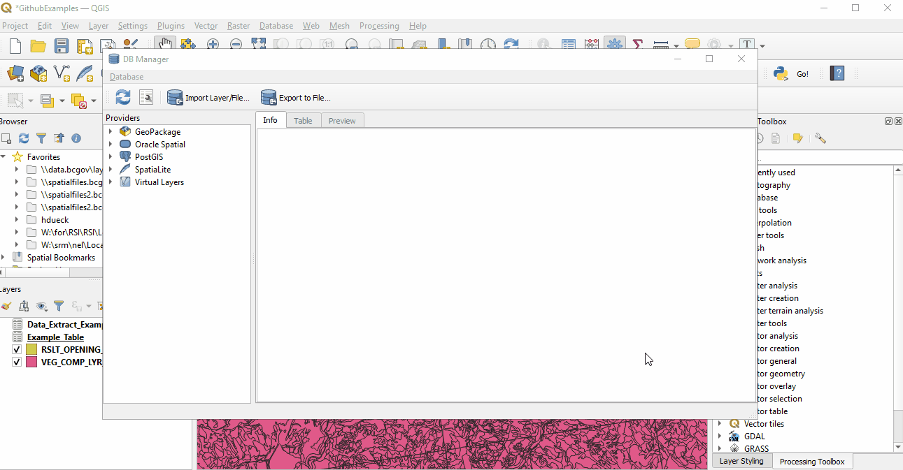

# Using Database Manager in QGIS

[Home](../README.md)

## Index
* [Intro](#intro)
* [Getting started](#getting-started)
* [Query Examples](#query-examples)
* [Loading layers](#loading-layers)
* [Exporting virtual layers](#exporting-virtual-layers)

## Intro
Database manager (DB Manager) can be used to query, combine, and/or subset tables and layers that can then be loaded into your QGIS project as virtual layers. One of the advantages of virtual layers is that, unlike scratch layers, they are maintained within the project even if you close it (hurray!). Another is the ability to add layers to your project that are already joined with other data *and* only contain the attributes you need.

## Getting started
To open DB manager, navigate to the Database menu and choose DB Manager from the dropdown. 


### Connect to a "Provider"
Through database manager you can work with layers/tables from within an Oracle (or other, e.g. Spatiallite) database, a geopackage, or from multiple locations if they are loaded into the project's layer pane.

You can access these through the **Providers** menu on the left side of the db manager screen.

#### **To add and connect to geopackage:**
* Right click the **GeoPackage** provider and select "New Connection"
* Navigate to geopackage location
* Select geopackage and click "Open"
* Once added, click the arrow beside the specific geopackage to open a connection


#### **To connect to Oracle database:**
*Note - you will need an established Oracle database connection in QGIS before you can access it through db manager.*
* Click arrow beside **Oracle Spatial**
* Click arrow beside the database connection
* Enter credentials and click ok


#### **To access/connect to project layers:**
* Click arrow beside **Virtual Layers** in Providers panel
* Click arrow beside **Project Layers** to open connection



### SQL Window

Once connected to a provider, data can be queried using the **SQL Window** and run using the **Execute** button at the bottom left of the query window.

Queries can be saved using the options above the query window - either by saving to a file (using **Save As File**) or within the project by entering a name for the query and selecting **Save**. These can later be loaded through the **Saved Query** dropdown menu, or, if saved as a file, by using the **Load File** option. 


## Query Examples

### Subsetting layers

It can be useful to subset Oracle layers before loading the entire dataset to QGIS, particularly when the dataset is large and only some attributes are needed. E.g. the example below selects specific attributes from the VRI dataset and limits records returned to openings within the Selkirk District.

```SQL
SELECT OPENING_ID, BEC_ZONE_CODE, BEC_SUBZONE, BEC_VARIANT, OBJECTID, GEOMETRY
FROM WHSE_FOREST_VEGETATION.VEG_COMP_LYR_R1_POLY
WHERE ORG_UNIT_CODE = 'DSE';
```

>For more tips on limiting the number of records returned check "Adding Oracle Data via DB Manager" in the [working with data in QGIS](../working-with-data-in-QGIS.md) doc.

### Combining layers and/or tables from multiple providers

This can be done by loading the relevant layers into the project's layer pane, then connecting to the project layers in the DB Manager. 

The SQL window can then be used to write queries joining data from multiple sources - for instance, joining a spatial dataset from the BCGW Oracle database with information from a non-spatial table, as in the example below. 

```SQL
SELECT R.OPENING_ID, R.OPENING_STATUS_CODE, R.DISTRICT_CODE, R.DISTRICT_NAME, R.OBJECT_ID, R.geometry, E.EVALUATION_YEAR
FROM RSLT_OPENING_SVW R
JOIN EXAMPLE_TABLE E
ON (E.OPENING_ID = R.OPENING_ID);
```


## Loading Layers

Results of queries can be loaded as a virtual layer into your QGIS project.

* Check the **Load as new layer** box
* Specify a unique identifier and geometry column (if not already automatically filled)
* Specify layer name, if desired
* Click **Load** button


## Exporting virtual layers

Since virtual layers don't actually contain data, but function like a view, it's sometimes better to export layers that are the result of complex queries or ones that return large datasets to a different data format (e.g. geopackage layer) to improve performance. 

Virtual layers are exported the same way as any other feature export, by right-clicking the layer in the **Layers** pane and selecting **Export** --> **Save features as**. 
See [exporting data in QGIS](../exporting-data.md) for more detail.

>More on virtual layers (including other ways of building them): [QGIS Documentation](https://docs.qgis.org/3.16/en/docs/user_manual/managing_data_source/create_layers.html#creating-virtual-layers).

---

[Back to Top](#Index)

