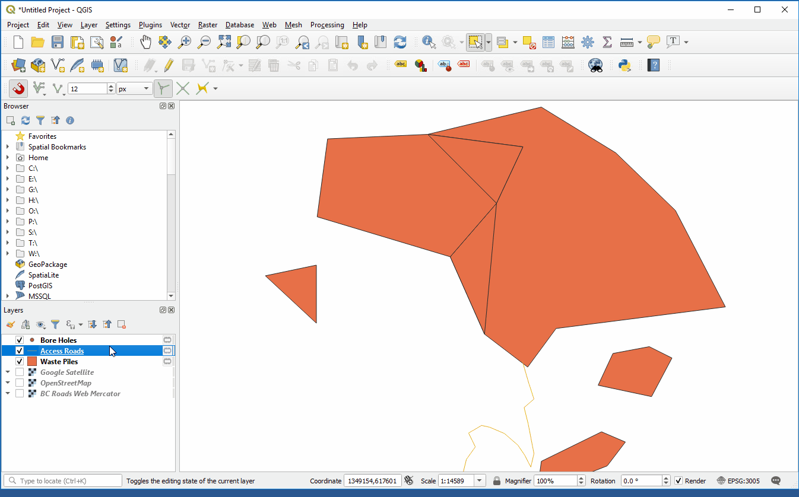
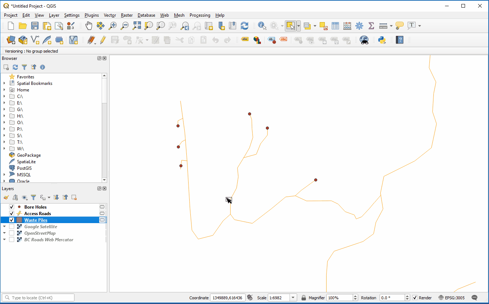
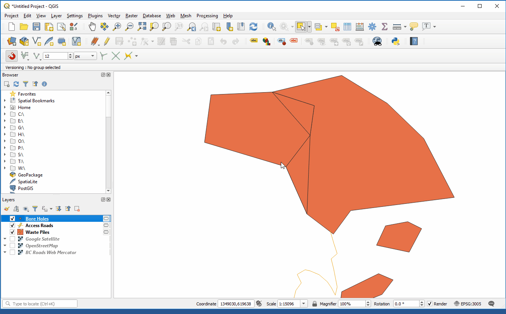
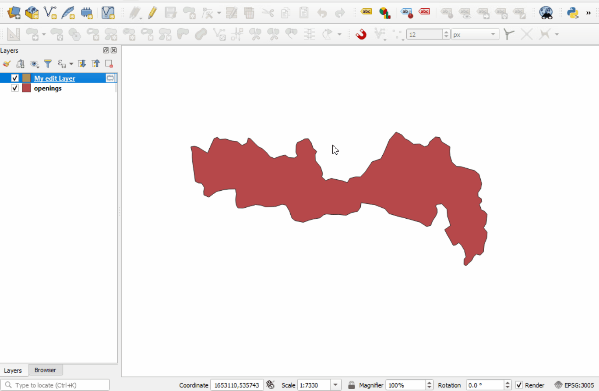
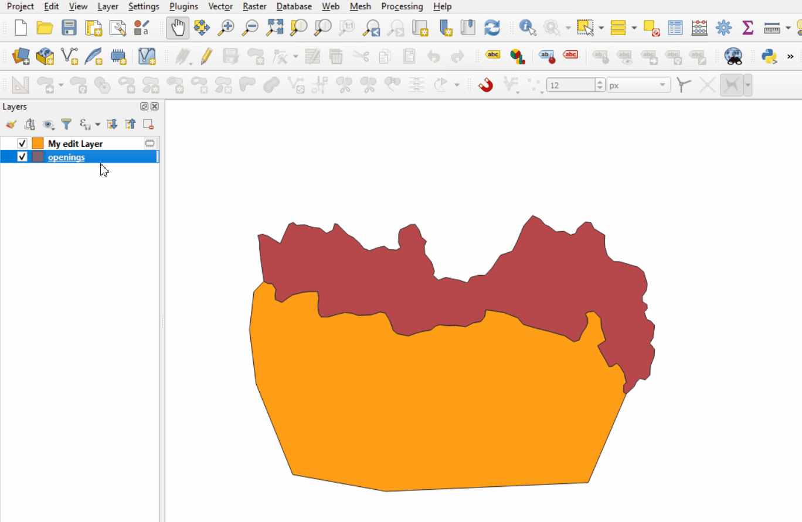
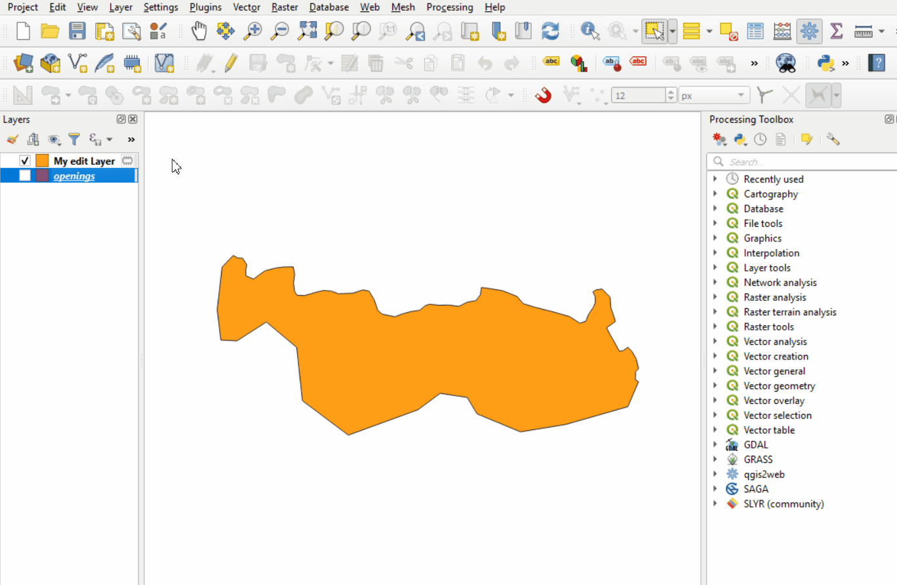

# Editing in QGIS

[Home](../README.md)

[QGIS Documentation](https://docs.qgis.org/testing/en/docs/gentle_gis_introduction/data_capture.html)

## Index
* [Creating new features](#Creating-new-features)
* [Attribution](#Attribution)
* [Add a field to a layer's attributes](#Add-a-field-to-layer-attributes)
* [Delete Features](#Delete-Features)
* [Moving and adding vertices](#Moving-and-adding-vertices)
* [Snapping](#Snapping)
* [Topological editing](#Topological-editing)
* [Tracing](#tracing)
* [Reshaping](#reshaping)
* [Edit in place](#edit-features-in-place)

## Creating new features
1. Enable editing on the desired layer

2. Select the create feature tool and click on the map to start drawing features. When finished, right click to stop drawing

## Attribution
1. When creating a new feature in a layer with attributes, a pop up will appear asking you to fill in the new feature's attributes

2. To edit attributes of an existing feature, open the attribute table, make sure editing is enabled and click into the attribute field to edit the value. (Depending on your settings, you may need to select the features for them to appear in the attribute table)

## Add a field to layer attributes
1. Open the attribute table
2. Make sure editing is enabled
3. Click add field
4. Fill in the field details

## Delete Features
1. In the attributes toolbar, enable the select tool
2. Select the features to be deleted and click the delete features button in the toolbar

## Moving and adding vertices  
1. Turn editing on for the desired layer
2. Select the vertex tool from the editing toolbar
## Snapping
1. Add the snapping toolbar by right clicking in the toolbar area and checking the snapping option
2. Click the red magnet  to enable snapping
3. By default, the tolereance is 12 px and snapping is set to vertices only. Change this to vertices and segments if you wish to snap to anywhere on an edge

## Topological editing
Topological editing allows you to easily maintain connections between nodes and edges when editing vertices. 
It can be enabled in the snapping toolbar.

## Tracing
Tracing allows you to trace your feature against an active layer,all layers, or a custom selection of layers. Tracing also allows you to specify an offset should that be required.
 

## Reshaping
Reshaping allows you to change the shape of an selected existing feature. With the desired feature selected and the reshape tool enabled start your reshape change on the same side of the feature you wish to finish. First digitize your reshape line before using right-click to finish. 

## Edit features in-place
Some prcessing tools can be used to edit features inplace. These processing tools can be run against all features or selected features in a layer with editing toggled on. Some of the tools that support this are: Buffer, Fix Geometries, Force right-hand-rule, Multipart to singleparts, Simplify, Smooth, Clip, Difference, Delete-holes, and others. 

---
[Back to Top](#Index)
