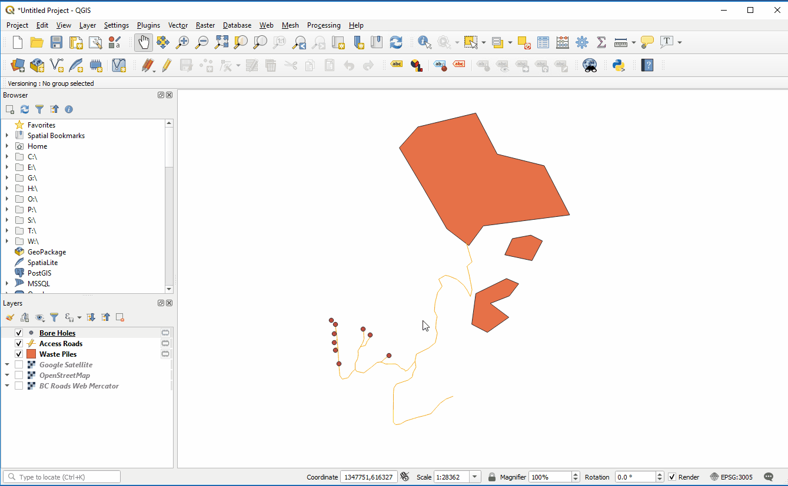
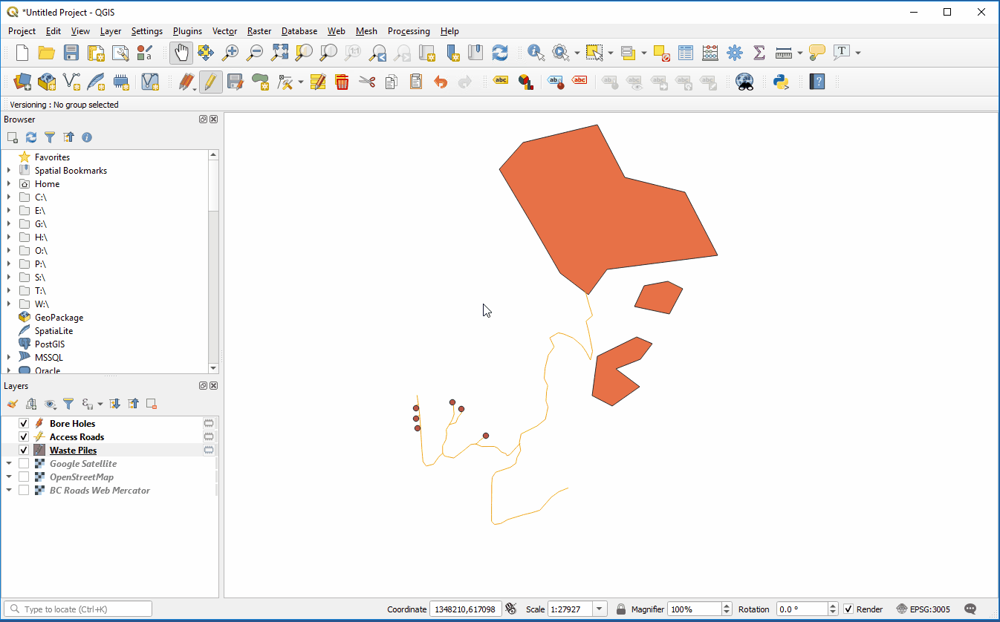
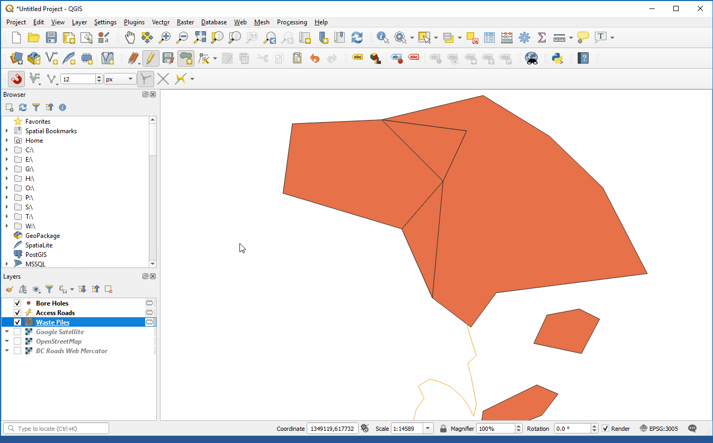
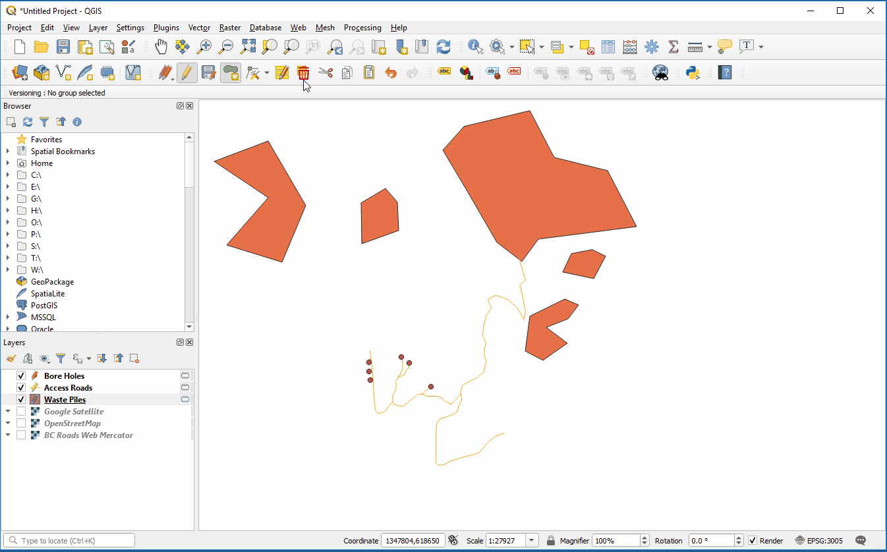
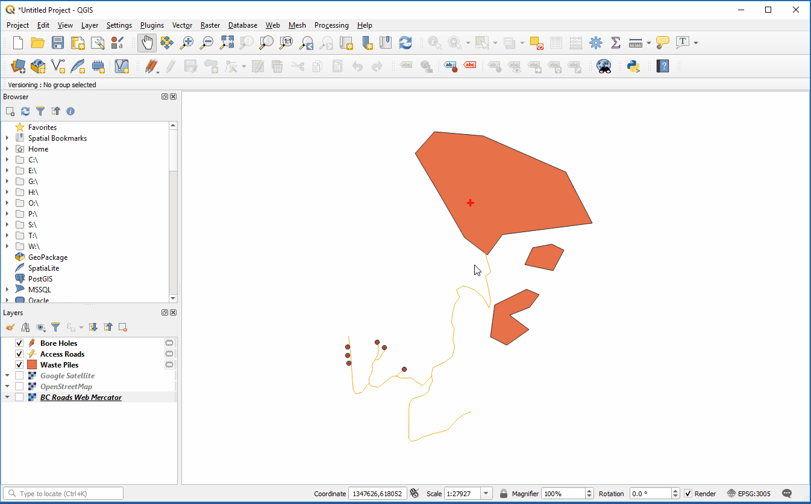
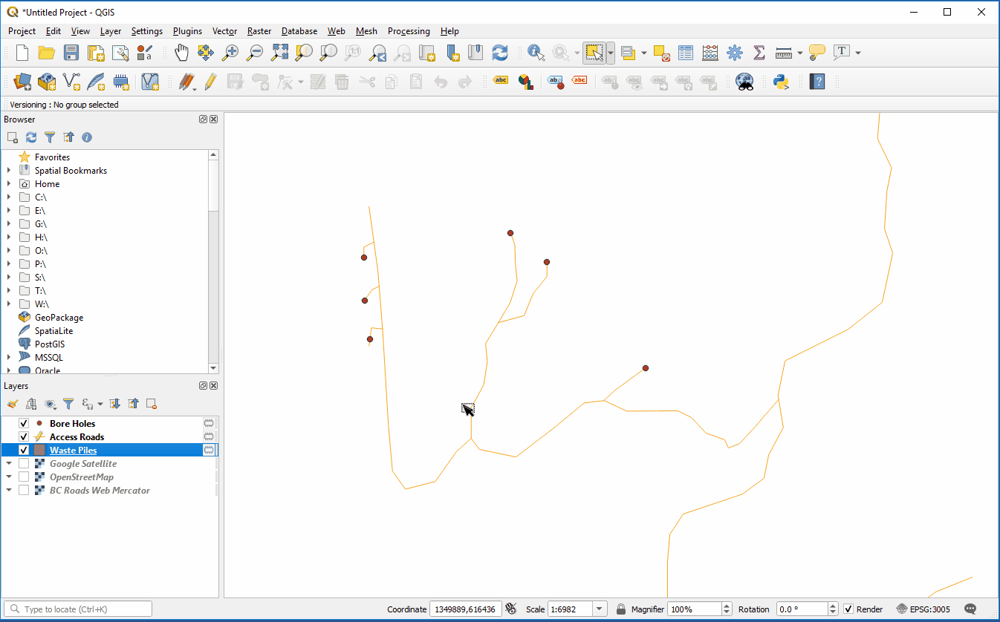
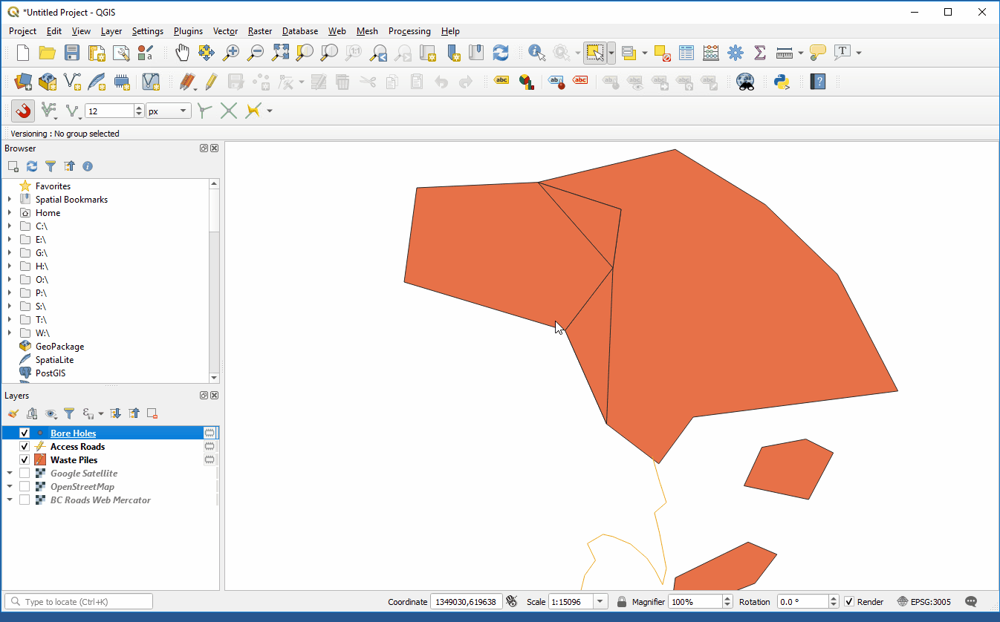

# Editing in QGIS !!!!!!!!!!!!!!!!!!!!!!!

[home](../readme.md)

[QGIS Documentation](https://docs.qgis.org/testing/en/docs/gentle_gis_introduction/data_capture.html)

1. Enable editing on the desired layer

2. Select the create feature tool and click on the map to start drawing features. When finished, right click to stop drawing.

## Attribution
1. When creating a new feature in a layer with attributes, a pop up will apread asking you to fill in the new features attributes.

2. To edit attributes on existing feature, open the attribute table, make sure editing is enabled and click into the attribute field to edit the value. (Depending on your settings, you may need to select the features for them to appear in the attribute table).

## Add a field to a layer's attributes
1. Open the attribute table
2. Make sure editing is enabled
3. Click add field
4. Fill in the field details

## Delete Features
1. In the attributes toolbar, enable to select tool.
2. Select features to be deleted and click the delete features button in the toolbar.

## Moving and adding vertices
1. Turn editing on for the desired layer
2. Select the vertex tool from the editing toolbar# Editing in QGIS

[home](../readme.md)

[QGIS Documentation](https://docs.qgis.org/testing/en/docs/gentle_gis_introduction/data_capture.html)

## Creating new features
1. Enable editing on the desired layer

2. Select the create feature tool and click on the map to start drawing features. When finished, right click to stop drawing.

## Attribution
1. When creating a new feature in a layer with attributes, a pop-up will appear asking you to fill in the new feature’s attributes.

2. To edit attributes on existing feature, open the attribute table, make sure editing is enabled and click into the attribute field to edit the value. (Depending on your settings, you may need to select the features for them to appear in the attribute table).

## Add a field to a layer's attributes
1. Open the attribute table
2. Make sure editing is enabled
3. Click add field
4. Fill in the field details

## Delete Features
1. In the attributes toolbar, enable to select tool.
2. Select features to be deleted and click the delete features button in the toolbar.

## Moving and adding vertices
1. Turn editing on for the desired layer
2. Select the vertex tool from the editing toolbar
3. Hover over a polygon, red circles will appear on its vertices, click a vertex to begin moving it and click again to place it in a new location or right click to release it to its original location.
4. To add a vertex to an edge, hover over the edge and a grey "+" will appears. Click the "+" to add a vertex, move it to the desired location, and click again to place it there or right click to restore the original edge.

## Snapping
1. Add the snapping toolbar by right clicking in the toolbar area and checking the snapping option. 
2. Click the red magnet to enable snapping
3. By default, the tolerance is 12 px and snapping is set to vertices only. Change this to vertices and segments if you wish to snap to anywhere on an edge.

## Topological editing
Topological editing allows you to easily maintain connections between nodes and edges when editing vertices. 
It can be enabled in the snapping toolbar.

3. Hover over a polygon, red circles will appear on its vertices, click a vertex to begin mvoing it and click again to place it in a new location or right click to release it to its original location.
4. To add a vertex to an edge, hover over the edge and a grey "+" will appears. Click the "+" to add a vertex, move it to the desired location, and click again to place it there or right click to restore the original edge.

## Snapping
1. Add the snapping toolbar by right clicking in the toolbar area and checking the snapping option. 
2. Click the red magent to enable snapping
3. By default, the tolereance is 12 px and snapping is set to vertices only. Change this to vertices and segments if you wish to snap to anywhere on an edge.

## Topological editing
Topological editing allows you to easily maintain connections between nodes and edges when editing vertices. 
It can be enabled in the snapping toolbar.

