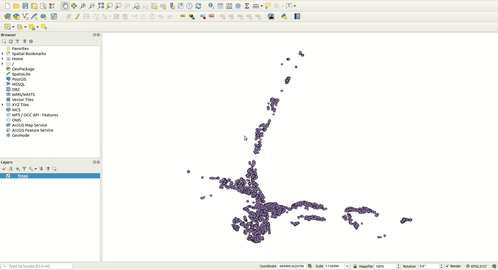
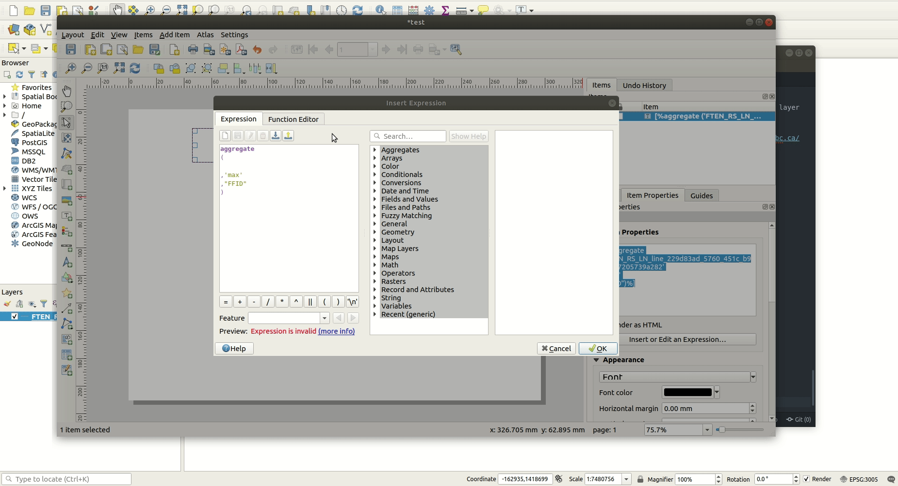

# Expressions and Filter Queries

[home](../readme.md)

## Index
* [Definition Query / Filter](#Definition-Query--Filter)
  * [Basic queries](#basic-queries)
  * [Queries on multiple columns with AND](#queries-on-multiple-columns-with-and)
  * [Queries on multiple columns with OR](#queries-on-multiple-columns-with-or)
* [Select by attribute query](#Select-By-Attribute-Query)
* [Select by geometry query](#Select-By-geometry-Query)
* [Geometry Expressions](#geometry-expressions)
* [Geometry Generator (Layer Style)](#geometry-generator-layer-style)
   *  [Getting Started](#getting-started)
   *  [The Centroid Function](#the-centroid-function)
   *  [The Area Function](#the-area-function)
   *  [The Scale Function](#the-scale-function)
* [Label Expressions](#label-expressions)
   *  [Accessing the label expression dialogue](#Accessing-the-label-expression-dialogue)
   *  [Adding a dynamic date variable](#adding-a-dynamic-date-variable)
   *  [Adding an attribute from a layer](#adding-an-attribute-from-a-layer)
   *  [Aggregating the length of multiple road sections](#aggregating-the-length-of-multiple-road-sections)
   *  [Iterators and Multiple Rows of data](#iterators-and-multiple-rows-of-data)
   *  [Start and End Points and Coordinate System Transformations](#start-and-end-points-and-coordinate-system-transformations)

## Definition Query / Filter

### Basic queries

* open QGIS and add the [Kamloops Trees Point Layer](https://mydata-kamloops.opendata.arcgis.com/datasets/trees)
* double click the layer in the layer tree to open its properties menu
* click the **Query Builder** button to open the menu to add a new query
* enter the following Query:

```sql
"SPECIES" IN ('apple','arborvitae')
```



* Navigate back to the query and change it to:

```sql
"SPECIES" NOT IN ('apple','arborvitae')
```

### Queries on multiple columns with AND

* Navigate back to the query and change it to:

```sql
"SPECIES" IN ('apple','arborvitae') AND "SPREAD" > 2
```

### Queries on multiple columns with OR

* Navigate back to the query and change it to:

```sql
"SPECIES" IN ('apple','arborvitae') OR "SPREAD" = 2
```

Some common query operators are:

* =       *Field value is exactly equal to the specified value*
* <>      *Field value is not equal to the specified value*
* !=      *Field value is not equal to the specified value*
* LIKE    *Field text value is equal or partially equal (using fuzzy logic) to the specified value*
* AND     *Allows adding multiple queries that must all be met*
* OR      *Allows adding multiple queries where one or more must be met*

Wildcards can be used to substitute any other characters in a string using the LIKE operator. Some common operators are:

* %       *Replaces an unlimited number of characters or no characters - characters can be numbers or letters*
* _       *Replaces a single character in a string*
* [list]  *Matches characters in a list*
* [^list] *Matches characters not specified in a list*
* [!list] *Matches characters not specified in a list*

* Navigate back to the query and change it to:

```sql
"SPECIES" LIKE 'a%'
```

For more information on all operators available in QGIS see the [QGIS documentation](https://docs.qgis.org/3.16/en/docs/user_manual/working_with_vector/vector_properties.html?highlight=query%20builder#query-builder)

## Select by attribute query

Selecting features by an attribute can be accessed through the layer's attribute table by clicking the *Select features using an expression* button in the top bar of the attribute table. This uses standard SQL syntax and can be written like a WHERE statement.

For example, using the BC_MAJOR_CITIES_POINTS_500M layer you could use the following expressions:

```sql
 -- Select 100 Mile House point
 "NAME" LIKE  '100 Mile House' 
```

```sql
-- Select cities with populations over 10,000 people
 "POP_2000" > 10000
```


## Select by geometry query

Selecting features by an geometry can be accessed through the layer's attribute table by clicking the *Select features using an expression* button in the top bar of the attribute table. This uses standard SQL syntax and can be written like a WHERE statement.

For example, using the BC_MAJOR_WATERSHEDS layer you could use the following expression:

```sql
 -- Select watersheds that are larger than 1 million hectares
 $area/10000 > 1000000 
```

Or, if you want to find an intersect between two layers:

```sql
--Select watersheds that intersect the 100 Mile House NRD
intersects(
	$geometry , 
	geometry(
		get_feature(
			'ADM_NR_DISTRICTS_SP_7a02069b_c6a1_49f9_af61_760c2576bcf1', 
			'DISTRICT_NAME', 
			'100 Mile House Natural Resource District'
		)
	)
)
```

The latter example would more commonly be accomplished using the *Select by location* tool but it is worth noting that everything that can be done using the *Select by location* tool can be done with a text expression as well and a single text expression can contain multiple queries using the AND and OR operators.

## Geometry Expressions

Examples of geometry expressions can be found in the [Select by geometry query](#Select-By-geometry-Query) and [Geometry Generator (Layer Style)](#geometry-generator-layer-style) sections.

More information on these can be found in the [QGIS documentation](https://docs.qgis.org/3.16/en/docs/user_manual/working_with_vector/expression.html#geometry-functions).

## Geometry Generator (Layer Style)

### Getting Started

QGIS allows feature data types to be changed without creating a new layer through the geometry generator.

[The following examples use the layers below:](#adding-data-from-layer-library)
* [WHSE_LAND_AND_NATURAL_RESOURCE.PROT_HISTORICAL_FIRE_POLYS_SP](https://catalogue.data.gov.bc.ca/dataset/fire-perimeters-historical#edc-pow)
* [WHSE_ADMIN_BOUNDARIES.ADM_NR_DISTRICTS_SP](https://catalogue.data.gov.bc.ca/dataset/natural-resource-nr-district#edc-pow)

* query the historical fire layer to only show fires from 2017

```sql
"FIRE_YEAR" = 2017
```

* make sure the fire layer is displayed above the NR District layer


### The Centroid Function
The Centroid function is used to convert polygons to points using the x,y coordinates of the centre of the polygon. It is used for data conversion purposes.

* double click the historical fire layer and enter its layer properties
* navigate to the Symbology tab 
* Change the **Symbol layer type** from *Simple fill* to *Geometry generator*
* set the **Geometry type** to *Point / MultiPoint*
* click the epsilon button near the upper right corner of the code block to open the Expression Dialog window 
* in the code block, enter the following code:

```python
Centroid($geometry)
```

* click OK to exit the Expression Dialog window and OK to exit the layer properties

Now every fire on the map is displayed as a point and you should be able to see some fires that weren't visible before.


### The Area Function
The $area function returns the area of a polygon feature as a real number. 

* open the properties of the Historical Fire layer 
* navigate to the Symbology tab
* open the code block for the geometry generator symbol you created in the [previous section](#the-centroid-function)
* change the code in the code block to the following:

```sql
if(
	$area / 10000 < 1000,
	centroid($geometry),
	Null
)
```

* click OK to exit the Expression Dialog

This will make fires smaller than 1,000 hectares display as points on the map but not display the fires larger than 1,000 hectares.

* in the symbology section of layer properties, add another Geometry generator below the Point / MultiPoint symbol using the green + button 
* leave the settings as default and enter the Expression Dialog 
* enter the following expression:

```sql
if(
	$area/10000 >= 1000,
	$geometry,
	Null
)
```

* click OK to exit the Expression Dialog

This will make all the polygons larger than or equal to 1,000 hectares appear as polygons on the map.


### The Scale Function

The Geometry Generator can also support scale dependent geometry with the @map_scale function. 
@map_scale returns the numerical scale of the current map.

* navigate to the Symbology tab of the fire perimeters layer
* enter the following code into the Expression Dialog for the Point / MultiPoint layer:

```sql
if(
	@map_scale > 250000,
	if(
		$area/10000 < 1000,
		centroid($geometry),
		Null
	),
	Null
)
```

* enter the following code into the Expression Dialog for the Polygon / MultipPolygon layer:

```sql
if(
	@map_scale > 250000,
	if(
		$area/10000 >= 1000,
		$geometry,
		Null
	),
	$geometry
)
```

* press OK to exit the Layer Properties
* zoom into and out of the map to see how the points turn to polygons when you zoom in beyond 1:250,000 in scale

## Label Expressions

Label expressions are code that are written directly in labels in QGIS map layouts. 
The [QGIS webpage](https://docs.qgis.org/3.16/en/docs/user_manual/print_composer/composer_items/composer_label.html) has a section on label expressions that you can explore further.
Below are some examples of label expressions.

To start you'll need to open a blank map and create a print layout. 
If you aren't familiar with creating print layouts please see the [making maps](https://github.com/bcgov/gis-pantry/blob/master/docs/getting-started-with-QGIS/doc/making-maps.md) section of this guide.

### Accessing the label expression dialogue
* create a blank map layout
* add a label by selecting **Add Label** from the *Add Item* dropdown list
* Select the label and then click the **Insert an Expression...** button in the label properties

### Adding a dynamic date variable
* the following code adds today's daty as text formatted as Month day, year:

```sql
format_date(now(),'MMMM dd, yyyy')
```

* Click OK

For more information on formatting dates see the [QGIS documentation section 14.3.7.6](https://docs.qgis.org/3.16/en/docs/user_manual/working_with_vector/functions_list.html#date-and-time-functions).

### Adding an attribute from a layer

Adding attributes from a layer is only slightly more difficult than adding a date because you have to reference a layer and a field and sometimes use an aggregate function.

To follow along with this section you will need the [FTEN road section lines dataset](https://catalogue.data.gov.bc.ca/dataset/forest-tenure-road-section-lines#edc-pow).

* Load the road section lines data set into the map
* Add a definition query to the layer:

if using the shapefile downloaded from the BC government data directory:

```sql
"FFID" LIKE 'R23206'
```

if using the Oracle database layer:

```sql
"FOREST_FILE_ID" LIKE 'R23206'
```

* add a new label to the print layout
* navigat back to the **Insert an Expression...** dialogue
* add the following expression to print the road's Forest File ID (FFID):

if using the shapefile downloaded from the BC government data directory:
```sql
aggregate('[layer_name]','max',"FFID")
```

if using the Oracle database layer:
```sql
aggregate('[layer_name]','max',"FOREST_FILE_ID")
```

replace layer_name with your layer's name which can be found in the Map Layers menu as shown below.



* Click OK 

Your label should now show the road's FFID - R23206

### Aggregating the length of multiple road sections

In this example you will use the same road sections but rather than printing the road ID you will print the sum, min, and max length of the sections.

* add a new label anywhere on the print layout
* navigate to the **Insert Label Expression...** window
* enter the following code:

if using the shapefile downloaded from the BC government data directory:
```sql
'Max: '
+
to_string(
	aggregate('[layer_name]'
   ,'max'
   ,"FEAT_LEN")
)
+
'\nMin: '
+
to_string(
	aggregate('[layer_name]'
   ,'min'
   ,"FEAT_LEN")
)
+
'\nSum: '
+
to_string(
	aggregate('[layer_name]'
   ,'sum'
   ,"FEAT_LEN")
)
```

if using the Oracle database layer:
```sql
'Max: '
+
to_string(
	aggregate('[layer_name]'
   ,'max'
   ,"FEATURE_LENGTH_M")
)
+
'\nMin: '
+
to_string(
	aggregate('[layer_name]'
   ,'min'
   ,"FEATURE_LENGTH_M")
)
+
'\nSum: '
+
to_string(
	aggregate('[layer_name]'
   ,'sum'
   ,"FEATURE_LENGTH_M")
)
```

Again, replace [layer_name] with your layer's name.

The result you should see in the label is a list of numbers similar to:

Max: 5997.0419
Min: 461.0144
Sum: 10222.712800000001

You'll notice the significant digits for the sum are very long. You can fix this by changing the code to:

if using the shapefile downloaded from the BC government data directory:
```sql
'\nSum: '
+
to_string(
	round(
		aggregate(
			'[layer_name]'
			,'sum'
			,"FEAT_LEN"
		),2
	)
)
```

if using the Oracle database layer:
```sql
'\nSum: '
+
to_string(
	round(
		aggregate(
			'[layer_name]'
			,'sum'
			,"FEATURE_LENGTH_M"
		),2
	)
)
```

### Iterators and Multiple Rows of data

Sometimes, rather than aggregating all the rows of data, you will need to show information from each individual row of data. 
In QGIS, this can be done by aggregating the data with the concatenate attribute.
The below code is an example of the farmatting used to accomplish this:

```sql
aggregate(
	layer:='your_layer',
	aggregate:='concatenate',
	expression:=[your_expression]
)
```

where [your_expression] is an sql expression without the brackets.

* add a new label anywhere on the print layout
* navigate to the **Insert Label Expression...** window
* enter the following code:

if using the shapefile downloaded from the BC government data directory:
```sql
aggregate(
	layer:='[layer_name]'
	,aggregate:='concatenate'
	,expression:="RD_SECT_ID" + ' ( Length: ' + to_string ("FEAT_LEN" / 1000) + 'Km )\n'
)
```

if using the Oracle database layer:
```sql
aggregate(
	layer:='[layer_name]'
	,aggregate:='concatenate'
	,expression:="ROAD_SECTION_ID" + ' ( Length: ' + to_string ("FEATURE_LENGTH" / 1000) + 'Km )\n'
)
```

### Start and End Points and Coordinate System Transformations

The previous example is a simple starting point but it gets more complicated when you want to show start and end points of a line in a different coordinate system than the data is stored in. Luckily, QGIS allows you to perform data transformations within your label expression so you don't have to make copies of your data in separate files.

QGIS allows you to print coordinates in different coordinate systems.
Here we will print the start and end points of our road lines in UTM coordinates.

* open the properties of the previous label you created to iterate through the road data
* navigate to the **Insert Label Expression...** window
* enter the following code:

if using the shapefile downloaded from the BC government data directory:
```sql
aggregate(
	layer:='[layer_name]'
	,aggregate:='concatenate'
	,expression:="RD_SECT_ID"
	+
	' ( Length: '
	+
	to_string(
		"FEAT_LEN" / 1000
	)
	+
	'Km )'
	+
	'PofC UTM10'
	+
	to_string(
		to_int(
			x(
				transform(
					point_n(
						$geometry, 1
					),
					'EPSG:3005', 'EPSG:26910'
				)
			)
		)
	)
	+
	'PofT UTM10'
	+
	to_string(
		to_int(
			x(
				transform(
					point_n(
						$geometry, -1
					),
					'EPSG:3005', 'EPSG:26910'
				)
			)
		)
	)
	+
	'\n'
)
```

if using the Oracle database layer:
```sql
aggregate(
	layer:='[layer_name]'
	,aggregate:='concatenate'
	,expression:="ROAD_SECTION_ID"
	+
	' ( Length: '
	+
	to_string(
		"FEATURE_LENGTH" / 1000
	)
	+
	'Km )'
	+
	'PofC UTM10'
	+
	to_string(
		to_int(
			x(
				transform(
					point_n(
						$geometry, 1
					),
					'EPSG:3005', 'EPSG:26910'
				)
			)
		)
	)
	+
	'PofT UTM10'
	+
	to_string(
		to_int(
			x(
				transform(
					point_n(
						$geometry, -1
					),
					'EPSG:3005', 'EPSG:26910'
				)
			)
		)
	)
	+
	'\n'
)
```

In this case we only printed the x coordinates but by replacing x with y in this code we could print the y coordinates instead.
