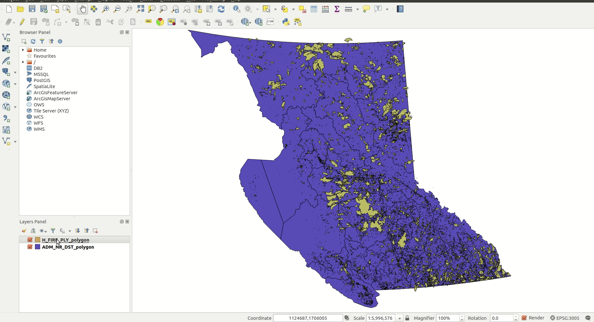
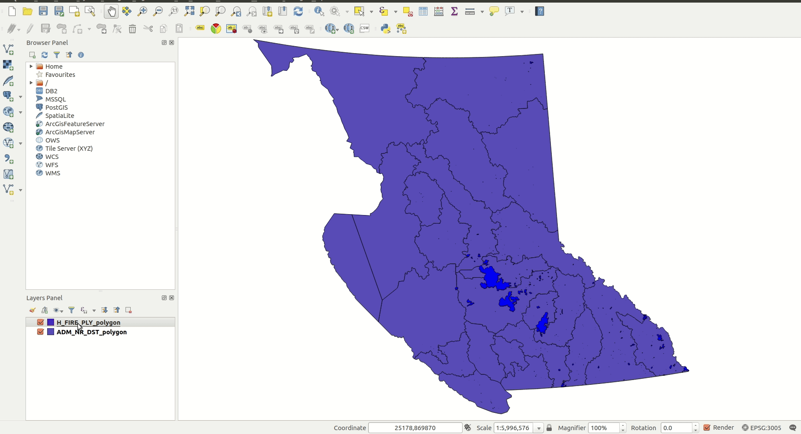
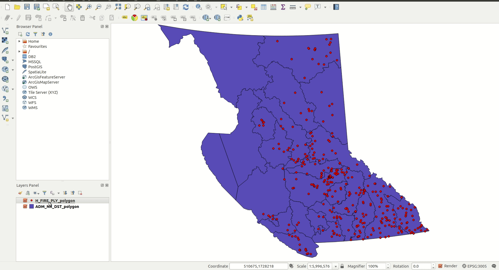

# Expressions and Filter Queries

[home](../readme.md)

## Definition Query / Filter

## Select by attribute query

## Geometry Expressions

## Geometry Generator (Layer Style)

Index
* [Getting Started](#getting-started)
* [The Centroid Function](#the-centroid-function)
* [The Area Function](#the-area-function)
* [The Scale Function](#the-scale-function)


## Getting Started

QGIS allows feature data types to be changed without creating a new layer through the geometry generator.

[The following examples use the layers below:](#adding-data-from-layer-library)
* [WHSE_LAND_AND_NATURAL_RESOURCE.PROT_HISTORICAL_FIRE_POLYS_SP](https://catalogue.data.gov.bc.ca/dataset/fire-perimeters-historical#edc-pow)
* [WHSE_ADMIN_BOUNDARIES.ADM_NR_DISTRICTS_SP](https://catalogue.data.gov.bc.ca/dataset/natural-resource-nr-district#edc-pow)

Query the Historical Fire layer to only show fires from 2017.
```sql
"FIRE_YEAR" = 2017
```
Make sure the fire layer is displayed above the NR District layer.



## The Centroid Function
The Centroid function is used to convert polygons to points based on the centroid coordinates of the polygon. It is used for data conversion purposes.

Double click the Historical Fire layer to enter its layer properties and navigate to the symbology tab. Change the symbology from Simple fill to Geometry generator and set the Geometry type to Point / MultiPoint.

Click the Epsilon button beside the code block to open the Expression Dialog window if it doesn't automatically appear. You can take some time at this point to explore different expressions that are displayed in the centre block of the dialog.

In the code block, enter the following code:
```python
Centroid($geometry)
```

Click Apply and OK to exit the window.

Now every fire on the map is displayed as a point and you should be able to see some fires that weren't visible before.




## The Area Function
The $area function is used to give the area of a polygon feature as a real number. It has lots of uses but, when using it in the Geometry Generator, it is generally reserved for conditional statements.

Open the properties of the Historical Fire layer and create a Geometry generator symbol with the Geometry type Point / MultiPoint if this does not already exist. Add the following code to the code block:

```sql
if(
	$area / 10000 < 1000,
	centroid($geometry),
	Null
)
```

This will make fires smaller than 1,000 hectares display as points on the map but not display the fires larger than 1,000 hectares.

Add another Geometry generator below the Point / MultiPoint symbol. Leave the settings as default and enter the Expression Dialog. Enter the following expression:

```sql
if(
	$area/10000 >= 1000,
	$geometry,
	Null
)
```

This will make all the polygons larger than or equal to 1,000 hectares appear as polygons on the map.



## The Scale Function

The Geometry Generator can also support scale dependent geometry with the @map_scale function. @map_scale returns the numerical scale of the current map and can be used for conditionals that change how layers are displayed when you zoom in or out of a map.

If you haven't already, create two geometry generators in the Historical Fire layer. Make one have the Geometry type Point / MultiPoint and the other Polygon / MultiPolygon.

Enter the following code into the Expression Dialog for the Point / MultiPoint layer:

```sql
if(
	@map_scale > 250000,
	if(
		$area/10000 < 1000,
		centroid($geometry),
		Null
	),
	Null
)
```

Now enter the following code into the Expression Dialog for the Polygon / MultipPolygon layer:

```sql
if(
	@map_scale > 250000,
	if(
		$area/10000 >= 1000,
		$geometry,
		Null
	),
	$geometry
)
```

Press Apply and OK to exit the Layer Properties. Now into and out of the map. Notice how the points turn to polygons when you zoom in beyond 1:250,000 in scale.
