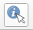
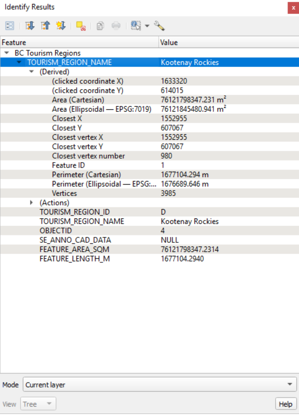
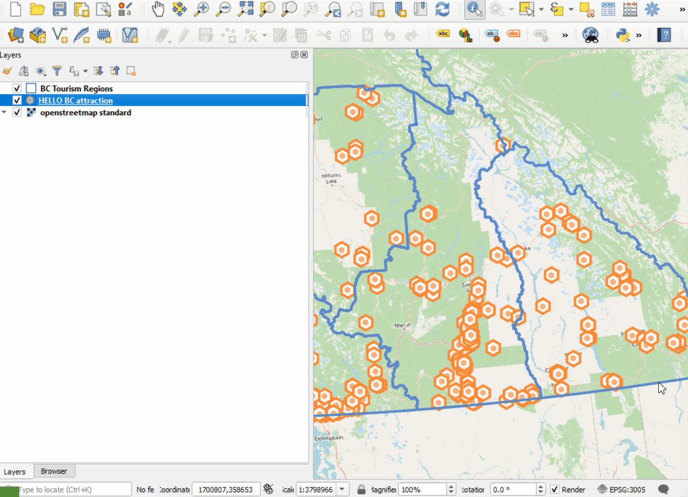
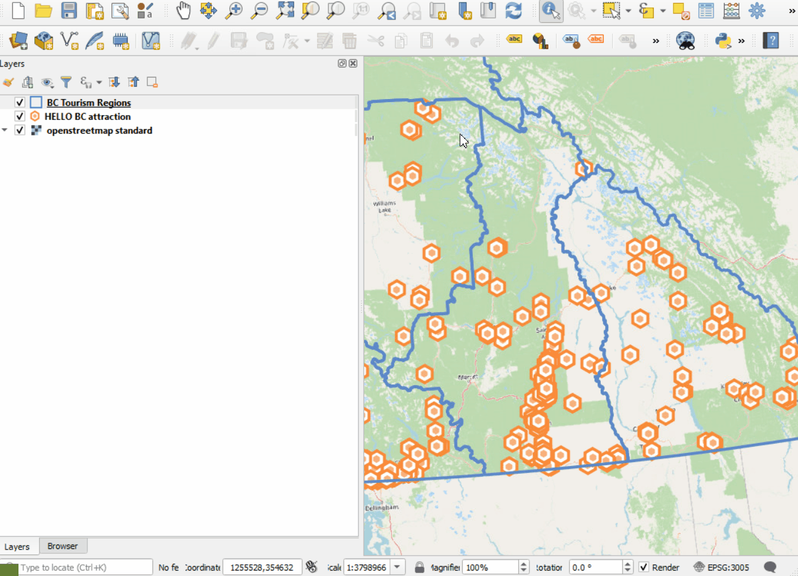
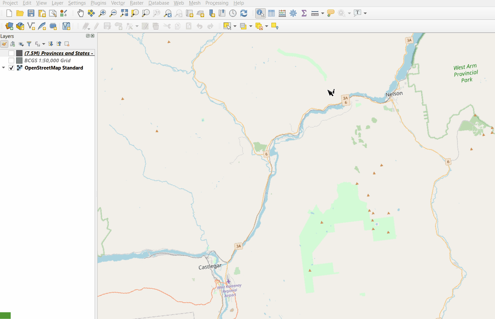
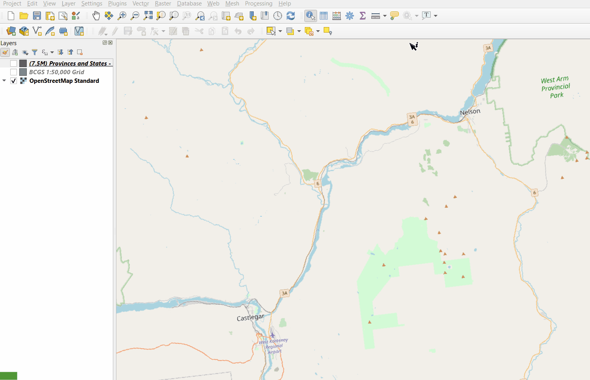
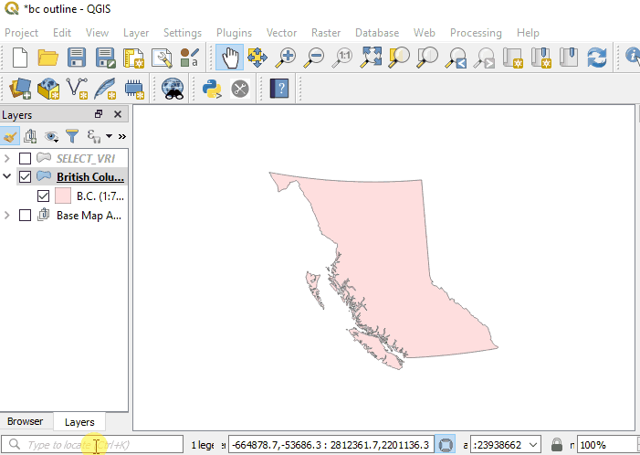

# Getting started with QGIS

[Home](../README.md)

This is the overview of the QGIS GUI.  [Link](https://docs.qgis.org/testing/en/docs/user_manual/introduction/qgis_gui.html)

---
## Quick Tips
1. Turn on/off panels from the View -> Panels menu
2. Tool bars can be activated by either using the View --> Toolbars menu or right-clicking on the toolbar area above the map area
3. Layer styling can be achieved through either the layer properites dialog or the layer styling panel.  The layer styling panel provides you with the great feature of live updates on map.
4. Some processing toolsets are accessed from the Vector/Raster menus and some are accessed from the processing panel.
---
## Getting around the map
The QGIS map 

---
## Identify Tool
The identify tool can be activated by clicking the identify tool  that is found on the attributes toolbar. In its default configuration this tool allows its user to identify features from the active layer on the map. Once features have been identified the tool presents a dialog of results to the user (below). 
 
At the top of the Identify Results dialog are some buttons for configuration of the tool. From left to right:
1. Opening the form view
2. Expanding the feature tree
3. Collapsing the feature tree
4. Toggle for expanded results by default
5. Clear current results
6. Copy current feature to clipboard
7. Print
8. Identify feature mode selection
9. Configuration form for single feature results toggle

Below this row of buttons is the feature results tree. Each listed feature will contain derived geometry information (such as perimeter, area, vertice count, etc) and the feature attributes.  

Below the feature results you can select from a list the identify tool mode to change the identify tools behaviour from identifing the current active layer to Top Down stop at first, Top Down, and layer selection. This setting will change which features can be identified on the map. 

---
## Measure tool
Every great GIS can measure map distance and area. QGIS is no exception!

### Measure Distance:

### Measure Area:

---
## Locator Widget
The Locator widget (Lower left of the QGIS window) can be used to quickly access everything in QGIS from layers to processing algorithms.

---
[Back to Top](#Getting-started-with-QGIS)
