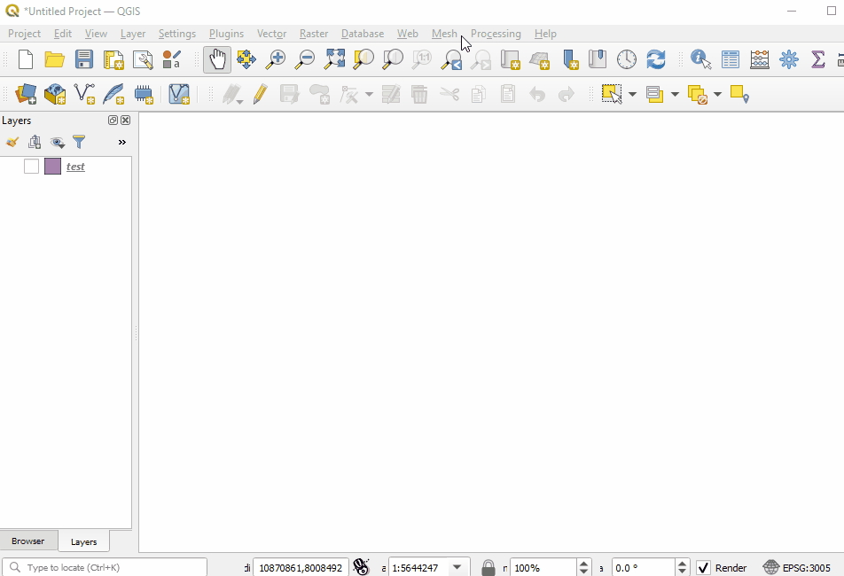
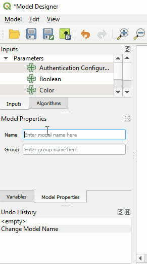
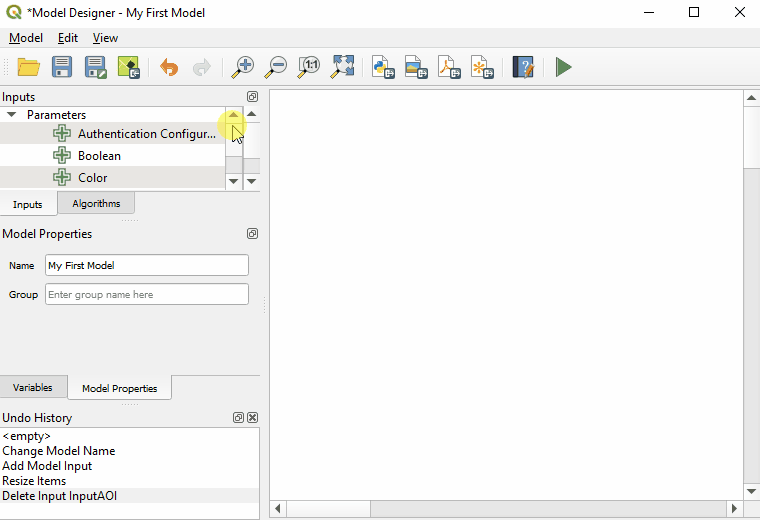
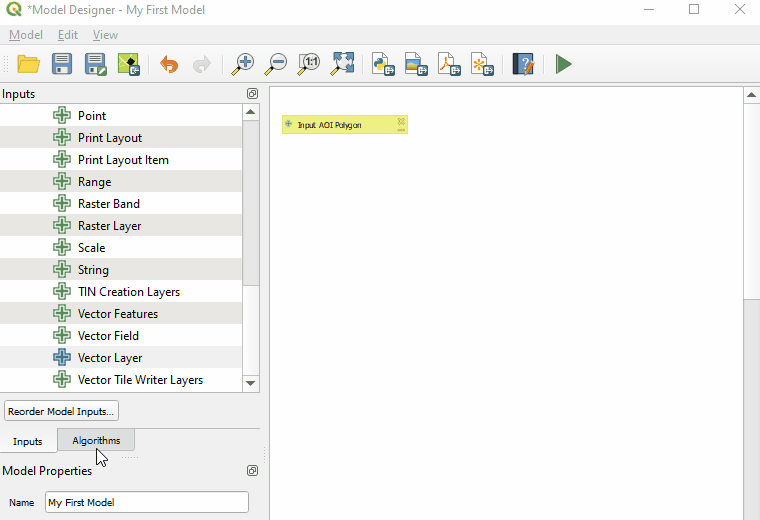
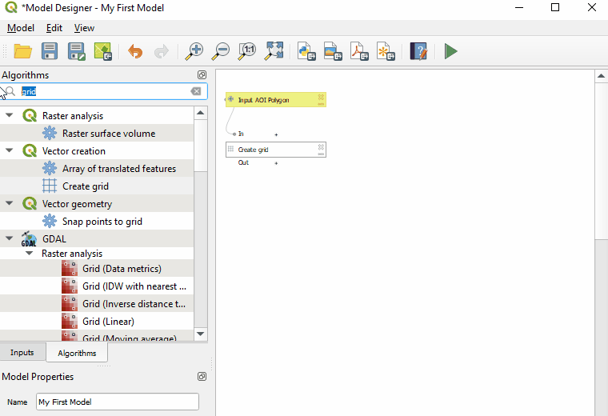
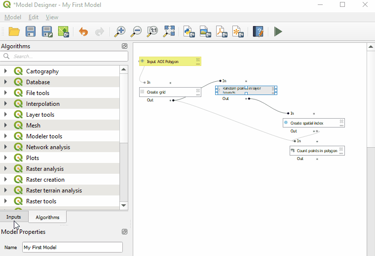

# Graphical Modeler
[home](../readme.md)

Index
* [Start Up](#start-up)
* [Building a Model](#building-a-model)

The QGIS graphical modeler can be used to chain a number processing tools together in to automate repetative analysis and document a workflow.

## Start Up
The graphical modeler can be started from the processing menu or by clicking the graphical modeler icon  at the top of the processing panel and selecting "Create New Model...".

## Building a Model
This document will step you through the basics of creating a simple model

1. With your model designer panel open (see Startup) enter in the Model Name and if needed the Model Group properties for your new model.

2. Add an vector layer input parameter. In this case this will be an area of interest polygon.

3. Next add a processing algrorithm to your model and set its parameters.

4. Add some more algorithms to complete your model and chain them together. To populate a parameter of an algorithm with the output of another click the  icon and select "Algorithm Output". To assign the parameter to a model parameter select "Model Input"

5. If your model has an output the output parameter of one of your algorithms can be specified as the model output or a model parameter can be created to store that result.  

6. Finally you can run your model just like you would any other processing algroithm by pressing the run icon 
The model can also be saved to be shared/reused.

[Download Example Model](../resource/graphical-model-example.model3)
