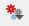

# Graphical Modeler
[home](../README.md)

Index
* [Start Up](#start-up)
* [Building a Model](#building-a-model)

The QGIS Graphical Modeler can be used to chain a number processing tools together in order to automate repetitive analyses and to document a workflow.

See the [QGIS docs](https://docs.qgis.org/3.16/en/docs/user_manual/processing/modeler.html) for more in-depth information from the QGIS User Guide.

## Start Up
The Graphical Modeler can be started from the Processing Menu or by clicking the Graphical Modeler icon  at the top of the Processing panel and selecting "Create New Model...".

## Building a Model
These are the steps on how to create a simple model using the Graphical Modeler:

1. With your Model Designer panel open (see Startup) enter text into the Model Name, and if needed, the Model Group for your new model.

2. Add a Vector Layer from the Inputs available. In this case this will be an area of interest polygon.

3. Next, add a processing algrorithm to your model and set its parameters. In this example we are creating a 10K hexagonal grid using the NAD83 BC Albers projection within the extent of our area of interest polygon.

4. Now add some more algorithms to complete your model and chain them together. To populate a parameter of an algorithm with the output of another click the  icon and select "Algorithm Output". To assign the parameter to a model parameter select "Model Input".

5. If your model has an output then the output parameter of one of your algorithms can be specified as the model output. Or a model parameter can be created to store that result.  

6. Finally you can run your model just like you would any other processing algroithm by pressing the run icon 
The model can also be saved to be shared or reused.

[Download Example Model](../resource/graphical-model-example.model3)

---
[Back to top](#Graphical-Modeler)
