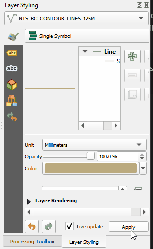
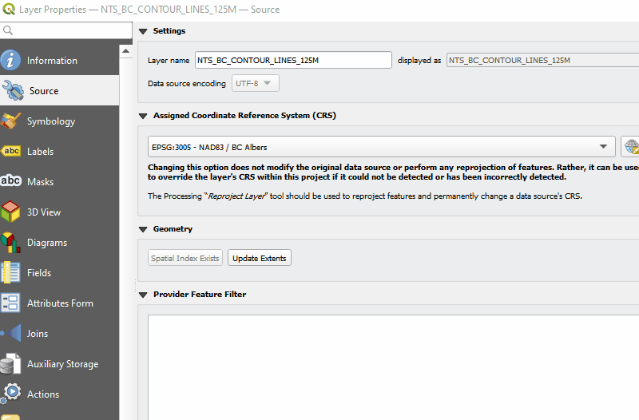
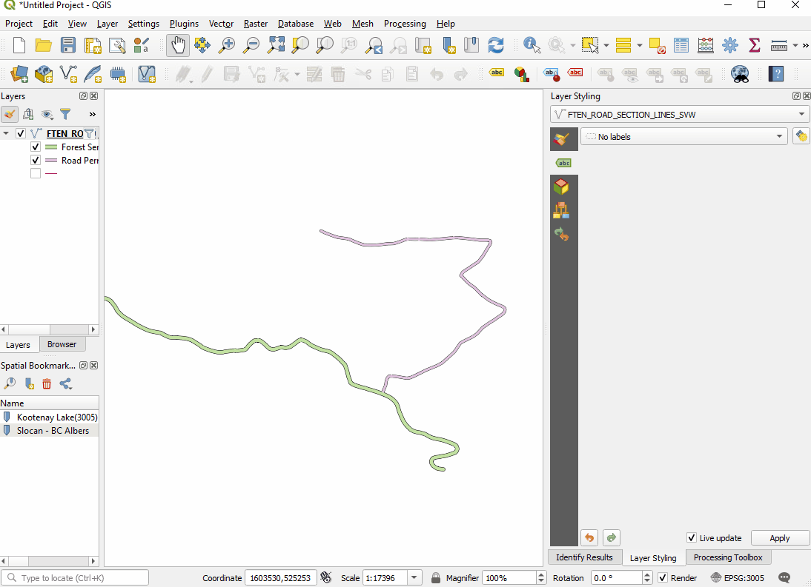

# Labels

This section describes the basics of creating basic labels for features on your map

Index <br>
* [Accessing Labels](#accessing-labels)
* [Label Text](#label-text)
* [Label Options](#label-options)

[QGIS Labeling Documentation](https://docs.qgis.org/testing/en/docs/user_manual/working_with_vector/vector_properties.html#labels-properties)

## Accessing Labels
Labels can be enabled and configured from two locations: 
1. The label dialog in the styling window <br>

2. The Layer Properties Labels tab <br>


In both configuration dialogs the options for labeling are identical.

## Label Text
Label text is controled by the value setting which can be set using a field or by using an expression. Fields can be set using the drop down dialog or a expression can be built using the expression editor.


In the expression dialog fields and values can be coerced into the desired output value. A 'output preview' of the result can be seen in the bottom left of the dialog.<br>
Expression examples: <br>
1. Concatenate two fields
    ```
    Field2 || Field3
    ```
2. The length of line features concatenated with units<br>
    ```
    round($length,1) || ' m'
    ```

## Label Options
Label options can be set using dropdown selections or radio buttons. Most options can also be set using fields or expressions. For example the size of a polygon lable can be set to be dependent on the geometry area.

The options are broken down into groups:
- Text Options (Font, Style, Size,Colour,Opacity)
- Formating (Type Case, Spacing, Orientaiton, Blending, Line wrapping,numerical formatting)
- Buffer(Control buffer mask size, colour, opacity, etc)
- Background (Create and control a background for your label)
- Shadow (drop shadow effect control)
- Callouts (draw and control line style between feature to label)
- Placement (Placement relative to feature, repeating and overun controls, geometry generation, datad defined locations, label priority)
- Rendering (mulitpart control, duplication reduction, feature label limits, feature priority)

