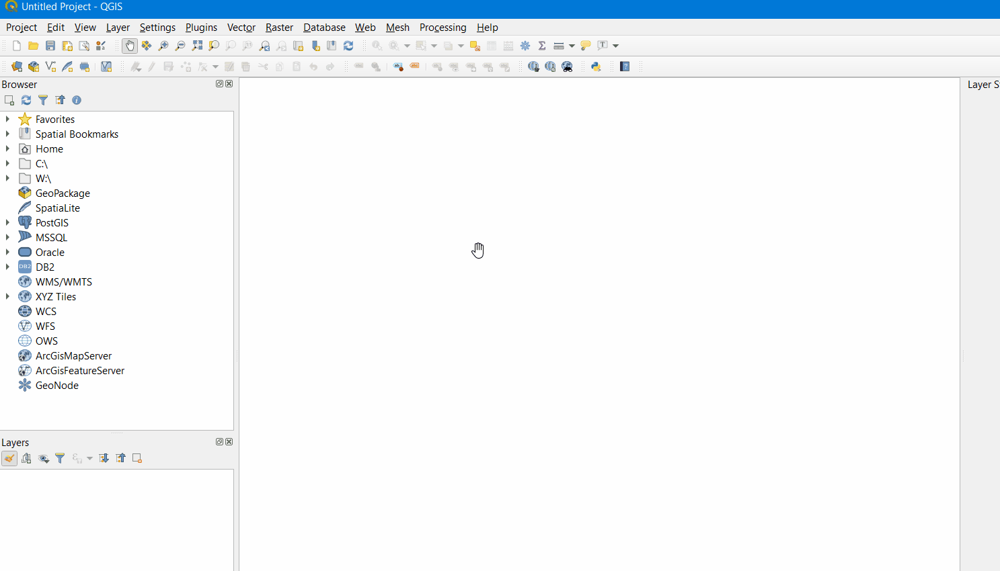
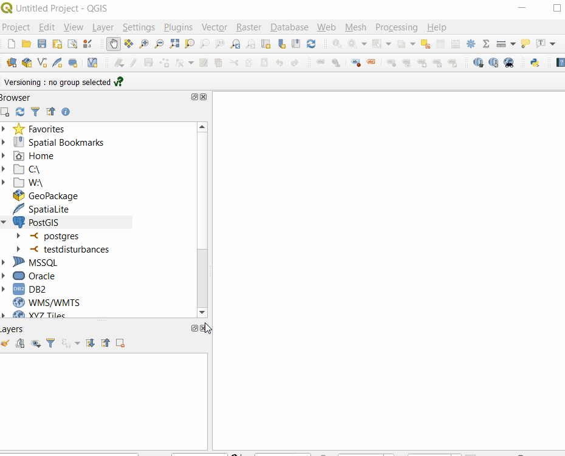
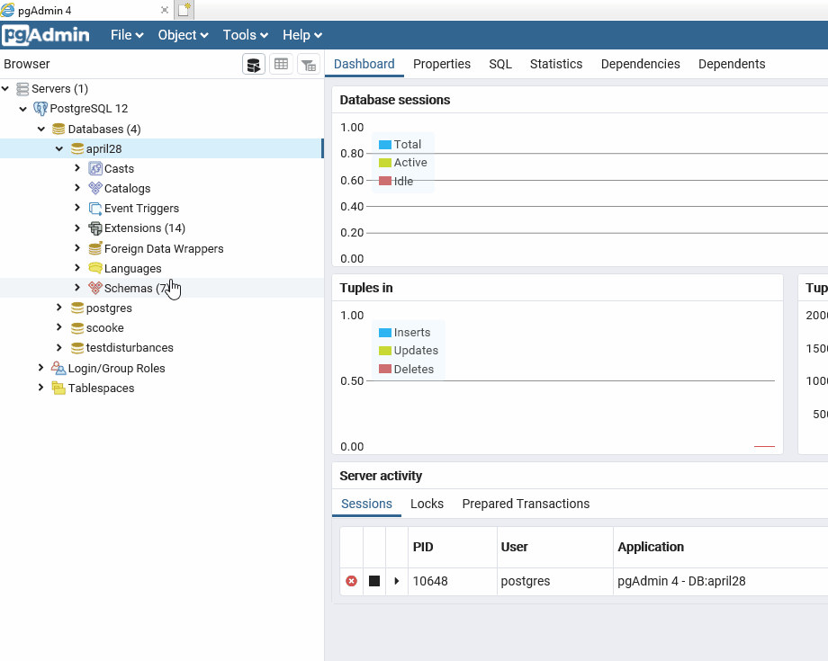
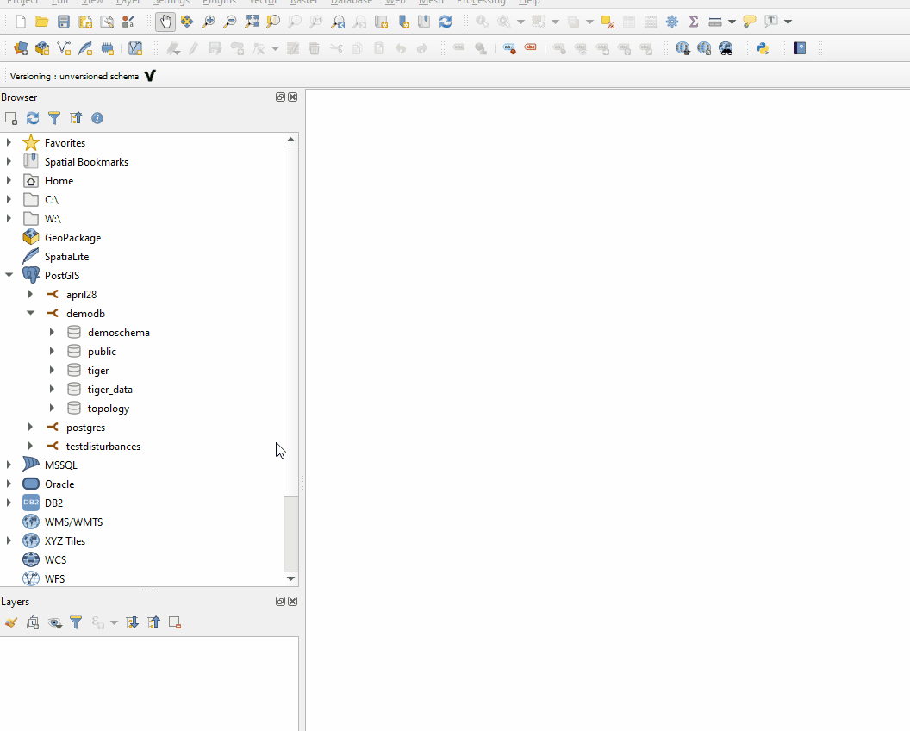
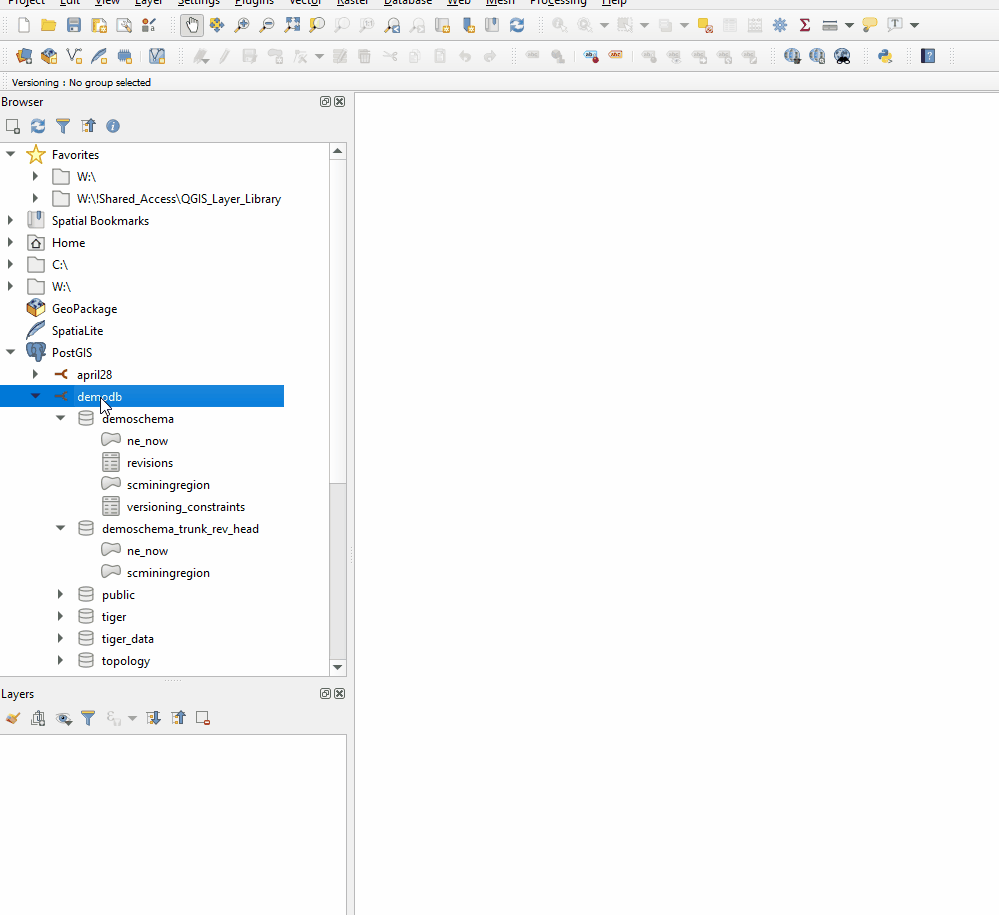
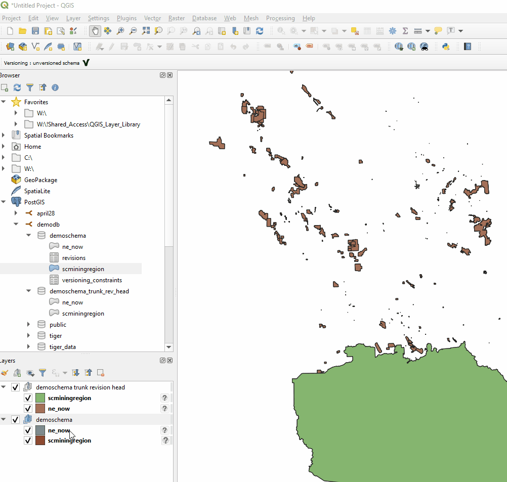
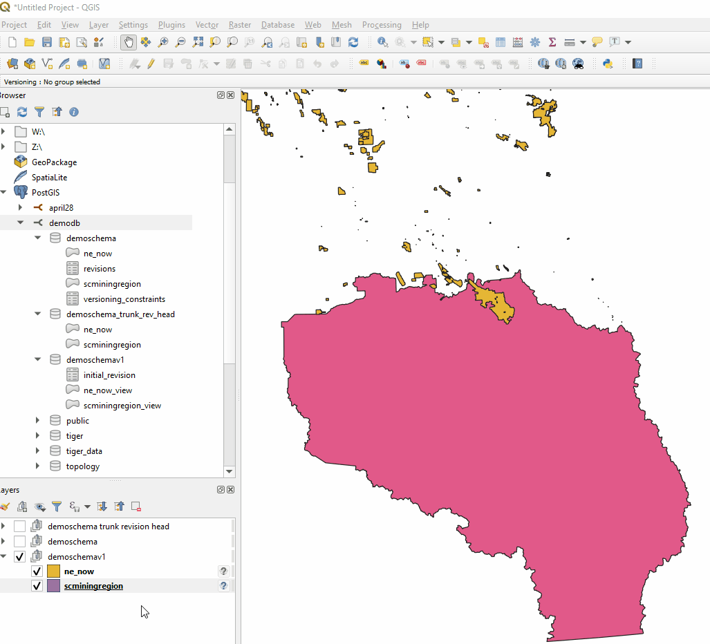
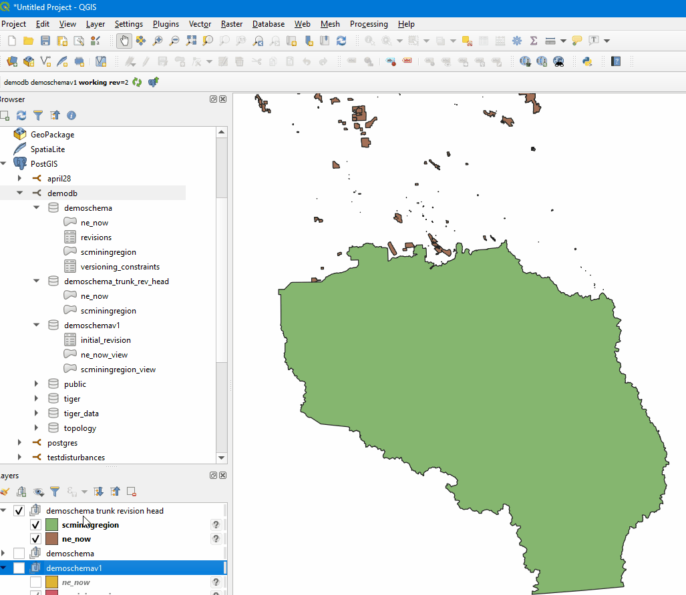
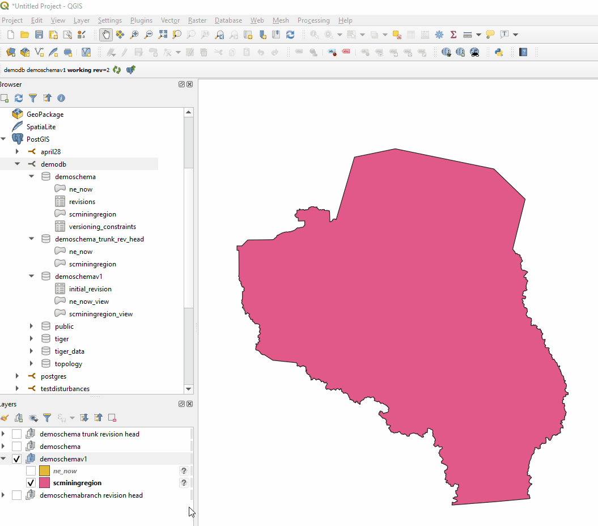
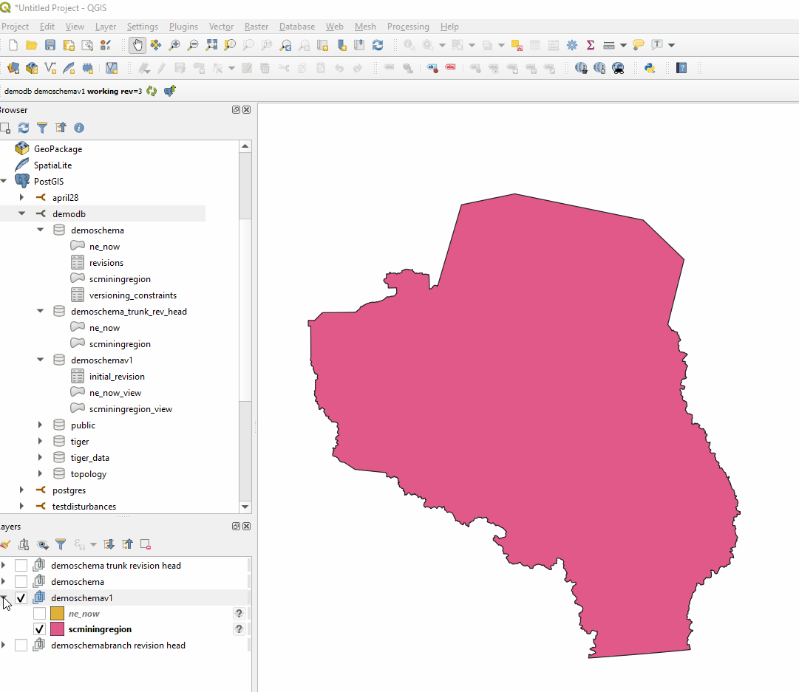

#  Multi-user editing in QGIS
#  Using PostGIS and the Versioning Plugin

## Index
* [home](../readme.md)
* [QGIS Documentation](https://docs.qgis.org/testing/en/docs/gentle_gis_introduction/data_capture.html)
* [What is PostgreSQL](#What-is-PostgreSQL-/-PostGIS-and-why-do-you-need-it?)
* [What is the Versioning Plugin](#What-is-the-Versioning-Plugin)
* [Installing the Versioning Plugin](#Installing-the-Versioning-Plugin)
* [Connecting to a PostgreSQL Database](#Connecting-to-a-PostgreSQL-Database)
* [Extensions needed](#Extensions-needed-on-your-PostGIS-database-before-versioning)
* [Start versioning a dataset](#Start-versioning-a-dataset)
* [How to tell if a table is historized already](#How-to-tell-if-a-table-is-historized-already)
* [Creating a version and doing edits](#Creating-a-version-and-doing-edits)
* [Branching](#Branching)
* [Committing edits to the master](#Committing-edits-to-the-master)
* [View historical changes and reverting](#View-historical-changes-and-reverting)

## What is PostgreSQL / PostGIS and why do you need it?
PostgreSQL (pronounced "postgres" by these authors) is an open source object-relational database system that came out of the University of California, Berkeley in the 1980's (https://www.postgresql.org/about/).

PostGIS is an add on for PostgreSQL that spatially enables the database (https://postgis.net/). Think of it as a Github for your spatial data.

## What is the Versioning Plugin

Our team has dived into using PostGIS on the recommendation from our architecture specialists as an open-source solution to allow for multiple users to access, edit, and save changes concurently without the risk of locked datasets and lost changes. A plugin has been developed for QGIS by Oslandia for versioning PostGIS databases (https://github.com/Oslandia/qgis-versioning). (Our architecture specialists are busy setting up our database and testing is commencing now, so this project is still in it's infancy).  

These are some extra links to browse through for those interested in learning more about PostGIS and the Versioning plugin:
  * https://oslandia.com/en/2013/07/13/qgis-versioning-plugin/
  * https://qgis-versioning.readthedocs.io/en/latest/introduction.html
  * https://www.bostongis.com/PrinterFriendly.aspx?content_name=postgis_tut01
  * https://docs.qgis.org/testing/en/docs/training_manual/spatial_databases/index.html   
  * https://readthedocs.org/projects/qgis-versioning/downloads/pdf/latest/
 

See our documentation on plugins for more information: https://github.com/bcgov/gis-pantry/blob/master/docs/getting-started-with-QGIS/doc/plugins.md

## Installing the Versioning Plugin
How to load the Versioining Plugin into QGIS:

1. In the Plugins window, search for the Versioning plugin.  
2. Install the plugin and wait for the ribbon to let you know it loaded successfully.
3. It usually appears in a new line of tools at the top left of the screen.

## Connecting to a PostgreSQL Database
1. Right click PostGIS in your Browser panel and add a New Connection.
2. Enter the parameters of the existing PostGIS database. You may enter your credentials here or choose to enter them later.
3. Test the connection, a ribbon will appear to let you know if it was successful.
4. You may also want to see tables without geometry, if so, select the box next to "Also list tables with no geometry".
5. Select OK. You will now be able to add data layers from within the schemas of your PostGIS to the project.

## Extensions needed on your PostGIS database before versioning
The extensions on your PostGIS database should be set up prior to starting your Versioning edits. This may be set up by the IT department depending on who creates the PostGIS database in the first place.

In PGAdmin, load the following extensions to your database by right-clicking on *Extensions > Create > Extension...* Search the extension name in the dropdown and click Save.

## Start versioning a dataset
1. Add the layers within your database schema that will need to be historised and later versioned to your project.
2. Group these layers. 
3. Click the Historize icon in the plugin and accept the warning pop-up notifying you that 4 new coloumns will be added to the tables in the schema. 
4. You will see your group name has changed to "trunk revision head" and that a new schema has been added to the database with the suffix "_trunk_rev_head". You will also see two new tables in the database called "revisions" and "versioning constraints". 

## How to tell if a table is historized already
To tell if a table is already historized, open the attribute table and note if there are four columns called: 
* trunk_rev_begin 
* trunk_rev_end 
* trunk_parent 
* trunk_child 

## Creating a version and doing edits
1. Note that the tools in the plugin change depending on whether you have the original datasets or the historized datasets selected in the Layers Panel.
2. Click the "postGIS checkout" tool and enter a name for the new version you are creating (this has to be lower case and not include any spaces or special characters).
3. Click OK and see the new version added to the Layers Panel. This can now be edited.

4. Toggle the edit mode for the layer you want to edit and perform your edits on a selected feature. Save your edits and click the group name to see the Versioning tools you'll need to use next. 

## Branching
Branching is an option in the Versioning process where a branch can be made of the schema and edits can be made in there before committing back up to the master, rather than checking out a working version every time edits are required. 
 

## Committing edits to the master
1. Commit button
2. Conflicts
3. 
4. 

## View historical changes and reverting.
1. 
2. 
3. 

