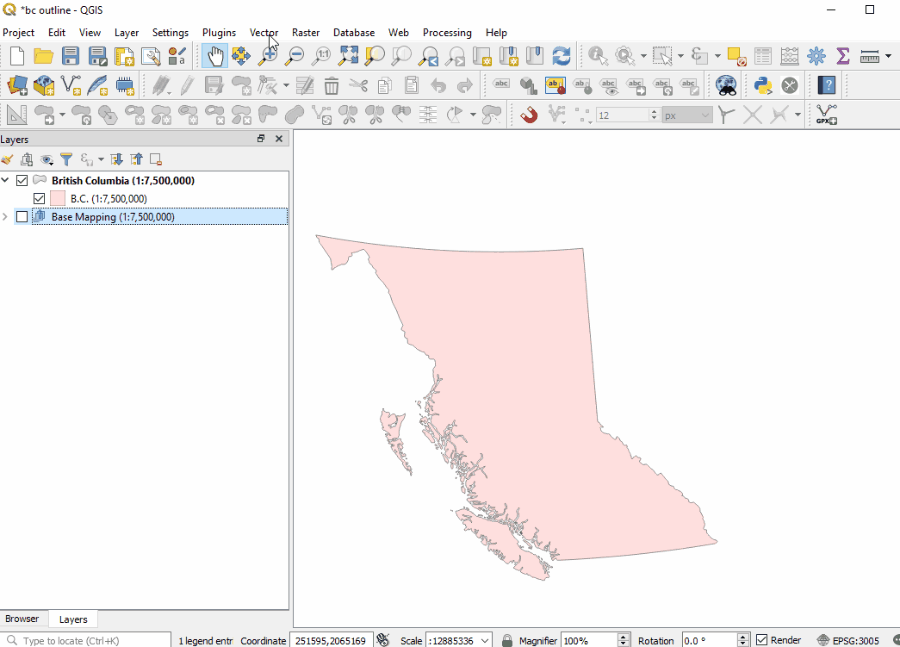

#  Multi-user editing in QGIS
#  Using PostGIS and the Versioning Plugin

[home](../readme.md)

[QGIS Documentation](https://docs.qgis.org/testing/en/docs/gentle_gis_introduction/data_capture.html)

## What is PostgreSQL / PostGIS and why do you need it?
1. A look at the structure in PG Admin?

2. 

## What is the versioning plugin

## Connecting to a PostgreSQL Database
1. 

## Versioning Plugin
1. Add a link to Jing's plugins page for more info..
### Start versioning a data set
1. Group layers
2. "historize: tables and field created
3. Back to PG Admin to show new tables and fields
4. 

### How to tell if a table is historized already
1. c
2. 

## Creating a verison and doing edits
1. 
2. 
3. 
4. 

## Branching
1.  
2. 
3. 

## Committing edits to the master

1. Commit button
2. Conflicts
3. 
4. 

## View historical changes and reverting.
1. 
2. 
3. 

