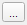

# GIS Processing
[home](../README.md)

Index
* [Vector Menu](#vector-menu)
* [Raster Menu](#raster-menu)
* [Processing Panel](#processing-panel)
* [Advanced processing topics](#advanced-topics)

QGIS provides many processing tools to help you analyze your GIS data. All the standard tools you would expect a GIS to provide are accessible to all users running QGIS. If the tool you need is more specialized it may be only accessible from the included GRASS GIS plugin or specific plugins you may need to install yourself.  
This document will discuss the standard tools available from QGIS. Access to processing tools from within QGIS is presented to users in three locations; Vector Menu, Raster Menu, and Processing Panel.

### Related QGIS Documentation

[QGIS docs - algorithm guide](https://docs.qgis.org/testing/en/docs/user_manual/processing_algs/index.html)

[QGIS Processing Guide]( https://docs.qgis.org/testing/en/docs/training_manual/processing/index.html)

## Vector Menu
The Vector menu provides access to many standard tools for interacting with vectors.  This menu is a convenient way to find common vector tools that have been organized into these categories: Geoprocessing, Geometry, Research, Analysis, and Data Management Tools.

**Vector Menu Category | Examples**:

1. Geoprocessing Tools
    - Buffer, Clip, Dissolve, Intersection, Union
2. Geometry Tools
    - Calculate Centroids, Validate Geometry, Extract Vertices, Mulitpart to Singlepart, Simplify, Lines to Polygons
3. Research Tools
    - Create Grid, Select by Location, Create Random Points, Create Regular Points
4. Analysis Tools
    - Mean Coordinates, Nearest Neighbour Analysis, Field Statistics, Count Points in Polygon
5. Data Management Tools
    - Merge Layers, Split Layers, Join Attributes by Location, Create Spatial Index, Reproject

## Raster Menu
The Raster menu provides access to many standard tools for interacting with raster data. This menu is a convenient way to access the Raster Calculator, the Align Rasters tool and other common raster tools that have been organized into these categories: Analysis, Projections, Miscellaneous, Extraction, and Conversion. It should be noted that the Raster Calculator accessed in this menu is slightly different than the raster calculator accessed in the Processing Panel ([more on Raster Calculator](raster-calculator.md)).

**Raster Menu Category | Examples**:

1. Analysis
    - Aspect, Slope, Hillshade, Proximity, Sieve
2. Projections
    - Assign Projection, Extract Projection, Warp (Reproject)
3. Miscellaneous
    - Merge, Build Virtual Raster, Tile Index, Build Overviews (Pyramids)
4. Extraction
    - Clip Raster, Create contours, Clip Raster By Mask Layer
5. Conversion
    - Raster to Vector, Vector to Raster, Translate (Conversion)

## Processing Panel
The Processing Panel can be activated by using the Processing menu and clicking “Toolbox” or pressing <ctr+Alt+T>. This will start the processing toolbox panel. The contents can be searched using the Search dialog or by browsing the processing providers by category. 

The QGIS Processing tools all follow a common layout that contains a Parameters tab and Log tab on the left and a collapsible information dialog screen on the right. Input data layers can be selected from a drop down of suitable existing map layers drawn from the table of contents or selected from a file using the  select file dialog.
If the tool produces output datasets, the same dialog button can be clicked in the output section to designate an output. 

If desired most tools allow for the output to remain blank and a temporary layer will be created and added to your map. A temporary layer will have a small icon to the right of the layer name in the Layers panel. Hovering over the icon will show a pop-up saying "Temporary layer only! Contents will be discarded after closing QGIS". 

After your tool has completed running the log will list the input parameters, execution time and output data location. Your results will be accessible via the Results Viewer. And your processing history can be accessed by clicking the history icon  at the top of the processing toolbox.

The processing history dialog will list executed processes with respective parameters used. 

Some processing tools can be used in conjunction with layer editing to modify features in place. To use this feature start editing a layer and activate edit in place using the icon . This is powerful way of [editing](editing.md) some or all features in a layer without duplicating data. Some examples of useful tools that can be used in this mode are:
- fix geometries
- simplify
- smooth
- multipart to sigleparts

## Advanced topics
[Graphical Modeler](graphical-modeler.md)  
[Processing with python](advanced-processing.md)

---
[Back to top](#gis-processing)
