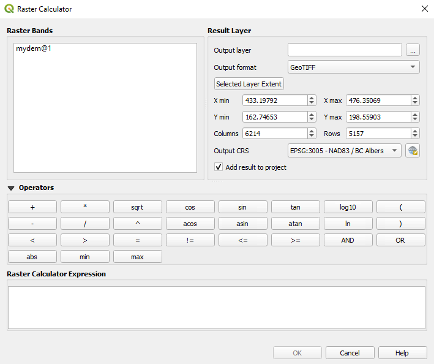

# GIS Processing
[home](../README.md)

Index
* [Raster Calculator](#raster-calculator)
* [Raster Calculator Tool](#raster-menu)
* [Examples](#examples)

[Read the QGIS Docs](https://docs.qgis.org/testing/en/docs/user_manual/working_with_raster/raster_analysis.html)<br>
The raster calculations are critical component any GIS software. QGIS provides access to this capability from a raster calculator. Two slightly different calculators are availiable; processing toolbox raster calculator and raster menu raster calculator.

## Raster Calculator
The raster calculator that is accessed from the Raster menu provides a quick access to the Raster bands availiable to the calculator from your map, a list of operators, a text box for building your expression, and a section for parameters of your output raster.



To build your expression you can either type your expression directly into the expression box, click on the rasterbands and operator buttons, or a combination of typing and clicking to populate your expression [see examples](#examples).  
## Raster Calculator Tool

The raster calculator tool is accessed from the processing panel in the Raster Analysis group. This tool offers very similar functionality to the calculator accessed from the raster menu but is organized differently, can be used to a create temporary raster, and can be chained with other tools in either Graphical Modeler or Python.


Convienently this toolbox also allows the designation of a reference raster to derive the output file projection,extent,and cell size.

## Examples
1. Expression creating a elevation mask with a single channel raster dem called mydem <br>

    ```
    (mydem@1>=1100)*1
    ```
    In this example the conditional statement within brackets is either evaluated as 1 (True) or 0 (False) and is subsequently multiplied by one. The result would be a raster with a value of 1 for pixel values greater than or equal to 1100 and values of 0 for pixel values less than 1100.
2. Expressions can also be used to find overlapping conditions between rasters <br>
    ```
    ("mydem@1"> 1600 AND "forest_cover@1">40)*1
    ```
    In this example the expression uses the raster values from a dem and a raster of forest cover to create a raster that can show areas over 1600 m that have a forest cover greater than 40 percent.
3. Expressions can also be used to perform arithmetic calculations between multiple raster files and/or bands. 
    ```
    (("mydem@1">1600)+1) * "forest_cover@1"/100
    ```
    This example might be a portion of a habitat model where habitat value is proportional to forest cover percent and habitat over 1600 m is valued twice as much as habitat less than 1600 m.
---

[Back to Top](#gis-processing)
