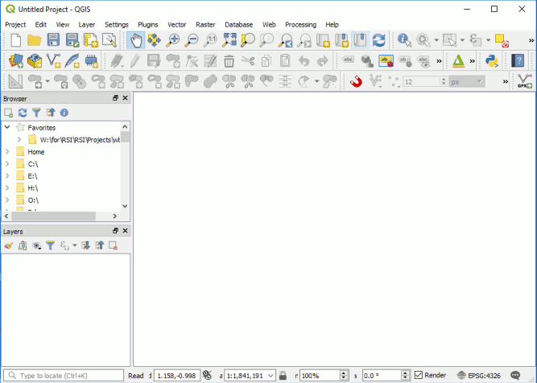
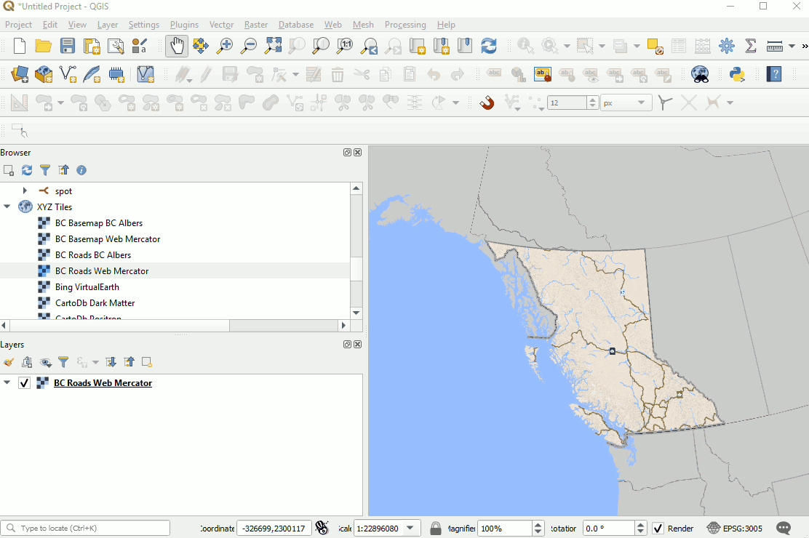

# Setup and Best Practice

[home](../README.md)

## Set your default CRS to 3005
The default projection QGIS CRS is WGS 84 (4326).  BC Government geographic standard crs is BC Government Albers (3005)


## Set your attribute table to show only Selected records
Some datasets are very large.  Changing your default from loading all records in the attribute talbe will help avoid waiting a very long time to load all 5.1 M records from a table. QGIS will not just load the first 1500.




## Adding basemaps from the web
This is a handy script.  
GitHub - Klakar [qgis_basemaps.py](https://github.com/klakar/QGIS_resources/blob/master/collections/Geosupportsystem/python/qgis_basemaps.py)

### You can append the bcgov basemap services by adding these lines...

```python
sources.append(["connections-xyz","BC Roads BC Albers","","","","http://maps.gov.bc.ca/arcserver/rest/services/province/roads/MapServer/tile/%7Bz%7D/%7By%7D/%7Bx%7D","","23","0"])
sources.append(["connections-xyz","BC Roads Web Mercator","","","","http://maps.gov.bc.ca/arcserver/rest/services/province/roads_wm/MapServer/tile/%7Bz%7D/%7By%7D/%7Bx%7D","","23","0"])
sources.append(["connections-xyz","BC Basemap BC Albers","","","","http://maps.gov.bc.ca/arcserver/rest/services/province/albers_cache/MapServer/tile/%7Bz%7D/%7By%7D/%7Bx%7D","","17","0"])
sources.append(["connections-xyz","BC Basemap Web Mercator","","","","http://maps.gov.bc.ca/arcserver/rest/services/province/web_mercator_cache/MapServer/tile/%7Bz%7D/%7By%7D/%7Bx%7D","","17","0"])
```

