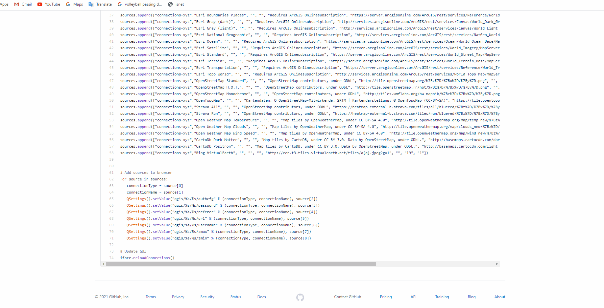

# Setup and Best Practice

[Home](../README.md)

## Set your default CRS to 3005

The default projection QGIS CRS is WGS 84 (4326).  BC Government geographic standard CRS is BC Government Albers (3005). 

Go to Settings -> Options -> CRS


## Set your attribute table to show only Selected records
Some datasets are very large.  Changing your default settings for your attribute table from "Show all features" to "Show selected features" or "Show features visible on map" will help you avoid waiting a very long time to load all 5.1 million records from a table, for example. If set QGIS will only load the first 1500 records. 

Go to Settings -> Options -> Data Sources -> Attribute Table Behaviour


## Adding basemaps from the web
This is a handy script for quickly adding basemaps from the web from the Python console in QGIS:  
GitHub - Klakar [qgis_basemaps.py](https://github.com/klakar/QGIS_resources/blob/master/collections/Geosupportsystem/python/qgis_basemaps.py)

### You can append the BC government basemap services by adding these lines...

```python
sources.append(["connections-xyz","BC Roads BC Albers","","","","http://maps.gov.bc.ca/arcserver/rest/services/province/roads/MapServer/tile/%7Bz%7D/%7By%7D/%7Bx%7D","","23","0"])
sources.append(["connections-xyz","BC Roads Web Mercator","","","","http://maps.gov.bc.ca/arcserver/rest/services/province/roads_wm/MapServer/tile/%7Bz%7D/%7By%7D/%7Bx%7D","","23","0"])
sources.append(["connections-xyz","BC Basemap BC Albers","","","","http://maps.gov.bc.ca/arcserver/rest/services/province/albers_cache/MapServer/tile/%7Bz%7D/%7By%7D/%7Bx%7D","","17","0"])
sources.append(["connections-xyz","BC Basemap Web Mercator","","","","http://maps.gov.bc.ca/arcserver/rest/services/province/web_mercator_cache/MapServer/tile/%7Bz%7D/%7By%7D/%7Bx%7D","","17","0"])
```

To run code in Python console:

1. Ctrl-Alt-P to open Python console
2. Copy code and paste into lower window
3. Run code will appear in window above



---
[Back to top](#Setup-and-Best-Practice)

