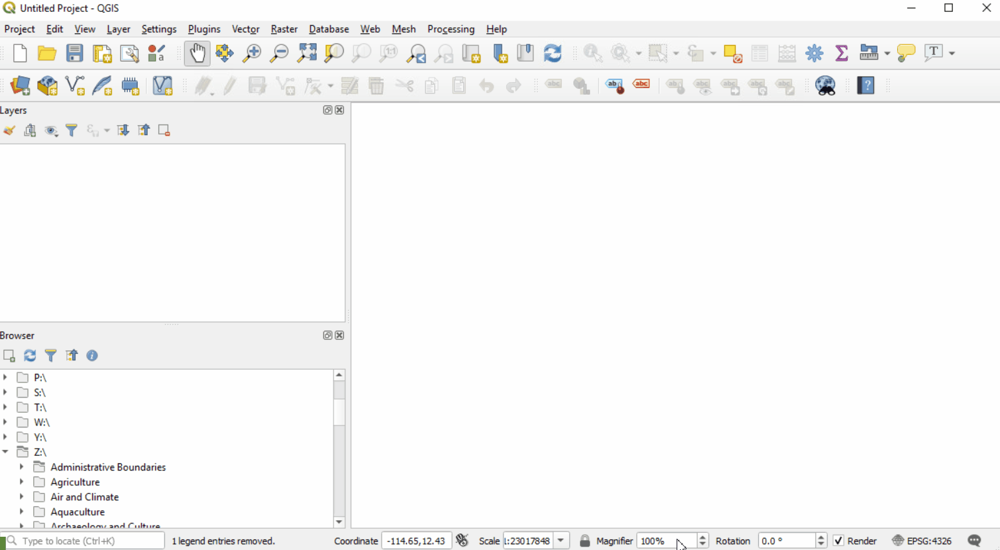
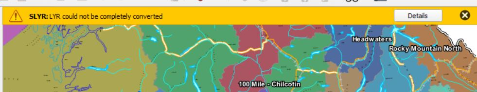
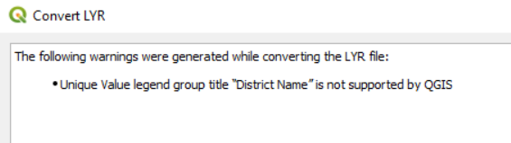
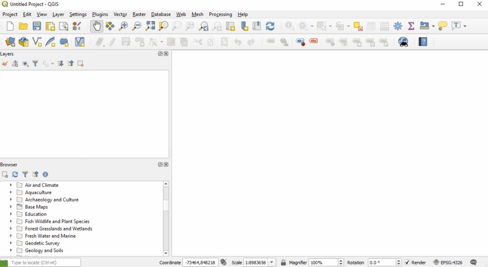

# SLYR Plugin

SLYR is a QGIS plugin developed by [North Road](https://north-road.com/). SLYR enables compatibility between ESRI ArcGIS and QGIS. With the SLYR plugin enabled your QGIS can:
- load / convert ArcGIS 10.x mxd's
- load / convert .lyr files
- provides processing tools for bulk conversions

[SLYR documentation page](https://north-road.com/slyr/)

Index
* [Adding Lyr files to QGIS](#adding-lyr-files)
* [Adding Mxd files to QGIS](#adding-mxd-files)
* [Convertion and Extraction Tools](#conversion-and-extraction-tools)
* [Installing SLYR](#installation)

## Adding lyr Files
Once your licensed version of the SLYR plugin has been installed you can magicly load many ArcGIS document and layer files via drag-and-drop or from the browser panel. 

Example: loading a layer file from the corporate layer library 

Sometimes SLYR plugin produces warnings or errors which are reported in a popup bar  

If everything is nominal you can keep working or examine the situation in more detail by clicking Details.

In this case a warning was generated due to the use of a field alias in ArcGIS that contains a space. No worries though it seems some assumptions were made and everything was loaded correctly!

## Adding mxd Files
The behaviour of mxd files with SLYR are similar to that of lyr files. An mxd can be added to QGIS from the browser panel or by dragging the file from file explorer onto the QGIS application map canvas. This adds the map layers within the mxd to your QGIS application and creates a page layout in your current project from the map layout in the mxd.

Example: loading a mxd to QGIS

## Conversion and extraction tools
The SLYR Plugin also provides access to processing tools to help in conversion of ESRI files to formats familiar to QGIS.

- AVL to QML (QGIS style definition file)
- LYR to QGIS style XML
- LYR to QLR (QGIS layer definition file)
- LYR to QML (QGIS layer style file)
- Set style from LYR file
- Add Layers from MXD to project
- Convert MXD/MXT to QGIS
- Export document structure (to JSON)
- Convert PMF to QGIS
- Extract SDE connection details
- Convert ESRI style to GPL color pallette
- Convert ESRI style to QGIS style XML
- Convert SXD to QGIS (2D)

## Installation
To install make sure you have an established QGIS profile by starting and closing QGIS then exectute this batchfile to install
P:\corp\script_whse\python\Utility_Misc\Published\install_slyr\install_QGIS_SLYR.bat

