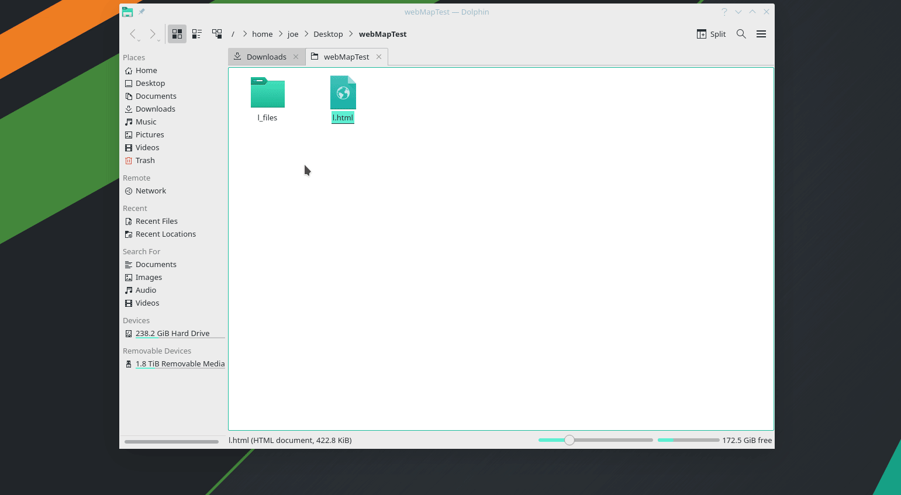
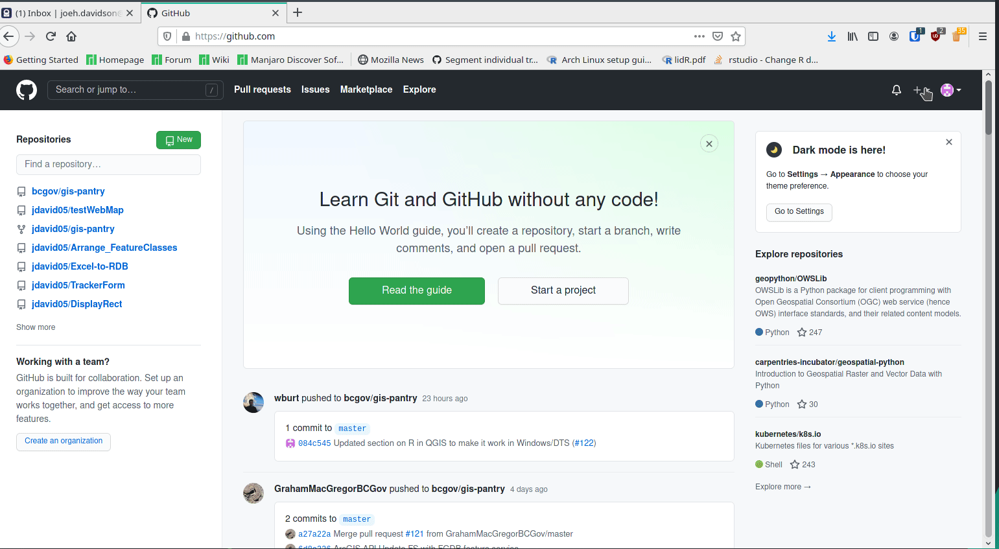
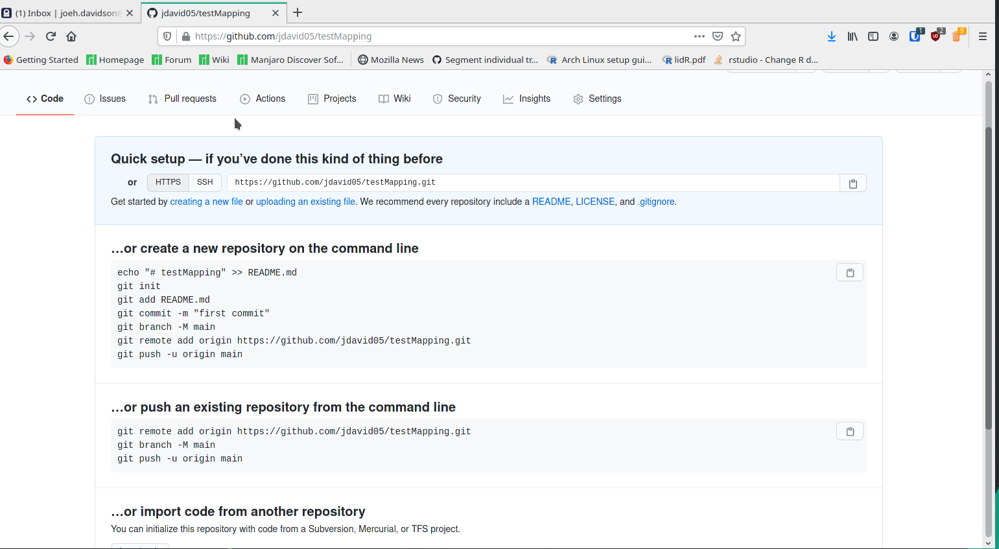
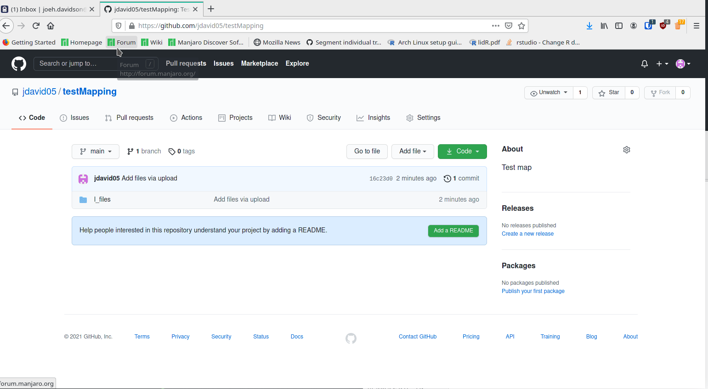
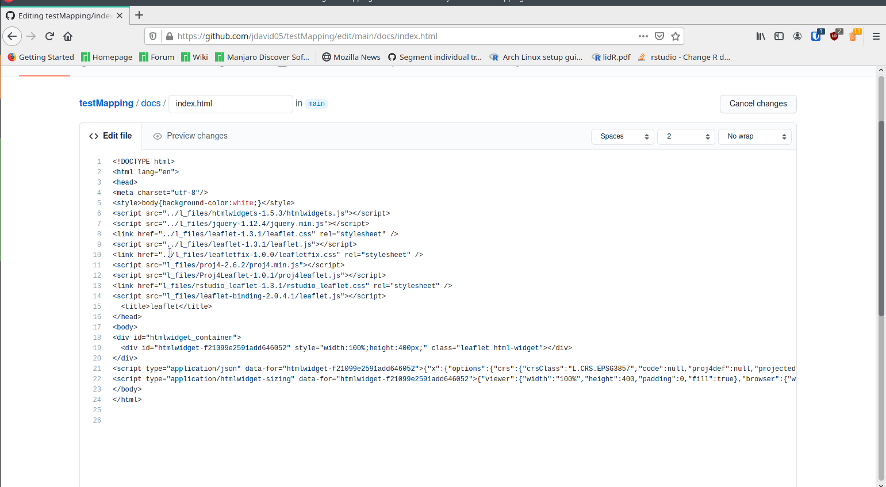
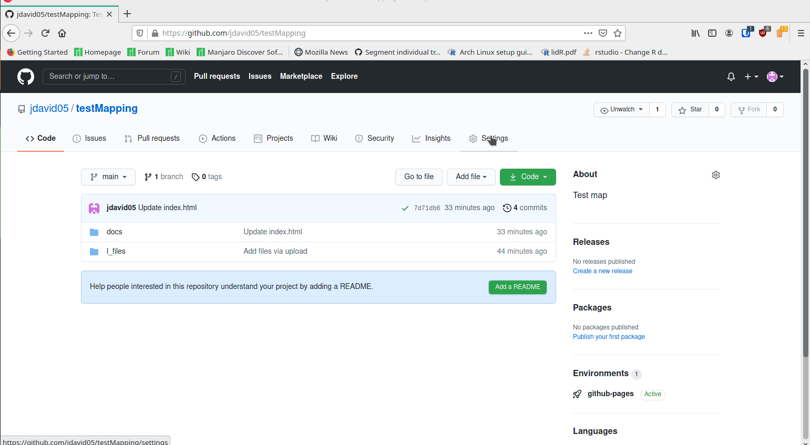
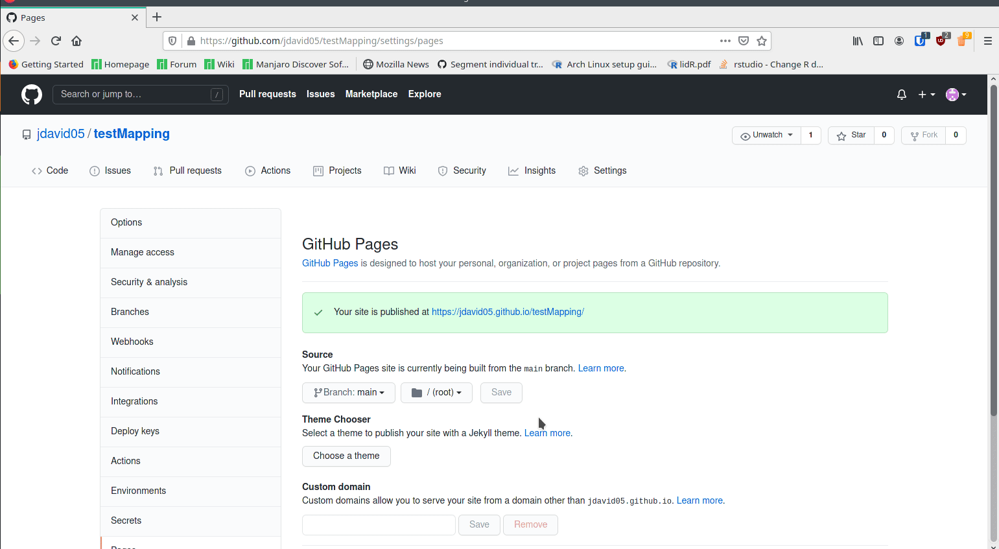

# Creating Web Maps with QGIS, R, and GitHub

[Home](../README.md)

This guide is intended to show you how to create HTML maps that can be hosted on GitHub. 
You should have already read the docs on [linking R and QGIS](https://github.com/bcgov/gis-pantry/blob/master/docs/getting-started-with-QGIS/doc/R-and-QGIS.md) before starting this module.

## Index

* [Installing the Required Packages](#installing-the-required-packages)
* [Creating a Simple Webmap](#creating-a-simple-webmap)
* [Adding Attributes to your Webmap](#adding-attributes-to-your-webmap)
* [Hosting your Webmap on Github](#r-in-qgis-code)

## Installing the Required Packages

You will need a few packages before you get started. To get these packages run the following code (make sure you update your library path to the library path you used for QGIS in [the R and QGIS module](https://github.com/bcgov/gis-pantry/blob/master/docs/getting-started-with-QGIS/doc/R-and-QGIS.md):

```r
# Set your library path to the library path you use in QGIS
.libPaths( c( "W:\\example\\QGIS\\Library\\path\\to\\rPackages", .libPaths() ) )

# Install leaflet, html widgets, and devtools
install.packages("htmlwidgets", dependencies=TRUE)
install.packages("devtools", dependencies=TRUE)
devtools::install_github('rstudio/leaflet')
```

With the packages installed we can now make a simple script to develop an HTML map.

## Creating a Simple Webmap

In this section we will create a simple webmap with some random points. 
It does not require any inputs except for a directory where you would like to place the html and javasript files.

You will need to create a new R script and enter the following code:

```r
##Webmaps=group
##Out_folder_for_webmap=folder

# Load the required libraries
library(leaflet)
library(htmlwidgets)

# Create 10 random lat (mean: 42.0285, variance: .01) and 10 random long (mean: -93.65, variance: .01) coordinates
rand_lng = function(n = 10) rnorm(n, -93.65, .01)
rand_lat = function(n = 10) rnorm(n, 42.0285, .01)

# Create the leaflet map
m = leaflet() %>% addTiles() %>% addCircles(rand_lng(50), rand_lat(50), radius = runif(50, 10, 200))

# Save the leaflet map
saveWidget(m, file=paste0(as.character(Out_folder_for_webmap),"/m.html"), selfcontained=FALSE )
```

Run the script.
Once it finishes navigate to the folder where you saved the webmap and open it in a web browser. 
You should see the map you just created displayed as a interactive webmap.
Currently, the map can be panned around in and zoomed in to but it doesn't display a legend or options to turn layers on and off.
It also doesn't use real data.

## Adding Attributes to your Webmap

You can easily add features to your webmap such as a legend, themes, and attribute tables.
You can also use point, line, and polygon data from within QGIS to build your webmap.

The first thing we will want to do is get some data. 

I'm going to use the opening data available in the BCGW or as a shapefile from the [BC Government website](https://catalogue.data.gov.bc.ca/dataset/results-openings-svw)
In order to reduce the number of features you can run a [definition query](https://github.com/bcgov/gis-pantry/blob/master/docs/getting-started-with-QGIS/doc/expressions.md) on the data using the code as follows:

```sql
"MAPSHEET" LIKE ' 82E005'
```

I will also use the Seedlot points from the BCGW and available for download [here](https://catalogue.data.gov.bc.ca/dataset/seedlot).

To reduce the number of points run the following definition query on the Seedlot points:

```sql
"OBJECTID" IN (4726, 7235, 1876, 7234, 7233, 7688, 3983, 5960, 6262, 5022, 1131, 6197)
```

With that done, lets setup our R script to make a map with this data. Create a new R script and add this code:

```r
##Webmaps=group
##input_polygon=vector
##input_points=vector
##Out_folder_for_webmap=folder

library(leaflet)
library(htmlwidgets)

input_polygon <- st_transform(input_polygon, "+proj=longlat +datum=WGS84")

input_points <- st_transform(input_points, "+proj=longlat +datum=WGS84")

pal <- colorNumeric("OrRd", domain = input_polygon$OBJECTID)

palpnt <- colorNumeric("OrRd", domain = input_points$OBJECTID)

input_polygon
input_points


l <- leaflet(input_points) %>%
  addTiles(
    group = "OpenStreetMap"
  ) %>%
  addPolygons(
    data=input_polygon,
    color = ~pal(OBJECTID), weight = 1, smoothFactor = 0.5,
    opacity = 1.0, fillOpacity = 0.5, group = "Opening Polygons",
    popup = paste0("<style>td, th {border: 1px solid #999; padding: 0.5rem;}</style><div class='leaflet-popup-scrolled' style='max-width:600px;max-height:200px'>",
      "<table><tr><td colspan='2'><B>", input_polygon$MAP_LABEL, "</B></td></tr>",
      "<tr><td>Slope</td><td>", input_polygon$SLOPE, "</td></tr></table>" 
    ),
    highlightOptions = highlightOptions(color = "white", weight = 2,
    bringToFront = TRUE)
  ) %>%
  addMarkers(
    group = "Seed Lot Points",
    popup = paste0("<style>td, th {border: 1px solid #999; padding: 0.5rem;}</style><div class='leaflet-popup-scrolled' style='max-width:600px;max-height:200px'>",
      "<table><tr><td colspan='2' style='text-align: center;'><B>", input_points$SEEDLOT_NU,"</td></tr>",
      "<tr><td>Seedlot Point ID</td><td>", input_points$SEEDLOT_PO,"</td></tr>",
      "<tr><td>Active(y/n)</td><td>", input_points$ACTIVE_IND,"</td></tr></table></div>"),
    options =
      popupOptions(
        maxWidth = 600,
        maxHeight = 500
      )
  ) %>% 
  addLayersControl(
      baseGroups = c("OpenStreetMap"),
      overlayGroups = c("Opening Polygons","Seed Lot Points")
  ) %>%
  addLegend(
    pal = pal,
    values = input_polygon$OBJECTID,
    group = "Opening Polygons",
    position = "bottomleft"
  ) %>%
  addScaleBar(
    position = c("bottomright")
  )

saveWidget(l, file=paste0(as.character(Out_folder_for_webmap),"/l.html"), selfcontained=FALSE )
```

If you're not familiar with leaflet it is worthwhile to read the [documentation](https://cran.r-project.org/web/packages/leaflet/leaflet.pdf) to understand what this code is doing.

With this code run you can open the HTML file and you should see a map with the opening polygons and seedlot points as well as a legend, scalebar, and options to turn layers on and off.

## Hosting your Webmap on Github

Once you've run the code above you should have a folder with a file labelled *l.html* and a folder labelled *l_files*.
You can open l.html in a browser to view it.



In order to host your webmap on GitHub you have to create a new repository.



With the new repository done you can upload the *l_files* folder by clicking *uploading an existing file* in the welcome page and commiting your changes.



You'll now need to create a docs folder with a file called index.html in it.



Now you'll want to open index.html for editing and paste the text from l.html into it, update the script sources by adding '../' to the start, and commit the changes.



Finally, you need to make your site viewable as HTML by going to settings->GitHub Pages and changing the source to main/root.



Now, you can click the link to the new site and add /docs to the end of the path to view your map.



And that is it. You're ready to share your map or make changes to the layout with HTML, CSS, and javascript as you see fit.

An example site is available [here](https://jdavid05.github.io/testMapping/docs/)
