# Getting Started with STAC for BCGOV

## What is SpatialTemporal Asset Catlogue (STAC)? 💡

STAC is a standard that provides a common structure for exposing and cataloging data
- such as Imagery, Point Clouds, Data Cubes, Full Motion Video, and more from data providers
- It’s like a library card catalog but for geospatial data
<p align="left">
  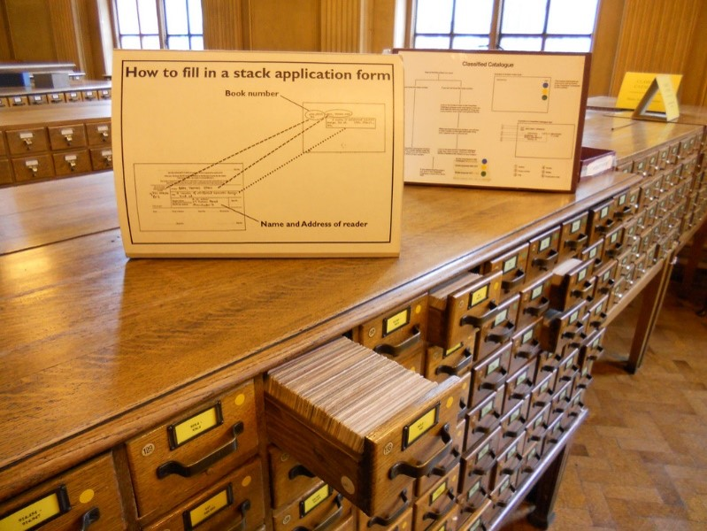
</p>

### Key Components
- Items: The actual data assets (like satellite images) with metadata (e.g., coordinates, timestamps).
- Collections: Groups of related items, like data for a specific region over time
- Catalogs:The highest level of organization, connecting multiple collections
- Example: A STAC catalog might organize satellite images for all cities in a country, with each city being a collection and each day’s image being an item.
<p align="left">
  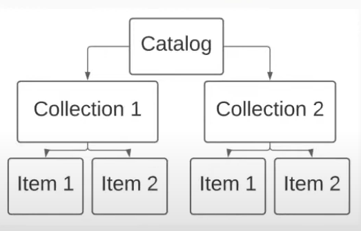
</p>


SpatioTemporal Asset Catalogs (STAC) provide standardized access to various formats of spatial data, enabling users to easily discover and retrieve geographic information across time. Instead of manually downloading individual LiDAR tiles or imagery for your study area, you can query data using a polygon and date range, then directly analyze it in your workflow.

As a proof of concept, the GeoBC STAC Task Team developed a custom STAC catalog for DEM and LiDAR collections. In the following section, I’ll demonstrate how to interact with the BC STAC using different tools.


## Using STAC with ArcGIS Pro 🔍
### Create a new STAC connection
- Click **Insert** tab 
- Click **Connections**
- select **STAC connection** from the dropdown
- Select **New STAC connection** from the second dropdown
- Give a **connection name**: BC-STAC
- Filling the **connection** with API URL: [https://pgstac-backend.apps.silver.devops.gov.bc.ca](https://pgstac-backend.apps.silver.devops.gov.bc.ca)

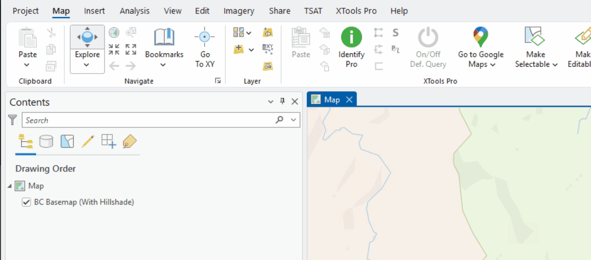

### Query STAC item with the connection
- Open the **Catalog Pane** and **Select STACs**
- Right click **bc_stac.astac**, the STAC connection we just created
- Select **Explore STAC...**
- Select **DEM** collection
Note: For the Point Cloud Collection, ArcGIS pro cannot directly add LAZ file. You will need to convert it to LAS datasets to display on the map
- Scroll down to specify date and time range
- Specify the extent by selecting the interested layer from the map, specify the coordinates or current display of map extent
- Click **result** on the top of the panel
- Find the interested data and click **add to current map**

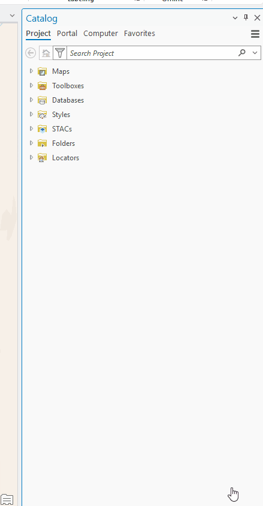
<p align="left">
  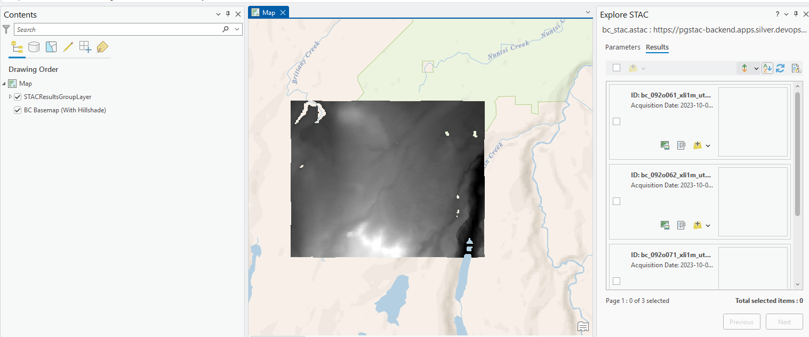
</p>


## Using STAC with QGIS 🔍
### Install STAC plugins
- Click **Plugins** tab on the top
- Select **Manage and Install Plugins**
- In the Plugins menu, search **STAC API Browswer** and click **Install Plugin**
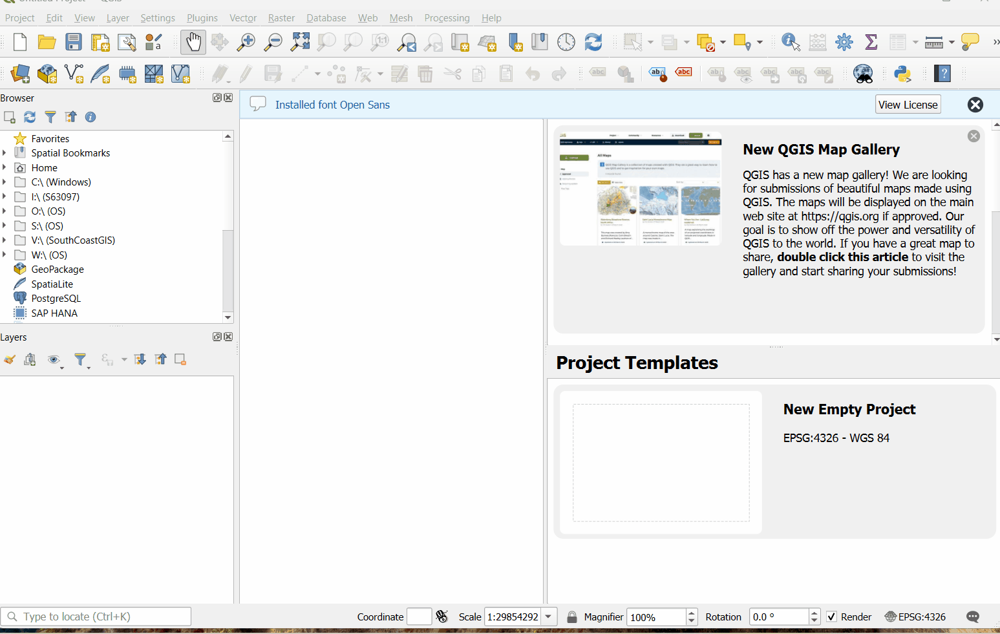
### Create the STAC Connection
- Click **Plugins** tab on the top
- Open the **STAC API Browswer Plugin** we just installed
- In the new pop-up menu, click **New** to create a new connection
- In the Create a New Connection pop-up, create a name for the connection, and filling the **connection** with API URL: [https://pgstac-backend.apps.silver.devops.gov.bc.ca](https://pgstac-backend.apps.silver.devops.gov.bc.ca)
- Click **Test Connection**
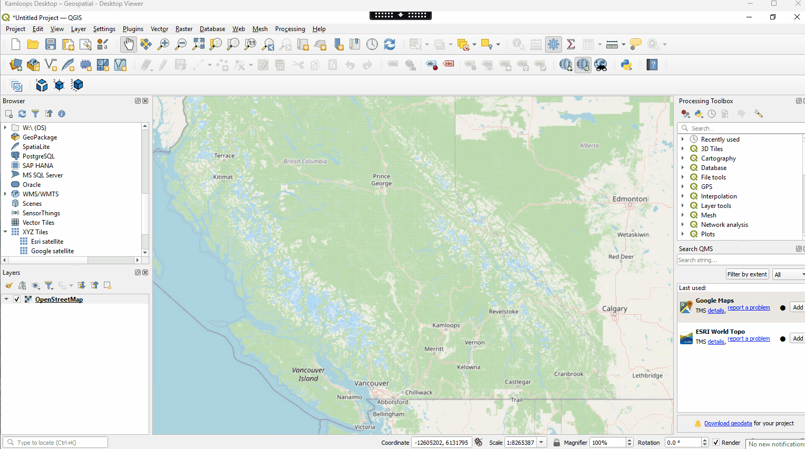

### Query STAC item with the connection
- Back to the STAC API Browser, select the connection we created
- Under Collections, click **Fetch Collection**
- Click the DEM/Point cloud collection
- Scroll down to specify date and time range
- Specify the extent by selecting the interested layer from the map, specify the coordinates or current display of map extent
- Click **search** at the bottom
- Find the interested data and click **view assets** , check the box **Selected to add as a layer**
- Click add selected assets as layers

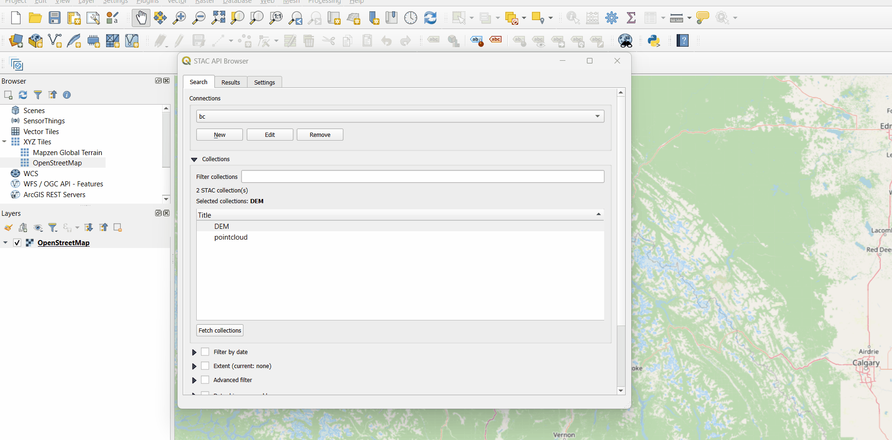
<p align="left">
  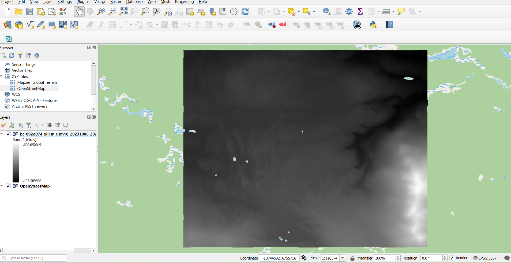
</p>


## Using STAC with STAC Browser 🔍
- There are multiple STAC browsers available. Here is an example one: [https://radiantearth.github.io/stac-browser/#/?.language=en](https://radiantearth.github.io/stac-browser/#/?.language=en)
- Copy and paste the STAC API url: [https://pgstac-backend.apps.silver.devops.gov.bc.ca](https://pgstac-backend.apps.silver.devops.gov.bc.ca) to the search bar and click load.
- Select the interested Catalogue: Point Cloud
- Filter the Point Clouds with Temporal Extent or Spatial Extent
- Click the interested data and you can view the stats and available assets
- Click laz assets to download the data


## Using STAC with R studio 🔍
### Install and load packages
If you haven’t already, install `rstac` and `terra`:

```r
install.packages("rstac")
install.packages("terra")
```
Load the packages:
```{r}
library(rstac)  # For interacting with STAC APIs
library(terra)  # For raster data handling
```
### Connect to the STAC API
Define the STAC endpoint and connect to it using `stac()`:

```r
stac_url <- "https://pgstac-backend.apps.silver.devops.gov.bc.ca/"
stac_obj <- rstac::stac(stac_url, force_version = "1.0.0")
```
### List all collections
This retrieves available collections (e.g., DEM, point clouds) from the API:

```r
collections_list <- rstac::collections(stac_obj)
collections_result <- rstac::get_request(collections_list)
collections_result
```
### Defing Bounding Box and Time Range
You can now filter your search using a spatial and temporal filter:
```r
bbox <- c(-126.2, 51.5, -121.0, 53.0)  # [minx, miny, maxx, maxy]
time_range <- "2018-01-01T00:00:00Z/2023-12-31T23:59:59Z"
```

### Search Items from the DEM Collection
```r
items <- rstac::stac_search(stac_obj, 
                            collections = "DEM",
                            bbox=bbox,
                            datetime = time_range)
items_result <- rstac::get_request(items)
```
### Extract Item's Asset URL
Pick the first feature and extract the URL to the actual DEM data:
```r
first_item <- items_result$features[[1]]
print(names(first_item$assets))  # Lists available assets

# Get the first asset's download URL
asset_data <- names(first_item$assets)[1]
asset_url <- first_item$assets[[asset_data]]$href
print(paste("Asset URL:", asset_url))
```
### Load and Plot the DEM with `terra`

```r
dem_raster <- rast(asset_url)
plot(dem_raster, col = grey.colors(100), main = first_item$id)
```
<p align="left">
  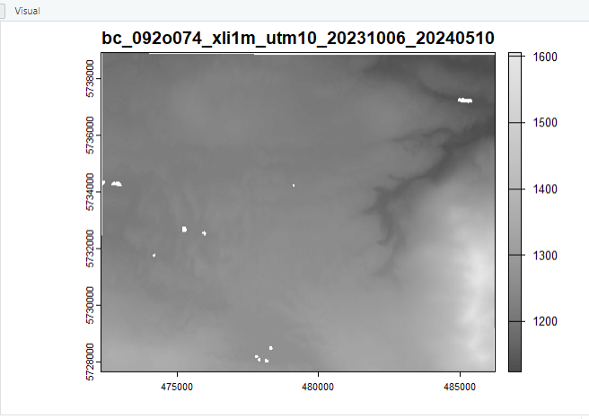
</p>

## Using STAC with Python 🔍

### Install packages
Install the required Python packages (if not done already):

```r
pip install pystac-client requests rasterio matplotlib
```
### Connect to STAC API
Import the necessary libraries and connect to the STAC endpoint.
```r
from pystac_client import Client
import requests
import rasterio
import matplotlib.pyplot as plt

# Define STAC URL
stac_url = "https://pgstac-backend.apps.silver.devops.gov.bc.ca/"

# Connect to the STAC catalog
catalog = Client.open(stac_url)
```
### Fetch and Print Metadata
Optionally fetch general metadata like the title and available collections:
```r
response = requests.get(stac_url)
data = response.json()

print(f"Title: {data.get('title')}")
print(f"Description: {data.get('description')}")
print(f"STAC Version: {data.get('stac_version')}")
print(f"Conforms To: {data.get('conformsTo')}")

print("\nAvailable Collections:")
for collection in data.get("links", []):
    if collection.get("rel") == "child":
        print(f"- {collection['title']} ({collection['href']})")

```
### Defing Bounding Box and Time Range
You can now filter your search using a spatial and temporal filter:
```r
# Bounding Box: [min_lon, min_lat, max_lon, max_lat]
bbox = [-126.2, 51.5, -121.0, 53.0]  # Central BC region

# Date Range: "YYYY-MM-DD/YYYY-MM-DD"
time_range = "2018-01-01/2023-12-31"
```
### Search for Items
Use catalog.search() to look for items in a specific collection (e.g., "DEM"):
```r
search = catalog.search(
    collections=["DEM"],
    bbox=bbox,
    datetime=time_range
)

items = search.item_collection()
print(f"Found {len(items)} item(s).")
```
### Get First DEM Item and Extract Asset URL
If results are found, access the first item and get the URL for the raster file:
```r
if len(items) > 0:
    first_item = items[0]
    asset = first_item.assets[list(first_item.assets.keys())[0]]
    dem_url = asset.href
    print(f"DEM URL: {dem_url}")
```

### Load and Plot the DEM with rasterio
Read and plot the raster data using rasterio and matplotlib.
```r
with rasterio.open(dem_url) as src:
    dem_data = src.read(1)
    plt.imshow(dem_data, cmap='gray')
    plt.title(first_item.id)
    # plt.colorbar(label='Elevation (m)')
    plt.show()
```


<p align="left">
  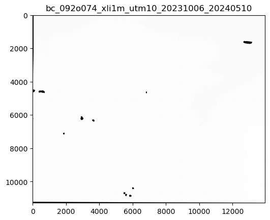
</p>


## Other common STAC and Resources 📝
- More about [STAC](https://stacspec.org/en)
- [Microsoft Planatary Computer STAC](https://planetarycomputer.microsoft.com/docs/quickstarts/reading-stac/)
- Natural Resources Canada STAC API:[https://datacube.services.geo.ca/stac/api/](https://datacube.services.geo.ca/stac/api/)
- Earth Search including Sentinel, Copernicus, NAIP and other COG Collections:[Earth Search API](https://earth-search.aws.element84.com/v1)
