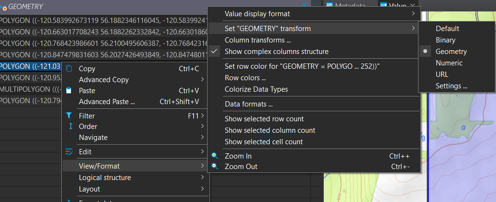
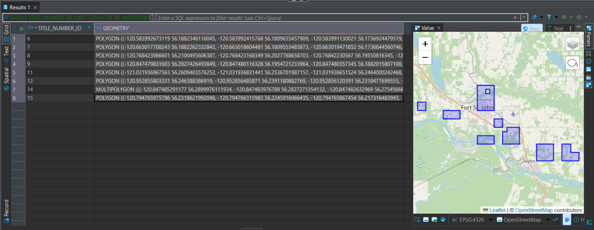

# DBeaver

[DBeaver Community Edition](https://dbeaver.io/) is a free and open source database client. It allows connections to Oracle databases like the BCGW. It can be installed locally on your machine and can be used to quickly load BCGW layers from SQL queries, or connecting to any other kind of database. 

It has a lot of useful auto-complete features and lets you search through all the tables in a database quickly. You can easily export the results in many data formats, or easily copy them to HTML or Markdown formatting.

I also find it useful for:

1. Quickly getting stats on large tables. For example, this will return descriptive statistics on the site index of all western red cedar-dominated stands in the province (from the VRI). It took 2.9s to run for me:

```sql
SELECT AVG(SITE_INDEX), MAX(SITE_INDEX), MIN(SITE_INDEX), STDDEV(SITE_INDEX) 
FROM WHSE_FOREST_VEGETATION.VEG_COMP_LYR_R1_POLY 
    WHERE SPECIES_CD_1 = 'CW'
```
**Result:**
|AVG(SITE_INDEX)|MAX(SITE_INDEX)|MIN(SITE_INDEX)|STDDEV(SITE_INDEX)|
|---------------|---------------|---------------|------------------|
|13.27|80.4|0|5.58|

2. Trying the same query on a few different tables when tracking down data (for example, searching through the BCER's many tables for a certain application number)

3. You can do some geometry intersect operations, but its a bit slow. It might be useful for recurring analyses, or embedding in an Excel sheet as a live database connection. Here is an example of one of these intersection queries, this one usually takes about 1 minute:
```sql
/* This SQL query returns a table of all of the active range tenures in the Northeast (Forest File ID and Client Number) 
  which intersect with EMBC Orders and Alerts. This can be input into an Excel sheet with a live BCGW database connection
  to create an Excel sheet that can be easily opened and refreshed once the user configures the database connection.

  Written by North Ross 2023 for Tanya Sharko (Northeast Region Range, FOR)
*/
SELECT r.forest_file_id, r.client_name, r.client_number, fire.EVENT_NAME, fire.ORDER_ALERT_STATUS
  FROM WHSE_HUMAN_CULTURAL_ECONOMIC.EMRG_ORDER_AND_ALERT_AREAS_SP fire, WHSE_FOREST_TENURE.FTEN_RANGE_POLY_SVW r
  WHERE fire.ORDER_ALERT_STATUS in ('Order', 'Alert')
  AND r.LIFE_CYCLE_STATUS_CODE = 'ACTIVE'
  AND r.ADMIN_DISTRICT_CODE in ('DPC', 'DFN')
  AND SDO_RELATE(fire.shape, r.geometry,
                   'mask=ANYINTERACT') = 'TRUE'
  ORDER BY fire.ORDER_ALERT_STATUS desc;
```

**Result (2025-06-26):**

|FOREST_FILE_ID|CLIENT_NAME|CLIENT_NUMBER|EVENT_NAME|ORDER_ALERT_STATUS|
|--------------|-----------|-------------|----------|------------------|
|RAN073731|STONE MOUNTAIN OUTFITTERS LTD|00198495|Summit Lake Wildfire|Alert|
|RAN077452|STEAMBOAT MOUNTAIN OUTFITTERS LTD|00163797|Summit Lake Wildfire|Alert|
|RAN077452|STEAMBOAT MOUNTAIN OUTFITTERS LTD|00163797|Summit Lake Wildfire|Alert|
|RAN077451|[redacted]|00046119|Summit Lake Wildfire|Alert|
|RAN075887|[redacted]|00120674|Summit Lake Wildfire|Alert|
|RAN077793|[redacted]|00187446|Summit Lake Wildfire|Alert|
|RAN075887|[redacted]|00120674|Summit Lake Wildfire|Alert|
|RAN075887|[redacted]|00120674|Summit Lake Wildfire|Alert|
|RAN075887|[redacted]|00120674|Summit Lake Wildfire|Alert|
|RAN075887|[redacted]|00120674|Summit Lake Wildfire|Alert|
|RAN075887|[redacted]|00120674|Summit Lake Wildfire|Alert|

## Connecting to the BCGW

To connect to the BCGW in DBeaver (IDIR restricted):

1. Create a new Connection and choose Oracle

2. Enter the following info:
    - **Host**: bcgw.bcgov
    - **Port**: 1521
    - **Database**: idwprod1.bcgov
    - On the dropdown next to Database, choose "Service Name"
    - Make sure not to save your password
    - At the bottom, there is a box to point to your Oracle client. It should be pre-installed with DBeaver if you used the default installation settings, but if not you can download from [Oracle](https://www.oracle.com/ca-en/database/technologies/instant-client/downloads.html), save on your PC and point to it here.

3. With your connection active, click the SQL button on the top menu to open a new script. You can also explore all the schemas, tables and views in the BCGW. It helps if you add a filter on the schemas (right click > Filter) with "WHSE*" so only the ones that start with WHSE (and contain the data tables) display.

## Embedded Leaflet Map

DBeaver also has some interesting capabilities for viewing [spatial data](https://dbeaver.com/docs/dbeaver/Working-with-Spatial-GIS-data/) in a little Leaflet interactive map. Unfortunately, this is not supported for Oracle geometry. 

I did figure out a little work-around where you can reproject the geometry to WGS 84 (EPSG:4326), convert to WKT and cast it as a VARCHAR2 string, then you can get DBeaver to recognize it as geometry and the Leaflet map will work. I have an example below. Note that this doesn't work with very complex geometry that spills over the character limit, and is very slow when retrieving lots of records. The simple query below ran for me in less than a second though. 


```sql
SELECT TITLE_NUMBER_ID, 
    CAST (SDO_UTIL.TO_WKTGEOMETRY(SDO_CS.TRANSFORM(GEOMETRY, 4326)) AS VARCHAR2(2000)) AS geometry
    FROM WHSE_MINERAL_TENURE.PTSA_PETROLEUM_TITLE_POLY 
    WHERE TITLE_NUMBER_ID < 16 
    ORDER BY TITLE_NUMBER_ID;
```
  - After running the above query, right-click on the Geometry column in the results and navigate to View/Format -> Set "GEOMETRY" transform -> Geometry, then push OK. The Leaflet map should appear. See screenshots below:




