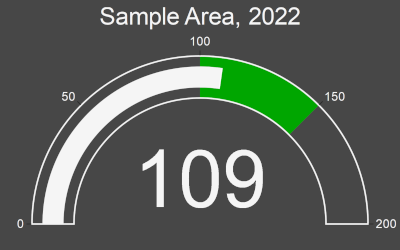

# Introduction

This is an example of using a series of static images of charts to build an interactive widget in ArcGIS Online dashboards. This allows for much more flexibility and customization than the built in dashboard options. In this example, charts are built programattically with plotly+python and then uploaded to object storage and retrieved as the user filters/interacts with the dashboard.

Integration with an automation solution like Jenkins can allow the dashboard widgets to be updated seamlessly.

The script takes in population survey results and a separate table with objective ranges. It generates svg-based charts with plotly, uploads them to object storage, and uploads a table to ArcGIS Online to allow the charts to be embedded in a dashboard/experience builder app.

As this is a specific implementation, it may not work in its current form for your usecase. Customization will be required.

## Operational Summary

This specific implementation reads population survey information from ArcGIS Online, combines it with locally stored population objectives, and creates charts with plotly before uploading them to object storage and linking to them in a table on ArcGIS Online.

This shows a simple use for a plotly gauge chart, showing progress against a variable objective range.



## Setup

### Requirements

This method relies on the following python libraries:

* arcgis
* arcpy
* plotly
* kaleido*

        If you are running your script on Jenkins, the kaleido library will have to be modified to be able to run from a network location.

### Optional: Modifying kaleido to work from network locations

Once you install plotly and kaleido, you can go to where your python environment is installed and edit this file:

        ./Lib/site-packages/kaleido/executable/kaleido.cmd

Change the line `chdir /d "%~dp0"` to `pushd "%~dp0"`. This is all that is needed to allow running off network locations (such as when using Jenkins).

### Inputs

Inputs are handled as dictionary objects.

`input_datasets`: the datasets that are ingested to generate the graphs. `"dataset"` is the path or address to the resource, and `"fields"` provides the relevant fields for the analysis.

`directories`: defines the `"working"` and `"output"` directories and geodatabases.

`object_properties`: defines the `"bucket"`, `"folder"`, and `"url"` used for object storage purposes. Note that the credentials and secret are loaded separately in the credentials section.

`agol_pop_objectives`: defines the feature service and service definition IDs for uploading to ArcGIS Online

### Chart configuration

Currently, chart configuration is handled statically within the `gaugeChart` class. It is set up specifically to accept the following variables:

`gmu`: used in combination with year for the title

`year`: used in combination with gmu for the title

`pop`: the population, used as the value for the gauge chart

`min`, `max`: used as the minimum and maximum values for the target range.

`gaugeChart.plot()` is the plotting function from plotly. It contains the values such as font, colours, and other properties coded within it. These are generally handled as key/value pairs such as:
```python
'bar': {'thickness': 0.5,'color': "#f5f5f5"}
```

This defines the thickness of the data bar relative to the graph and its colour as a hex value.

Further configuration information can be found in the plotly documentation linked below.

### Credentials

It is best practice to store credentials outside of scripts.

For this script, credentials are loaded in from external files for ArcGIS Online and object storage.

### Outputs

svg charts are saved locally to the output folder before being uploaded to object storage.

`output_table`: the table that contains all the used attributes and links to the objects in the bucket. This table is saved to the output gdb and then uploaded to ArcGIS Online

## Implementing in ArcGIS Online Dashboards

Once the resources have been created, the svg graph can be displayed in a dashboard using the `Embedded Content` widget.

Configure the widget to point to the `{url}` parameter. Once set up, the embedded widget can be filtered like any other widget.

## Additional Resources

[plotly documentation](https://plotly.com/python/getting-started/)

[minio documentation](https://min.io/docs/minio/linux/developers/python/minio-py.html)

[(stackoverflow) setting bucket policies](https://stackoverflow.com/questions/69588432/minio-bucket-private-but-objects-public)
