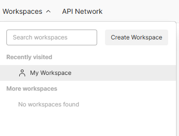
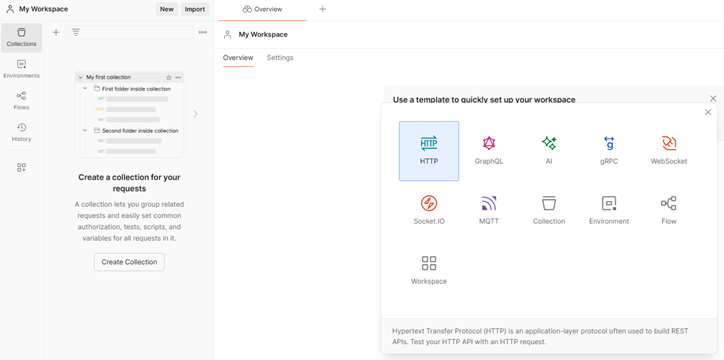
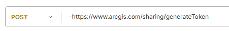
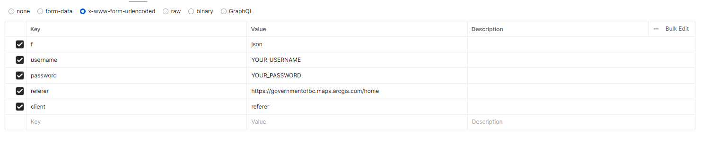

## Instructions to get ESRI Token via Postman

1. **Login or Create a Postman Account**: [https://www.postman.com/](https://www.postman.com/)
2. In the top left corner, click on **‘Workspaces’** and select **‘My Workspace’**. Or create a new workspace if you prefer.
    - 
3. Once in your workspace, choose **‘New’** > **HTTP**.
    - 
4. Change the HTTP request method to **POST**.
5. Paste the following URL: `https://www.arcgis.com/sharing/generateToken`
    - 
6. Complete the body of the request:
   - Navigate to **‘Body’** and choose **‘x-www-form-urlencoded’**.
   - Type the following **Key:Value** pairs into each row:

   | Key        | Value             |
   |------------|-------------------|
   | f          | json              |
   | username   | YOUR_USERNAME     |
   | password   | YOUR_PASSWORD     |
   | referer    | https://governmentofbc.maps.arcgis.com/home |
   | client     | referer           |

    

7. Click **‘Send’**.
8. The response will be in **JSON format** and will contain your token.
