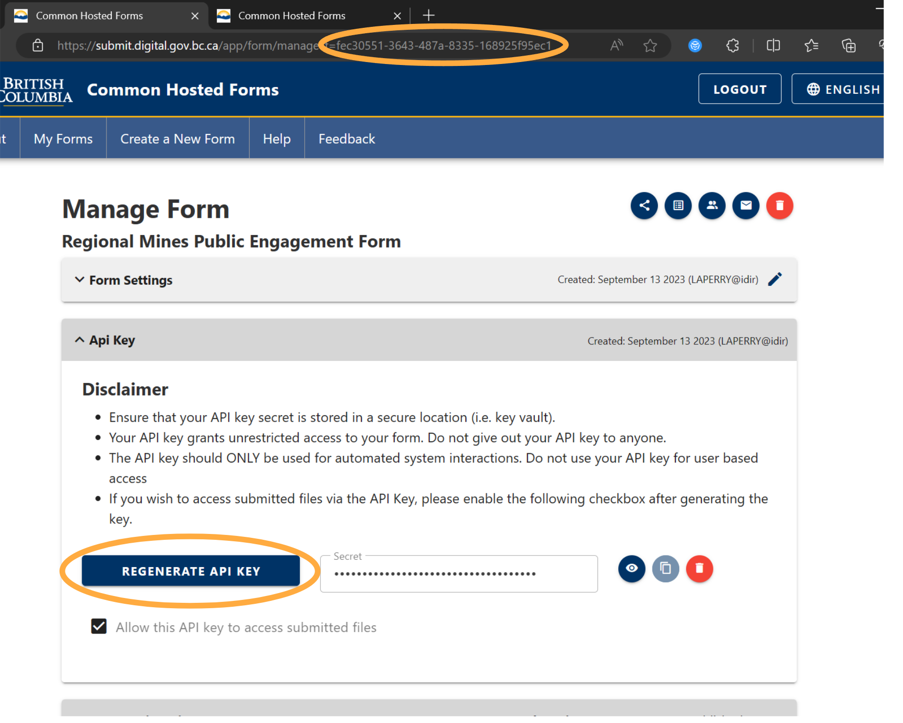

# Name
Read me for get_chefs_submissions_json.py

# Author
Laurence Perry
EMLI, MCAD, Regional Operations

# Description

A function to pull responses in JSON form from the Common Hosted Forms (CHEFS) API.

Note, you will need input an API key and form ID to use this function. The API key can be generated under "Manage Form" after creating a new form. The form ID can be found in the URL of the form.

# Dependencies/Requirements/Environments

* Requests
* Base64

# Known Bugs/Limitations

None known

# Update Log

Created - 2023Apr16