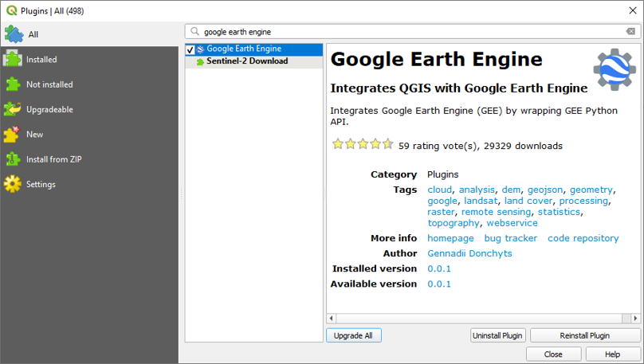

Google Earth Engine QGIS Plugin Examples
================
<b>Alexandre Bevington</b><br>Research Hydrologist<br>FLNRORD<br>Prince
George, BC<br>
<br><b>BCGOV GIS CoP <br>April 15, 2020</b>

## Google Earth Engine API: 5 ways to code

  - **GEE JavaScript API**<br>*<https://code.earthengine.google.com/>*
  - **GEE Python API**<br>*<https://github.com/google/earthengine-api>*
  - **GEE Python API via Google
    Colab**<br>*<https://developers.google.com/earth-engine/python_install-colab>*
  - **GEE Python API via
    QGIS**<br>*<http://qgis-ee-plugin.appspot.com/user-guide>*
  - **GEE Python API via
    R**<br>*<https://philippgaertner.github.io/2019/12/earth-engine-rstudio-reticulate/>*

## JavaScript API (Web Browser Only)

<https://code.earthengine.google.com/fa6f9d9c074cae0cd3fe92bc3ca53f9d>

``` python
# Polygon of British Columbia from Assets
  var BC = ee.FeatureCollection('users/bevingtona/BC')
  Map.addLayer(BC, {}, "British Columbia")

# Sentinel-2 Median Mosaic of British Columbia
  var s2 = ee.ImageCollection('COPERNICUS/S2')
    .filter(ee.Filter.calendarRange(7,8,"month"))
    .filterMetadata("CLOUDY_PIXEL_PERCENTAGE","less_than",30) 
    .map(function(img){return img.clip(BC)})
    .median()
  Map.addLayer(s2, {bands: ['B11','B8','B4'], max:4000}, "S2")
```

## Python API

<https://developers.google.com/earth-engine/python_install-conda><br>
<https://anaconda.org/conda-forge/earthengine-api>

**Install**<br>

``` python
pip install earthengine-api
```

**Authenticate**

Command line

``` python
earthengine authenticate
```

or in Python

``` python
ee.Authenticate()
```

## Google Earth Engine QGIS Plugin



## Example 1: Hillshade

``` python
import ee #import GEE API
from ee_plugin import Map #import GEE QGIS Plugin

# Imports
bc = ee.FeatureCollection('users/bevingtona/BC') #Polygon of BC
srtm = ee.Image("USGS/SRTMGL1_003").clip(bc) #SRTM DEM
alos = ee.Image("JAXA/ALOS/AW3D30/V2_2").select('AVE_DSM').clip(bc) #AW3D30 DEM

# Hillshades
srtm_hs = ee.Terrain.hillshade(srtm) 
alos_hs = ee.Terrain.hillshade(alos)

# Plot Hillshades
Map.addLayer(srtm_hs, {}, "SRTM")
Map.addLayer(alos_hs, {}, "AW3D30")

# Difference DEMS
dif = alos.subtract(srtm)

# Plot difference
Map.addLayer(dif, {'palette': ['red','white','blue'],'min': -50, 'max': 50}, "DEM Diff", 0, 0.5)
```

## Example 2: Provincial mosaic

``` python
import ee
from ee_plugin import Map

# Import BC
bc = ee.FeatureCollection('users/bevingtona/BC')

# Import, filter Sentinel-2, reduce, clip
image = ee.ImageCollection('COPERNICUS/S2')\
    .filterMetadata('CLOUDY_PIXEL_PERCENTAGE','less_than',30)\
    .filter(ee.Filter.calendarRange(7,8,'month'))\
    .median()\
    .clip(bc)\

# Add to Map
Map.addLayer(image, {'bands': ['B12', 'B8', 'B4'], 'max': 4000}, 'Sentinel-2')
```

## Example 3: Time Series images (1/2)

``` python
import ee
from ee_plugin import Map

# Get current map view
aoi = bounds = Map.getBounds(True)

# Band names 
L45_BANDS = ['B1', 'B2', 'B3', 'B4', 'B5', 'B7', 'B6'];
L8_BANDS  = ['B2', 'B3', 'B4', 'B5', 'B6', 'B7', 'B10'];
STD_NAMES = ['blue', 'green', 'red', 'nir', 'swir1', 'swir2', 'tir',];

# Merge collections from Landsat 5 and 8
col = ee.ImageCollection("LANDSAT/LT05/C01/T1_SR").select(L45_BANDS, STD_NAMES).merge(
      ee.ImageCollection("LANDSAT/LC08/C01/T1_SR").select(L8_BANDS, STD_NAMES))\
        .filterMetadata("CLOUD_COVER","less_than",10)\
        .filterBounds(aoi)\
        .filter(ee.Filter.calendarRange(7, 8, "month"))\

interval = 5 # how many yeas per mosaic?
count = 7 # how many msoaics?
sequence = ee.List.sequence(0, ee.Number(count).subtract(1))
origin = ee.Date('1985-01-01') # Start date
end = ee.Date('2020-01-01') # End date

# Function to calculate median mosaic per interval
def proc(i): 
    start = origin.advance(ee.Number(interval).multiply(i), "year");
    end = origin.advance(ee.Number(interval).multiply(ee.Number(i).add(1)), "year");
    return col.filterDate(start, end).median().set({'year': start.format('yyyy')});

# Image collection of the mapped mosaics
col = ee.ImageCollection(sequence.map(proc)) 

# Plot
vis = {'bands': ['swir1','nir','red'], 'min': 0, 'max': 4000}
Map.addLayer(col.filterMetadata('year','equals','1985').first().clip(aoi), vis, '1985')
Map.addLayer(col.filterMetadata('year','equals','2015').first().clip(aoi), vis, '2015')
```

## Example 4: Image classification

``` python
import ee
from ee_plugin import Map

# Get current map view
aoi = bounds = Map.getBounds(True)

# Import Sentinel-2, filter, mosaic, clip
input = ee.ImageCollection('COPERNICUS/S2')\
    .filterMetadata('CLOUDY_PIXEL_PERCENTAGE','less_than',30)\
    .filter(ee.Filter.calendarRange(7,8,'month')).median().clip(aoi)\

# Plot
Map.addLayer(input, {'bands': ['B12', 'B8', 'B4'], 'max': 4000}, 'Sentinel-2')

# Randomly sample training data
training = input.sample(**{'region': aoi,'scale': 30,'numPixels': 5000});

# Cluster the training data
clusterer = ee.Clusterer.wekaKMeans(5).train(training);

# Apply clusterer to image (classify image)
result = input.cluster(clusterer);

# Plot 
Map.addLayer(result.randomVisualizer(), {}, 'clusters');
```

## Example 5: Sentinel-5

``` python
import ee
from ee_plugin import Map

aoi = bounds = Map.getBounds(True)

S5_col = ee.ImageCollection('COPERNICUS/S5P/NRTI/L3_NO2')\
                      .select('NO2_column_number_density')

vis = {'min': 0.000002, 'max': 0.0005, 'opacity': 1,\
  'palette': ['black', 'blue', 'purple', 'cyan',\
  'green', 'yellow', 'yellow', 'red', 'red']}

Map.addLayer(S5_col.filterDate('2019-03-01','2019-04-01').mean(),\
  vis, 'March 2019', 1)
Map.addLayer(S5_col.filterDate('2020-03-01','2020-04-01').mean(),\
  vis, 'March 2020', 1)
```
